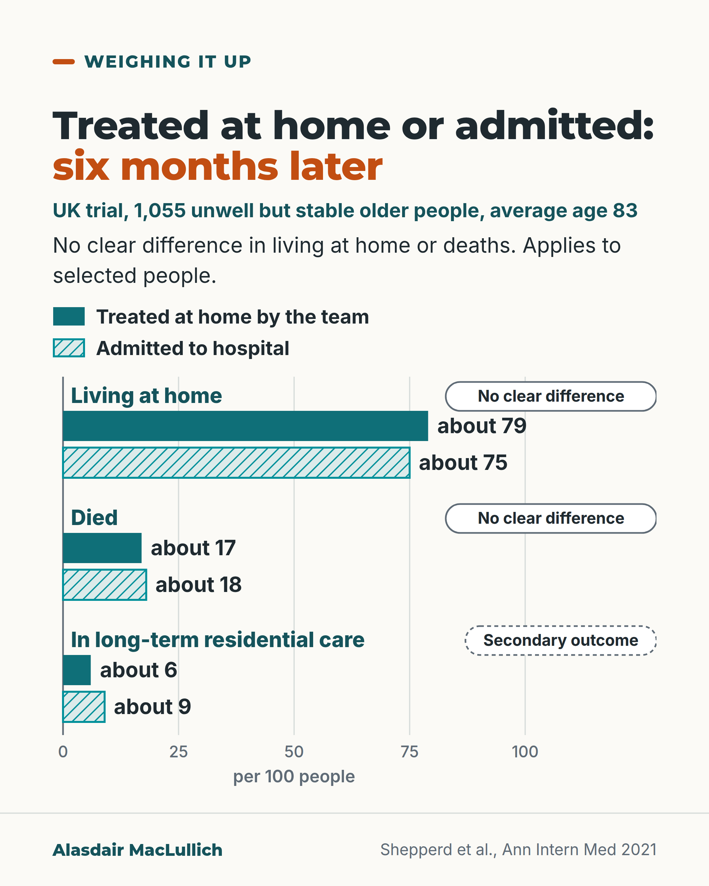

# G152: Hospital at home: what the UK trial found

- Category: C15 Hospital care, emergency care and discharge
- Audience: both
- Series: Weighing it up
- Post type: decision_support
- Visual format: chart (paired bars per 100)
- Status: text text_final, visual final
- Working id: C15-P05 (candidate C15-12)

## Insight

In a UK trial of 1,055 older people who were unwell but stable and referred for emergency admission, being treated at home by a hospital-at-home team gave similar results at six months to hospital admission for living at home and for deaths, and fewer moves into long-term residential care.

## Angle and position

The default is that hospital is safest. For selected, stable older people, one trial found home treatment with a specialist team matched admission on the main outcomes. The result applies to selected people, and the choice should include what the person wants and what care at home would involve for the household.

Basis: mixed: the percentages and the selection are empirical findings from one randomised trial; that the choice should include the person's wishes and what the household can manage is ethical and clinical judgement.

## X (1053 characters)

```text
A UK trial tested treating unwell older people at home instead of admitting them to hospital. It included 1,055 people, average age 83. They were unwell but stable and had been referred for emergency admission, mostly from short-stay acute medical assessment units.

A hospital-at-home team looked after them at home, with a full assessment of health, medicines, mood and support (comprehensive geriatric assessment).

Six months later, about 79 in 100 treated at home and 75 in 100 admitted were living at home. The trial did not show a clear difference: a gap of about 3 in 100 could be due to chance. About 17 in 100 treated at home and 18 in 100 admitted had died.

About 6 in 100 treated at home and 9 in 100 admitted had moved into long-term residential care by six months. This was not the trial's main question, so treat it as less certain.

This applies to selected people, not everyone. The trial summary reports nothing on the strain on family carers. If home treatment is offered, ask what care at home would involve for you and your family.
```

## LinkedIn (1608 characters)

```text
A UK trial tested treating unwell older people at home instead of admitting them to hospital. The trial ran in nine sites and included 1,055 older people, average age 83. They were unwell but medically stable and had been referred for emergency admission, mostly from short-stay acute medical assessment units. They were assigned by chance: two thirds to a hospital-at-home team, who treated them at home with a comprehensive geriatric assessment (a full assessment of health, medicines, mood and support by a specialist team). The rest were admitted to hospital.

Six months later, about 79 in 100 treated at home and 75 in 100 admitted were living at home. The trial did not show a clear difference: a gap of about 3 in 100 could be due to chance.

About 17 in 100 treated at home and 18 in 100 admitted had died by six months. Again, no clear difference. The trial was not built to show that deaths were the same in both groups, so this figure is uncertain.

About 6 in 100 treated at home and 9 in 100 admitted had moved into long-term residential care by six months. This was not the trial's main question, so treat it as less certain.

These were selected, stable people, so the results apply to them and not to everyone referred for admission. The trial summary gives no finding about family carers.

As a judgement: for people who qualify, home treatment with a specialist team is an option to consider alongside admission. The choice should include what the person wants and what the household can manage. We should ask what care at home would involve for the family, day and night, before deciding.
```

## Bluesky (283 characters)

```text
UK trial of 1,055 unwell but stable older people. At 6 months, 79 in 100 treated at home and 75 in 100 admitted were living at home (no clear difference). In care homes: 6 in 100 treated at home, 9 in 100 admitted (not the trial's main question). Ask what care at home would involve.
```

## Threads (488 characters)

```text
In a UK trial of 1,055 unwell but stable older people (average age 83), about 79 in 100 treated at home by a specialist team and 75 in 100 admitted were living at home six months later. No clear difference. About 17 in 100 treated at home and 18 in 100 admitted had died.

About 6 in 100 treated at home and 9 in 100 admitted were in residential care (not the trial's main question). The results apply to selected people. If home treatment is offered, ask what care at home would involve.
```

## Source reply

Source: https://doi.org/10.7326/M20-5688 (Shepperd et al., Annals of Internal Medicine 2021)

## Visual



Alt text: Bar chart per 100 people, six months after UK trial of treatment at home versus admission in 1,055 older people, average age 83. Living at home about 79 versus 75; died about 17 versus 18 (no clear difference in either); long-term residential care about 6 versus 9 (secondary outcome). Applies to selected people.

Editable source: `visuals/src/G152.html`

Design instructions: Single 4:5 light card. Paired horizontal bars 0 to 100 (pairBars in visuals/src/c15_common.js): solid teal treated at home, hatched pale teal admitted; pill tags No clear difference and dashed Secondary outcome. Claims C15-12-a, C15-12-b, C15-12-c.

## Sources and verification

- C15-12-a (supported): Living at home at 6 months similar with hospital at home vs admission
  - Source: Shepperd S, Butler C, Cradduck-Bamford A, Ellis G, Gray A, Hemsley A, et al. Is comprehensive geriatric assessment admission avoidance hospital at home an alternative to hospital admission for older persons? A randomized trial. Ann Intern Med. 2021;174(7):889-98.
  - Passage: "At 6-month follow-up, 528 of 672 (78.6%) participants in the CGA HAH group versus 247 of 328 (75.3%) participants in the hospital group were living at home (relative risk [RR], 1.05 [95% CI, 0.95 to 1.15];= 0.36)" (Abstract, Results)
- C15-12-b (supported): Deaths at 6 months similar
  - Source: Shepperd S, Butler C, Cradduck-Bamford A, Ellis G, Gray A, Hemsley A, et al. Is comprehensive geriatric assessment admission avoidance hospital at home an alternative to hospital admission for older persons? A randomized trial. Ann Intern Med. 2021;174(7):889-98.
  - Passage: "114 of 673 (16.9%) versus 58 of 328 (17.7%) had died (RR, 0.98 [CI, 0.65 to 1.47];= 0.92)" (Abstract, Results)
- C15-12-c (supported_with_qualification): Fewer in long-term residential care at 6 months
  - Source: Shepperd S, Butler C, Cradduck-Bamford A, Ellis G, Gray A, Hemsley A, et al. Is comprehensive geriatric assessment admission avoidance hospital at home an alternative to hospital admission for older persons? A randomized trial. Ann Intern Med. 2021;174(7):889-98.
  - Passage: "37 of 646 (5.7%) versus 27 of 311 (8.7%) were in long-term residential care (RR, 0.58 [CI, 0.45 to 0.76];< 0.001)" (Abstract, Results)
- C15-12-d (supported): Applicability: selected stable older people
  - Source: Shepperd S, Butler C, Cradduck-Bamford A, Ellis G, Gray A, Hemsley A, et al. Is comprehensive geriatric assessment admission avoidance hospital at home an alternative to hospital admission for older persons? A randomized trial. Ann Intern Med. 2021;174(7):889-98.
  - Passage: "The findings are most applicable to older persons referred from a hospital short-stay acute medical assessment unit; episodes of delirium may have been undetected." (Abstract, Limitations)

Verification notes: C15-12-a, -b, -c, -d: Shepperd 2021 abstract. Absolute figures only; RR 0.58 not quoted; mortality CI wide and not an equivalence design. Two thirds / one third allocation (2:1 randomisation) taken from the claim qualification. C15-12-e (carer outcomes) not found, so no carer finding is stated; the family prompt is framed as judgement. 'Nine sites' from the source population field.

## Attention and follow potential

Pause: Hospital is usually assumed to be the safest place; this shows a randomised comparison where it was not clearly better on the main outcomes.

Gain: Numbers per 100 for three outcomes and a prompt to ask what care at home would involve.

Follow: Treatment decisions set out with benefits, limits and who the evidence applies to.

## Open issues

None.
