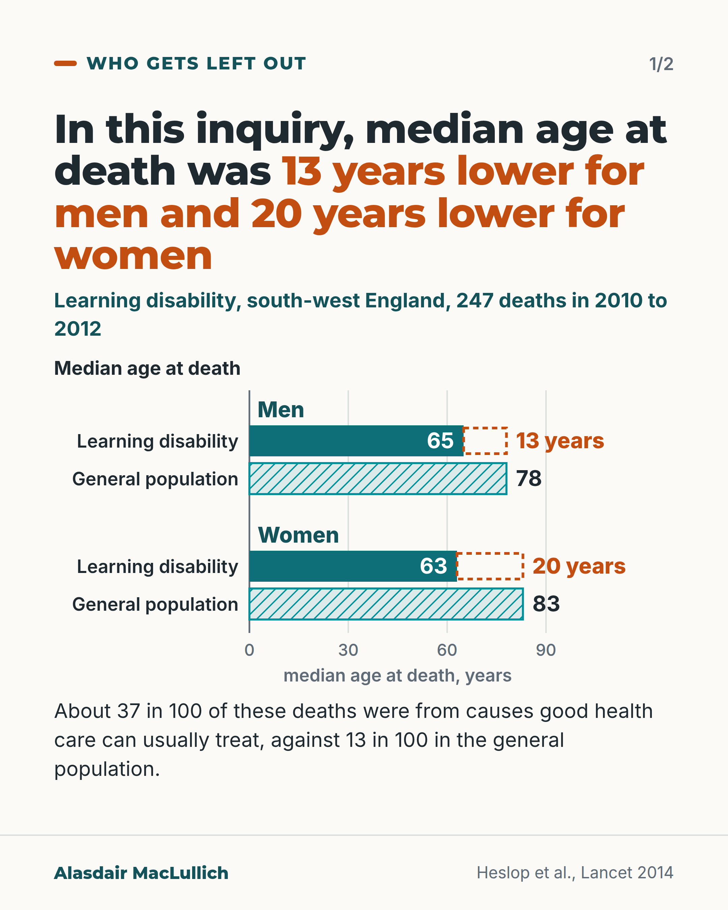
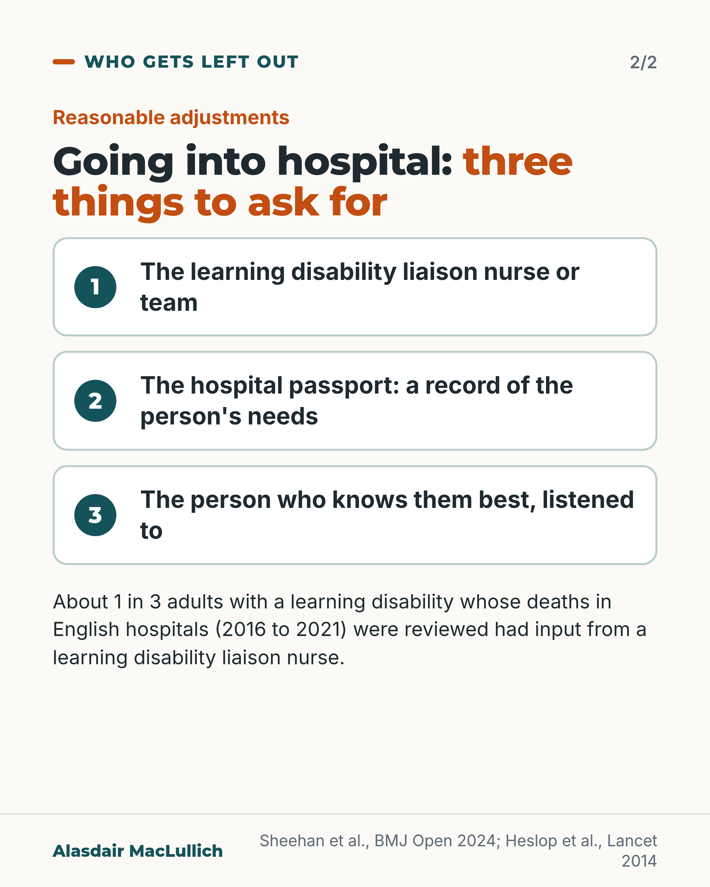

# G154: Learning disability and hospital: the gap, and what to ask for

- Category: C15 Hospital care, emergency care and discharge
- Audience: both
- Series: Who gets left out
- Post type: criticism
- Visual format: carousel (bars then checklist)
- Status: text text_final, visual final
- Working id: C15-P07 (candidate C15-25)

## Insight

People with a learning disability in England die years younger than the general population, and in a southwest England inquiry far more of their deaths were from causes good health care can usually treat. Adjusting care in hospital, with a hospital passport, the liaison nurse and the people who know the person best, is a reasonable thing to ask for.

## Angle and position

Hospitals reach adults with a learning disability at ages well below those of other patients, with the illnesses that come with it. The inquiry found problems such as care not being adjusted as needs changed and carers not feeling listened to. Position: hospitals should make reasonable adjustments, and families and support workers can ask for them.

Basis: mixed: the age gap, the 37 versus 13 in 100 figure, the contributory factors and the liaison nurse findings are empirical (observational) findings; that hospitals should make reasonable adjustments and that people should ask for the passport, liaison team and the person who knows them best is ethical and practical judgement.

## X (1221 characters)

```text
In an inquiry into 247 deaths in south-west England in 2010 to 2012, the typical (median) age at death was 13 years lower for men with a learning disability than for men in the general population, and 20 years lower for women.

About 37 in 100 of these deaths were from causes that good health care can usually treat, against 13 in 100 in the general population. Reviewers looked at some of these deaths. They found two problems more often than in similar deaths of people without a learning disability: care not adjusted as needs changed, and carers not feeling listened to.

In England in 2021 to 2023, among deaths reviewed in the national programme, the typical (median) age at death was 65 for adults with a mild or moderate learning disability and 58 for a severe or profound one, against 82 in the general population.

Reviewers looked at adults with a learning disability who died in English hospitals (2016 to 2021). Only about 1 in 3 had input from a liaison nurse, a nurse who specialises in learning disability.

Hospitals should change how they care for the person to fit their needs (reasonable adjustments). If you support someone going into hospital, ask for the liaison nurse and say who knows them best.
```

## LinkedIn (1878 characters)

```text
In an inquiry into 247 deaths in south-west England in 2010 to 2012, the typical (median) age at death was 13 years lower for men with a learning disability than for men in the general population, and 20 years lower for women. The median age was 65 for men against 78, and 63 for women against 83. The inquiry is regional and over a decade old.

About 37 in 100 of these deaths were from causes that good health care can usually treat, against 13 in 100 in the general population. Problems found more often included care not being adjusted as needs changed, and carers not feeling listened to. These are judgements made by review panels.

More recent national data point the same way. In England in 2021 to 2023, adults with a mild or moderate learning disability died at a median age of 65, and those with a severe or profound learning disability at 58, against 82 in the general population. These figures cover deaths that were reviewed, not every death.

Liaison nurses (nurses who specialise in learning disability): 4,742 adults with a learning disability died in English general hospitals between 2016 and 2021 and had their deaths reviewed. About 1 in 3 had input from a liaison nurse. When a nurse was involved, care was more often adjusted to the person's needs. That is an association, and there was no difference in the overall quality rating.

Five studies of adults' own experiences were reviewed. In two, hospital passports (a record of the person's needs) and liaison nurses were reported to improve the hospital experience.

Hospitals should change how they care for the person to fit their needs (reasonable adjustments). If you support someone with a learning disability going into hospital:

1. Ask for the learning disability liaison nurse or team.
2. Bring or ask for the hospital passport.
3. Say who knows the person best, and ask staff to listen to them.
```

## Bluesky (296 characters)

```text
In a south-west England inquiry (2010 to 2012), men with a learning disability died at a typical (median) age 13 years younger than men in general, women 20 years younger. Going into hospital? Ask for adjustments to care and for the liaison nurse (a nurse who specialises in learning disability).
```

## Threads (497 characters)

```text
An inquiry into 247 deaths in 2010 to 2012 found men with a learning disability in south-west England died at a typical (median) age 13 years younger than men in general. For women it was 20 years younger. About 37 in 100 of these deaths were from causes good care can usually treat, against 13 in 100.

Hospitals should make reasonable adjustments. If you support someone going into hospital, ask for the liaison nurse (a nurse who specialises in learning disability) and say who knows them best.
```

## Source reply

Sources: https://doi.org/10.1016/S0140-6736(13)62026-7 (Confidential Inquiry, Heslop 2014) https://doi.org/10.1371/journal.pmed.1005029 (England 2021 to 2023) https://doi.org/10.1136/bmjopen-2023-077124 (liaison nurses) https://doi.org/10.1111/hsc.13253 (people's experiences)

## Visual



Alt text: Card 1: median age at death in a south-west England learning disability inquiry of 247 deaths in 2010 to 2012. Men 65 versus 78 in the general population, 13 years lower; women 63 versus 83, 20 years lower. About 37 in 100 deaths were from treatable causes versus 13 in 100.



Alt text: Card 2: three things to ask for on going into hospital: the learning disability liaison nurse or team, the hospital passport, and the person who knows them best, listened to. About 1 in 3 reviewed hospital deaths had liaison nurse input.

Editable source: `visuals/src/G154.html`

Design instructions: Two 4:5 light cards. Card 1 pairBars 0 to 90 years with labelled rows, values inside teal bars, dashed orange gap boxes labelled 13 years and 20 years. Card 2 three numbered white cards. No icons. Claims C15-25-a, C15-25-b.

## Sources and verification

- C15-25-a (supported_with_qualification): In the Confidential Inquiry, median age at death of people with intellectual disabilities was 64; men 13 and women 20 years younger than the general population
  - Source: Heslop P, Blair PS, Fleming P, Hoghton M, Marriott A, Russ L. The Confidential Inquiry into premature deaths of people with intellectual disabilities in the UK: a population-based study. Lancet. 2014;383(9920):889-95.
  - Passage: "the median age at death was 64 years (IQR 52-75). The median age at death of male individuals with intellectual disabilities was 65 years (IQR 54-76), 13 years younger than the median age at death of male individuals in the general population of England and Wales (78 years). The median age at death of female individuals with intellectual disabilities was 63 years (IQR 54-75), 20 years younger than the median age at death for female individuals in the general population (83 years)." (Abstract, Findings)
- C15-25-b (supported_with_qualification): 37% of deaths amenable to good-quality health care vs 13% in general population
  - Source: Heslop P, Blair PS, Fleming P, Hoghton M, Marriott A, Russ L. The Confidential Inquiry into premature deaths of people with intellectual disabilities in the UK: a population-based study. Lancet. 2014;383(9920):889-95.
  - Passage: "Avoidable deaths from causes amenable to change by good quality health care were more common in people with intellectual disabilities (37%, 90 of 244) than in the general population of England and Wales (13%)." (Abstract, Findings)
- C15-25-c (supported): Contributory factors included advance care planning, Mental Capacity Act adherence, adjusting care as needs changed, carers not feeling listened to
  - Source: Heslop P, Blair PS, Fleming P, Hoghton M, Marriott A, Russ L. The Confidential Inquiry into premature deaths of people with intellectual disabilities in the UK: a population-based study. Lancet. 2014;383(9920):889-95.
  - Passage: "Contributory factors to premature deaths in a subset of people with intellectual disabilities compared with a comparator group of people without intellectual disabilities included problems in advanced care planning (p=0·0003), adherence to the Mental Capacity Act (p=0·0008), living in inappropriate accommodation (p<0·0001), adjusting care as needs changed (p=0·009), and carers not feeling listened to (p=0·006)." (Abstract, Findings)
- C15-25-d (supported_with_qualification): Recent national (LeDeR) data on age at death and avoidable deaths
  - Source: Yu MKL, Sheehan R, Magill N, White A, Bokor L, Ding J, et al. Avoidable mortality, clinical outcomes and determinants of premature death among adults with severe or profound intellectual disability: a population-based analysis of mortality data in England. PLoS Med. 2026;23(8):e1005029.
  - Passage: "The median age at death was markedly lower in this group (57.9 years) compared to those with mild or moderate intellectual disability (65.0 years) and the general population (81.9 years) (p < 0.001). We classified two-fifths of deaths among adults with severe or profound intellectual disability as avoidable (39.5%)" (Abstract, Results)
- C15-25-e (supported_with_qualification): Learning disability liaison nurses and hospital passports exist and help; liaison nurse input linked with more reasonable adjustments
  - Source: Sheehan R, Ding J, White A, Magill N, Chauhan U, Marshall-Tate K, et al. Specialist intellectual disability liaison nurses in general hospitals in England: cohort study using a large mortality dataset. BMJ Open. 2024;14(8):e077124.; McCormick F, Marsh L, Taggart L, Brown M. Experiences of adults with intellectual disabilities accessing acute hospital services: a systematic review of the international evidence. Health Soc Care Community. 2021;29(5):1222-32.
  - Passage: "One-third of people with intellectual disability who died in hospital in England between 2016 and 2021 had input from an intellectual disability liaison nurse. ... associated with increased likelihood of reasonable adjustments being made to care (adjusted OR (aOR) 1.95, 95% CI 1.63 to 2.32) ... but was not associated with a rating of overall quality of care received (aOR 0.94, 95% CI 0.78 to 1.12). | the use of the hospital passport and the intellectual disability liaison nurse to significantly improve the hospital experience for adults with intellectual disabilities was identified in two of the studies." (Abstracts, Results)

Verification notes: C15-25-a, -b, -c: Heslop 2014 (abstract; south-west England, 2010 to 2012, regional and over a decade old, stated). 'Amenable' as the inquiry's term; not mixed with LeDeR 'avoidable'. C15-25-d: Yu 2026 (abstract), England 2021 to 2023, medians 65, 58 and 82; deaths reviewed, not all. C15-25-e: Sheehan 2024 (one third had liaison nurse input; association, no overall quality difference; no odds ratio quoted) and McCormick 2020 review (people said passports and liaison nurses made hospital easier). C15-25-f: Equality Act not cited; 'hospitals should make reasonable adjustments' is judgement. The hospital passport gloss ('a record of the person's needs') is a plain-language definition of the term, not a finding. The post does not imply that these are mainly old-age deaths.

## Attention and follow potential

Pause: The gap is shown as years of life, with the place and dates, and the same slide set ends on what a family can ask for.

Gain: Three concrete requests for a hospital admission, and the reason behind them.

Follow: Posts about people who are poorly served, with the evidence dated and located.

## Open issues

None.
