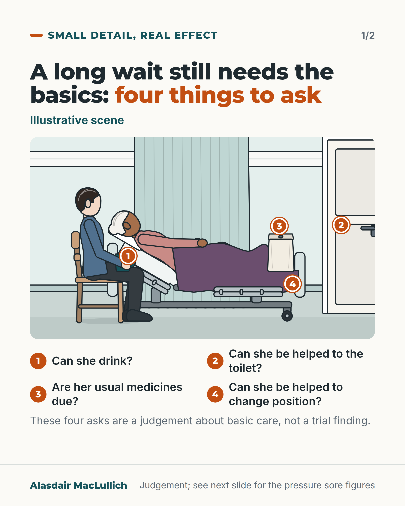
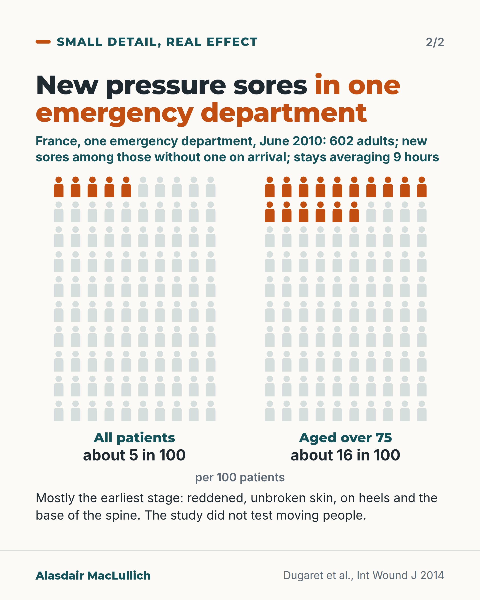

# G155: On a trolley for hours: the basics still apply

- Category: C15 Hospital care, emergency care and discharge
- Audience: public
- Series: Small detail, real effect
- Post type: decision_support
- Visual format: annotated scene plus icon arrays (2 cards)
- Status: text text_final, visual final
- Working id: C15-P08 (candidate C15-15)

## Insight

During a long wait on a trolley or chair in the emergency department, you can ask whether the person is allowed to drink, for help to the toilet, when their usual medicines are due, and whether they can be helped to change position. In one French emergency department about 5 in 100 patients, and 16 in 100 of those over 75, developed a new pressure sore during a stay that averaged 9 hours.

## Angle and position

Long waits are usually discussed as a system problem. For the person on the trolley, some risks are specific: new pressure sores on heels and the base of the spine, time-critical medicines given late, and no one noticing the need for a drink or the toilet. Position: basic care during a wait is part of treatment, and asking for it kindly and specifically is reasonable.

Basis: mixed: the pressure sore figures, the longer stays of older people and the Parkinson's medicine findings are empirical (observational, with stated limits); the four requests are judgement and are not presented as proven to prevent harm.

## X (807 characters)

```text
A long wait on a trolley or chair in the emergency department (A&E) still needs the basics. If you are with an older person, you can ask kindly and specifically.

Ask whether they are allowed to drink. Ask for help to the toilet. Ask when their usual medicines are due. Ask whether they can be helped to change position.

These four requests come from judgement about basic care; no trial is cited for them.

Why the last one: in one French emergency department, about 5 in 100 patients developed a new pressure sore during a stay that averaged 9 hours. Among people over 75 it was about 16 in 100. Most were the earliest stage, reddened skin that is still unbroken, mostly on the heels and the base of the spine. That study did not test whether moving people prevents them.

If the wait goes on, ask again.
```

## LinkedIn (1918 characters)

```text
A long wait on a trolley or chair in the emergency department (A&E) still needs the basics. If you are with an older person, you can ask kindly and specifically:

1. Are they allowed to drink?
2. Can they be helped to the toilet?
3. When are their usual medicines due?
4. Can they be helped to change position?

These four requests come from judgement about basic care. No trial is cited for them.

Pressure sores: in one French emergency department, about 5 in 100 patients developed a new pressure sore during a stay that averaged 9 hours. Among people over 75 it was about 16 in 100. Most were stage I, the earliest stage (reddened skin that is still unbroken), mostly on the heels and the base of the spine. It was one centre, over two weeks in 2010, and many patients were excluded for missing data. A longer stay was linked with new sores in the raw figures, but not after allowing for other differences between patients. So the study does not show that longer waits raise the risk by themselves. It did not test repositioning.

Older people's visits tend to last longer. At one large English emergency department in 2019, about 44 in 100 visits by adults aged 18 to 64 lasted 4 hours or more, against about 71 in 100 for people aged 75 to 84 and about 79 in 100 for people aged 85 or over. These count visits, not people, and longer stays may partly reflect more tests and assessment, not only waiting for a bed.

For some medicines, such as Parkinson's drugs, the timing of each dose is important. In one Dublin hospital, about half of Parkinson's doses were given more than 30 minutes late. In hospitals in the Basque Country, Spain, missed Parkinson's doses were linked with longer stays and more deaths in hospital. Those were ward patients, not people waiting in an emergency department, and the studies cover Parkinson's medicines only.

Ask for these four things early, and ask again if the wait goes on.
```

## Bluesky (297 characters)

```text
If you are with an older person waiting hours in A&E, ask: can they drink, get to the toilet, change position? When are their medicines due? In one French emergency department, about 16 in 100 patients over 75 got a new pressure sore, mostly red, unbroken skin. These requests come from judgement.
```

## Threads (495 characters)

```text
A long wait on a trolley in the emergency department needs the basics. If you are with an older person, ask whether they are allowed to drink, for help to the toilet, when their usual medicines are due, and whether they can change position.

In one French emergency department, about 16 in 100 people over 75 got a new pressure sore. Most were the earliest stage (reddened, unbroken skin). Stays there averaged 9 hours across all patients.

These requests come from judgement; no trial is cited.
```

## Source reply

Sources: https://doi.org/10.1111/j.1742-481X.2012.01103.x (pressure sores in an emergency department) https://doi.org/10.1007/s40520-022-02226-5 (age and length of stay) https://doi.org/10.1002/mdc3.13408 (Parkinson's doses, Dublin) https://doi.org/10.1016/j.parkreldis.2016.12.028 (Parkinson's doses, Spain)

## Visual



Alt text: Card 1: illustrative emergency department bay. An older woman with white hair lies propped on a trolley under a plum blanket; her son sits beside her holding a cup of water. Four pins mark the cup, the door to the toilet, her medicines bag and her heels, matching four questions on basic care. This is judgement, not a trial finding.



Alt text: Card 2: two person icon grids per 100 patients, one French emergency department, June 2010. New pressure sores: about 5 in 100 of all patients, about 16 in 100 of those over 75. Mostly early stage, on heels and base of spine.

Editable source: `visuals/src/G155.html`

Design instructions: Two 4:5 light cards. Card 1 kit scene (hospital_bay, curtain, door, hospital bed with woman sitting_up_bed, seated son holding cup, medicines bag), four orange pins and key. Card 2 two 10x10 person iconArrays, 5 and 16 filled orange. Claim C15-15-a.

## Sources and verification

- C15-15-a (supported_with_qualification): New pressure sores develop during emergency department stays, more often in people over 75; most are early (stage I) and on the heels and sacrum.
  - Source: Dugaret E, Videau MN, Faure I, Gabinski C, Bourdel-Marchasson I, Salles N. Prevalence and incidence rates of pressure ulcers in an Emergency Department. Int Wound J. 2014;11(4):386-91.
  - Passage: "A total of 27 patients developed new PU during their ED stay, among them 20 were aged over 75 years. The cumulative incidence was 4·9% and this rate increased to 15·7% in patients aged over 75 years. | Heels and sacrum were both the main sites of PUs, and new PUs were most often localised on these two sites with a greater tendency to appear on the heels. Stage I PUs were the most often stages registered among the 38 new PUs that occurred during the ED stay [i.e. 34 (89·5%) PUs]. | Length of stay, hours (mean ± SD) 9·1 (8·5) | A proportion of 165 (27·4%) patients were older than 75 years." (Results; Table 2)
- C15-15-b (supported_with_qualification): Older people are more likely than younger adults to have long emergency department stays.
  - Source: Ogliari G, Coffey F, Keillor L, Aw D, Azad MY, Allaboudy M, et al. Emergency department use and length of stay by younger and older adults: Nottingham cohort study in the emergency department (NOCED). Aging Clin Exp Res. 2022;34(11):2873-85.
  - Passage: "Attendances of adults aged 65 to 74 years, 75 to 84 years and ≥ 85 years, respectively, had an increased risk (odds ratio (95% confidence interval) of length of ED stay ≥ 4 h of 1.52 (1.45-1.58), 1.65 (1.58-1.72), and 1.84 (1.75-1.93), compared to those of adults 18 to 64 years (all p < 0.001). | Table 3 (stay ≥ 4 h, all attendances): Aged 18 to 64 years 45,311 (43.6); 65 to 74 years 9,027 (63.1); 75 to 84 years 11,156 (71.4); ≥ 85 years 10,142 (79.0)" (Abstract, Results; Table 3)
- C15-15-c (partly_supported): Usual medicines can be given late or missed in hospital, and for time-critical medicines such as Parkinson's drugs this is linked with harm.
  - Source: Richard G, Redmond A, Penugonda M, Bradley D. Parkinson's disease medication prescribing and administration during unplanned hospital admissions. Mov Disord Clin Pract. 2022;9(3):334-9.; Lertxundi U, Isla A, Solinís MÁ, Domingo-Echaburu S, Hernandez R, Peral-Aguirregoitia J, et al. Medication errors in Parkinson's disease inpatients in the Basque Country. Parkinsonism Relat Disord. 2017;36:57-62.
  - Passage: "Richard 2022: Time-critical medications were prescribed correctly on admission in 50% of admissions, with errors in medication timing most common (31.6%). Of all doses, 51.7% were administered >30 minutes late, and 29.7% of doses were administered >1 hour late. | Lertxundi 2017: Medication errors, affecting almost one third of admissions and half of patients, were associated with higher mortality: inappropriately omitted dopaminergic drug doses OR = 1.92 CI 95% (1.34-2.76). Inappropriately omitted doses and both inappropriate antipsychotic and antiemetic administration were associated with a significant 4-day increase in median hospital stay." (Abstracts, Results)
- C15-15-d (not_found): During a long wait an older person still needs a drink (if allowed), help to the toilet, and help to change position, and it is reasonable to ask for each.
  - Source: 
  - Passage: "No source opened on dehydration, continence or repositioning during emergency department waits." (Not applicable)

Verification notes: C15-15-a (B2 wording): Dugaret 2014 full text; one French ED, two weeks in 2010, 361 of 963 excluded; incidence among patients without a sore on arrival; length of stay not independent after adjustment, so no causal claim; no repositioning claim. C15-15-b (B2): Ogliari 2022 full text, crude percentages, one hospital, 2019. C15-15-c (partly supported): Parkinson's medicines only, inpatient studies, observational; used with the stated limits and no claim for medicines in general. C15-15-d: requests framed as judgement. C15-15-e (B1): drinking kept as a question only. The French and Spanish overnight-stay composite (C15-15-d in B1) is not used, to keep this post apart from C15-P04. This post replaces C15-04, which was dropped for lack of a source for its central claim.

## Attention and follow potential

Pause: A relative sitting by a trolley can feel they have no right to ask for anything; this gives four specific asks.

Gain: Four questions to use at the bedside, and the reason for the last one.

Follow: Practical, kindly framed asks with the evidence and its limits stated.

## Open issues

None.
