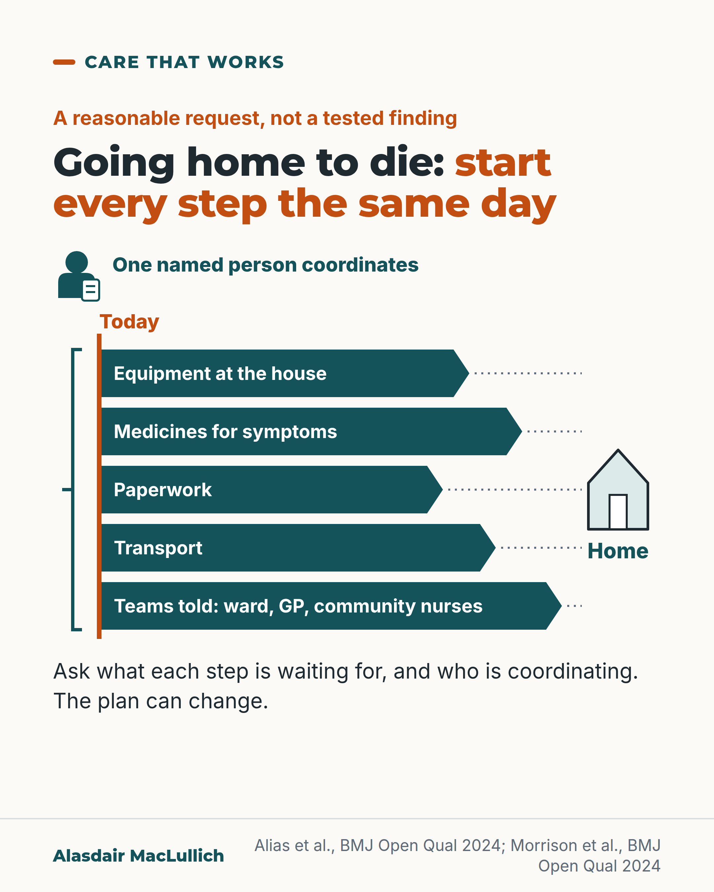

# G156: Getting home to die: start every step the same day

- Category: C15 Hospital care, emergency care and discharge
- Audience: public
- Series: Care that works
- Post type: good_care
- Visual format: diagram (parallel lanes)
- Status: text text_final, visual final
- Working id: C15-P09 (candidate C15-07)

## Insight

Going home to die involves several separate tasks, and hospital projects in England and Singapore found that hold-ups included equipment, medicines, paperwork and poor communication between teams. Asking for every step to start at once, with one named person coordinating, is a reasonable request. A person may die before leaving: in one English project, 10 in 104 referred people did.

## Angle and position

A rapid discharge home is only as quick as its slowest task. Families can ask what each task is waiting for. The same-day principle is a judgement, not a tested finding, and the plan can change. Position: ask for all the steps to start at once and for one person to coordinate, and be told openly that the person may die before leaving.

Basis: mixed: the hold-ups and the 10 in 104 figure are findings from two single-site improvement projects with no comparison group; that all steps should start at once with one coordinator, and that the plan can change, are judgements.

## X (935 characters)

```text
When someone who is dying wants to go home, ask the ward to start every part of the discharge today, and ask what each part is waiting for.

Going home needs several separate things: equipment at the house, medicines for symptoms, paperwork, transport, and the community teams told. Hospital improvement projects in England and Singapore found that delays included getting equipment and medicines to the home, poor communication between teams, and paperwork.

A person may die before the discharge can happen. In one English hospital project, 10 in 104 people referred to an end-of-life discharge team died before they could leave. For the 94 who did get home, the middle (median) wait for discharge was 1 day. The plan can change if the person gets worse quickly.

No study compared starting everything at once with starting in turn, so this is a reasonable request, not a tested one. We should ask for one named person to coordinate.
```

## LinkedIn (1928 characters)

```text
When someone who is dying wants to go home, ask the ward to start every part of the discharge today, and ask what each part is waiting for.

Going home involves several separate tasks. Equipment such as a bed or commode has to reach the house. Medicines for symptoms have to be there. Paperwork has to be finished, transport arranged, and the community teams told. A delay in any one can stop the person getting home.

Two hospital improvement projects, one in England and one in Singapore, found that delays included getting equipment and medicines to the home, poor communication between teams, and paperwork. Both were single-site projects without a control group, so they show what held discharge up in those hospitals, not a ranking of causes everywhere.

A person may die before the discharge can happen. In the English project, in Somerset, 10 in 104 people referred to an end-of-life discharge team died before they could leave. For the 94 who did get home, the middle (median) wait to discharge was 1 day, and they survived a median of 9 days after discharge. In the Singapore project, 59 of 61 rapid discharges in the final year got the person home. In the other 2, the person died in hospital after delays in equipment and paperwork. A further 19 requests that year did not go ahead. In 10, the person got worse very quickly. In 7, the family changed their mind. In 2, the person was medically unsuitable. The project excluded these from its success rate. These are single-hospital figures, not UK rates.

National guidance for England covers planning symptom medicines in advance for the last days of life, so they are available at home.

No study compared starting everything on the same day with starting in turn, so this is a reasonable request rather than a finding. Asking for one named person to coordinate is also a judgement. We should ask for both, and be told openly that the person may die before leaving.
```

## Bluesky (272 characters)

```text
If someone who is dying wants to go home, ask the ward to start every part of the discharge today. In one English project, 10 in 104 people referred to an end-of-life discharge team died before leaving hospital. Ask who coordinates. We found no study testing this request.
```

## Threads (496 characters)

```text
When someone who is dying wants to go home, ask the ward to start every part of the discharge today, and ask what each part is waiting for.

Hospital projects in England and Singapore found that delays included equipment, medicines, paperwork and poor communication between teams. In one English project, 10 in 104 people referred to an end-of-life discharge team died before they could leave.

Ask for one named person to coordinate. We found no study testing this request, so it is a judgement.
```

## Source reply

Sources: https://doi.org/10.1136/bmjoq-2023-002666 (Singapore project) https://doi.org/10.1136/bmjoq-2024-002790 (Somerset project) https://doi.org/10.7861/clinmedicine.16-3-254 (care in the last days of life)

## Visual



Alt text: Diagram: five teal lanes start together at a line marked Today and run to a house marked Home: equipment at the house, medicines for symptoms, paperwork, transport, and teams told. A bracket and figure show one named person coordinates. Marked as a reasonable request, not a tested finding.

Editable source: `visuals/src/G156.html`

Design instructions: Single 4:5 light card. Orange kicker, h1.s; SVG with five teal arrow lanes of different lengths from an orange Today line, teal bracket, coordinator figure with clipboard, dotted joins to a house icon labelled Home. Claim C15-07-b (not shown).

## Sources and verification

- C15-07-a (supported_with_qualification): Barriers to rapid (compassionate) discharge include getting equipment and medicines and poor communication between teams
  - Source: Alias R, Neo YL, Wang L, Sie LZ, Goh HJ, Mohamed Hussein MY, et al. Fulfilling last wishes: improving the compassionate discharge process. BMJ Open Qual. 2024;13(3):e002666.; Morrison J, Robinson F, Witney A, Greene H, Marks C, Davis C. Careirst-ndater (CareFFuL): an end-of-life home care quality improvement project. BMJ Open Qual. 2024;13(2):e002790.
  - Passage: "Process mapping, an Ishikawa diagram and a Pareto chart were used to identify barriers, which included timely acquisition of home equipment and medication and poor communication among stakeholders. | Barriers identified included sourcing of equipment, communication between teams and clunky paperwork." (Abstracts)
- C15-07-b (supported_with_qualification): Some people referred for rapid discharge die in hospital before discharge
  - Source: Morrison J, Robinson F, Witney A, Greene H, Marks C, Davis C. Careirst-ndater (CareFFuL): an end-of-life home care quality improvement project. BMJ Open Qual. 2024;13(2):e002790.
  - Passage: "The average time to discharge was 6.3 days and 29% died in hospital, as median survival was only 15 days. ... In phase 2, we extended the pilot, and 104 patients were identified; 94 people were discharged to home, with a median of wait of 1 day (range 0-7) to discharge, and 10 (9.6%) died prior to discharge (median 1 day; range 0-4). Median survival from discharge for the 94 who achieved their wishes to go home to die was 9 days" (Abstract)
- C15-07-c (supported_with_qualification): NICE NG31 covers anticipatory prescribing for last days of life
  - Source: Hodgkinson S, Ruegger J, Field-Smith A, et al. Care of dying adults in the last days of life. Clin Med (Lond). 2016;16(3):254-8.
  - Passage: "This Concise Guideline overviews NICE Clinical Guideline (NG31), which addresses: recognising dying; communication and shared decision making; maintaining hydration; and pharmacological symptom control, including anticipatory prescribing." (Abstract)
- C15-07-d (partly_supported): NHS CHC Fast Track funds care quickly (England)
  - Source: Morrison J, Robinson F, Witney A, Greene H, Marks C, Davis C. Careirst-ndater (CareFFuL): an end-of-life home care quality improvement project. BMJ Open Qual. 2024;13(2):e002790.
  - Passage: "assessment processes for care funding, through continuing healthcare fast-track funding often inhibit people being able to die at home." (Abstract, Background)

Verification notes: Claim wording used is the B3 batch for C15-07-a (England and Singapore projects: Alias 2024 full text; Morrison 2024 abstract) and C15-07-b (10 of 104 died before discharge, median wait 1 day, median survival after discharge 9 days; the 29% background figure not used). The Singapore figures (59 of 61 home, 2 died after delays in equipment and paperwork) are from the B2 version of C15-07-b, used with the 'single hospital, not a UK rate' qualification; 'did not get home', not 'died', applies to the 10 who deteriorated, which are not quoted. C15-07-c: the same-day starting and the named coordinator are judgement (B2 'partly supported'). C15-07-d (B2) / -c (B3): NICE guidance on planning symptom medicines in advance, from the Hodgkinson 2016 abstract; kept general, England-focused. NHS Continuing Healthcare Fast Track deliberately left out, as the editor allowed. 'Home is one of several good places to die' is judgement.

## Attention and follow potential

Pause: Families are rarely told that a rapid discharge is several separate tasks that can each hold it up.

Gain: Two questions to ask the ward, and a plain account of what the evidence does and does not show.

Follow: Examples of good care described with their evidence, including where time runs out.

## Open issues

None.
