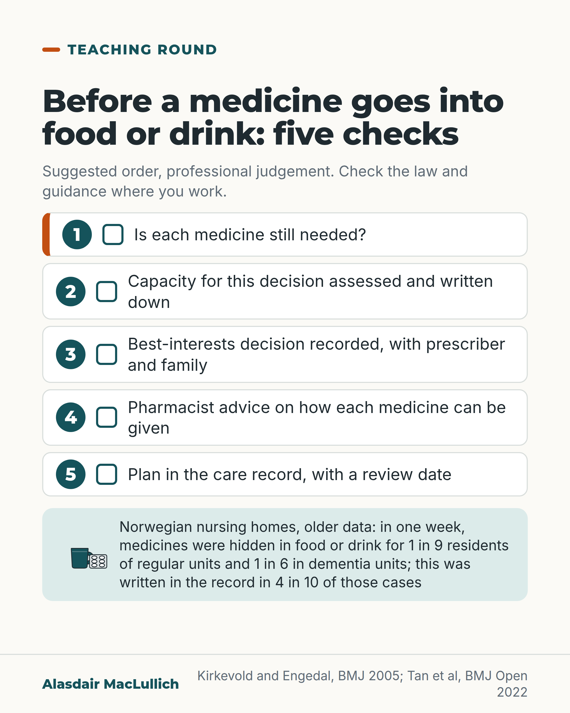

# G157: Before a medicine goes into food or drink

- Category: C16 Primary care, home care and care homes
- Audience: practitioners
- Series: Teaching round
- Post type: teaching
- Visual format: single card
- Status: text text_final, visual final
- Working id: C16-P01 (candidate C16-17)

## Insight

Before a medicine is hidden in food or drink, ask whether the person still needs it; then follow a documented capacity and best-interests process with pharmacist advice on each medicine. In one older Norwegian study, hidden medicines were common and often unrecorded.

## Angle and position

Covert administration is taught as a legal step. This post puts a clinical question first (is each medicine still needed?) and then sets out a suggested order of checks as professional judgement, with the one sourced practical point that a pharmacist-developed checklist asks about coating, modified release and taste.

Basis: Empirical finding: Norwegian prevalence and recording figures (old data) and the pharmacist considerations (consensus tool). Ethical and clinical judgement: the suggested sequence of checks and the 'still needed' first question, marked as 'we should' and 'suggested'. No national guidance or law is cited.

## X (871 characters)

```text
Before a medicine goes into someone's food or drink, ask whether they still need it.

In a Norwegian study of nursing homes, about 1 in 9 residents in regular units, and 1 in 6 in dementia units, had medicines hidden in food or drink in one week. The record said so in only 4 in 10 cases. The data were published in 2005 and are from Norway, so UK figures may differ.

We suggest hiding a medicine only after a documented capacity assessment and a best-interests decision, with a pharmacist involved. This is judgement, not a legal summary: check the law and guidance where you work. A pharmacist-developed checklist for judging whether a tablet can be crushed or mixed into food asks about special coating, modified release (made to release slowly) and taste. Ask a pharmacist about each medicine.

Stopping a medicine that no longer helps means fewer medicines to hide.
```

## LinkedIn (1404 characters)

```text
Before a medicine goes into someone's food or drink, ask whether they still need it.

Giving medicines hidden in food or drink is called covert administration. It is a decision made about a person who may not be able to decide for themselves.

A Norwegian study followed 1,926 nursing home residents. In one week, medicines were hidden in food or drink at least once for about 1 in 9 residents in regular units and 1 in 6 in dementia units. The practice was written in the record in only 4 in 10 cases. The data were published in 2005 and are from Norway, so UK figures may differ.

A sequence we suggest, as professional judgement:

1. Ask whether each medicine is still needed. Stopping one that no longer helps means fewer medicines to hide.
2. Assess and document the person's capacity for this decision.
3. Record a best-interests decision, made with the prescriber and the family.
4. Ask a pharmacist how each medicine can be given.
5. Write the plan in the care record, with a date to review it.

On step 4: a pharmacist-developed checklist for judging whether a tablet can be crushed or mixed into food asks about special coating, modified release (made to release slowly) and taste. Ask about each medicine rather than assuming one answer for all of them.

Before you hide any medicine in food or drink, check the law and guidance where you work, and ask again whether the person still needs it.
```

## Bluesky (296 characters)

```text
Before hiding a medicine in food or drink, ask if the person still needs it. In an older Norwegian nursing home study, medicines were hidden in a week for about 1 in 9 residents of regular units and 1 in 6 in dementia units. Only 4 in 10 cases were recorded. Ask a pharmacist about each medicine.
```

## Threads (479 characters)

```text
Before a medicine goes into someone's food or drink, ask whether they still need it.

In an older Norwegian study, medicines were hidden in food or drink in one week for about 1 in 9 residents in regular nursing home units and 1 in 6 in dementia units. The record said so in only 4 in 10 cases. UK figures may differ.

We suggest hiding a medicine only after a documented capacity and best-interests decision, with a pharmacist's advice on each one. Check the law where you work.
```

## Source reply

Sources: Kirkevold and Engedal, BMJ 2005 https://doi.org/10.1136/bmj.38268.579097.55 | Tan et al, BMJ Open 2022 https://doi.org/10.1136/bmjopen-2022-061774

## Visual



Alt text: Checklist of five checks before a medicine is hidden in food or drink: is each medicine needed, capacity assessed, best-interests decision recorded, pharmacist advice, and a plan with a review date. A strip notes older Norwegian data: 1 in 9 and 1 in 6 residents, recorded in 4 in 10 cases.

Editable source: `visuals/src/G157.html`

Design instructions: Single card, off-white. Headline, five numbered rows (teal circle, empty box), row 1 orange left bar, mint strip with cup and blister icons and the Norwegian figures. Claim C16-17-a.

## Sources and verification

- C16-17-a (supported_with_qualification): Covert administration is common and often poorly documented.
  - Source: Kirkevold O, Engedal K. Concealment of drugs in food and beverages in nursing homes: cross sectional study. BMJ. 2005;330(7481):20.
  - Passage: "11% of the patients in regular nursing home units and 17% of the patients in special care units for people with dementia received drugs mixed in their food or beverages at least once during seven days. ... The practice was documented in patients' records in 40% (96/241) of cases." (Abstract, Results)
- C16-17-b (supported_with_qualification): Tablets with special coatings or modified release, and bitter-tasting medicines, may be unsuitable for crushing or mixing.
  - Source: Tan PL, Chung WL, Sklar GE, Yap KZ, Chan SY. Development and validation of the INappropriate solid oral dosaGE form modification aSsessmenT (INGEST) Algorithm using data of patients with medication dysphagia from a neurology ward and nursing home in Singapore. BMJ Open. 2022;12(9):e061774.
  - Passage: "considerations included by consensus in the INGEST algorithm were the presence of special coating or modified release characteristics of the SODF medications, hazardous nature and taste of the active ingredients, manufacturer's advice and use of tube feeding." (Abstract, Results)
- C16-17-c (not_found): NICE SC1 and Scottish AWI Act/MWC guide steps (capacity, best interests, section 47 certificate).
  - Source: 
  - Passage: "" ()

Verification notes: C16-17-a: Kirkevold and Engedal BMJ 2005 (abstract): 11% regular units, 17% dementia special care units, documented 40% (96/241) in 7 days; Norwegian, old, UK figures may differ (carried). C16-17-b: Tan 2022 BMJ Open (abstract), consensus tool: coating, modified release and taste considered; worded as what pharmacists check. C16-17-c not found: no NICE or Mental Welfare Commission steps cited; the sequence is stated as 'we should' judgement and 'suggested'. Access level: abstract.

## Attention and follow potential

Pause: A practical question (is it still needed?) placed before the legal steps; a recording figure many teams will not expect.

Gain: A five-step order to follow and one practical pharmacy point to check before a tablet is crushed or mixed.

Follow: Teaching rounds on the practical pharmacy and decision-making of care home medicine.

## Open issues

- NICE SC1 and Scottish Mental Welfare Commission steps not opened, so the sequence is professional judgement, not attributed to guidance; the post tells readers to check local law.
- Editor's note suggested stating the Scottish route; not possible without an opened source.
