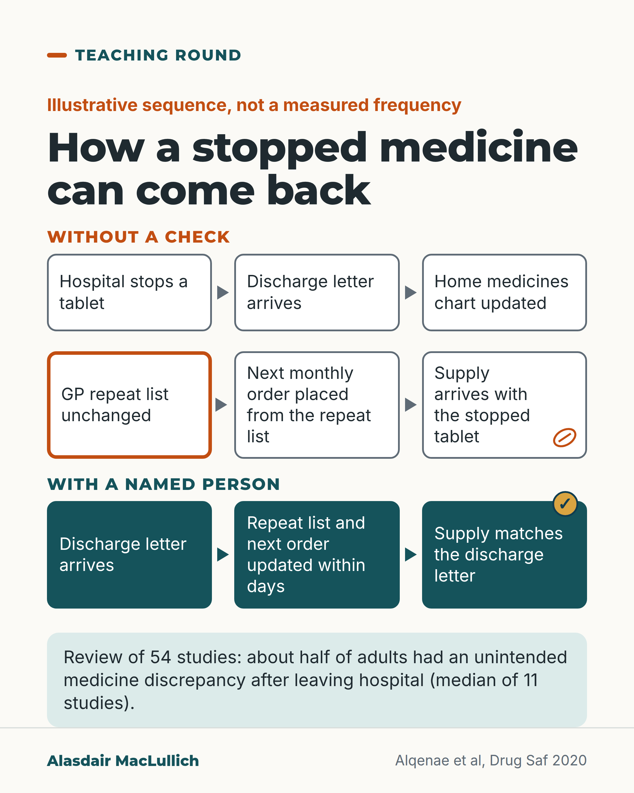

# G158: The tablet stopped in hospital that came back

- Category: C16 Primary care, home care and care homes
- Audience: practitioners
- Series: Teaching round
- Post type: teaching
- Visual format: single card
- Status: text text_final, visual final
- Working id: C16-P02 (candidate C16-11)

## Insight

After a hospital stay, about half of adults in a systematic review had at least one unintended medicine discrepancy; one illustrative route is a stopped tablet returning through the GP repeat list and the next monthly order, which a named person can check within days.

## Angle and position

Follows one handover across services without blaming any of them. The repeat-list route is labelled as an illustration, not a measured frequency; the measured part is the review median.

Basis: Empirical finding: review median of unintended discrepancies after discharge. Illustration: the repeat-list sequence. Judgement: a named person should reconcile the repeat list and next order within days.

## X (641 characters)

```text
If the GP repeat list isn't updated after a hospital stay, a stopped medicine can come back in the next monthly supply.

That is an illustrative sequence, not a measured frequency. Measured figures cover more than this route. In a systematic review, about half of adults had at least one unintended medicine discrepancy after leaving hospital. That is the median across 11 studies. The middle half of the studies reported between 39 and 76 in 100. Definitions varied, and the studies were not limited to care homes.

We should name one person to check the repeat list and the next pharmacy order within days of the discharge letter arriving.
```

## LinkedIn (1227 characters)

```text
If the GP repeat list isn't updated after a hospital stay, a stopped medicine can come back in the next monthly supply.

One way it can happen, as an illustrative sequence and not a measured frequency: the hospital stops a tablet and says so in the discharge letter. The care home or the person at home updates their medicines chart. The GP repeat list stays the same. The next monthly order is placed from the repeat list, and the new supply arrives with the stopped tablet in it.

What has been measured is wider. A systematic review of 54 studies of people discharged from hospital to community settings found that, for adults, the median rate of unintended medicine discrepancies after discharge was 50% across 11 studies. The middle half of those studies reported between 39 and 76 in 100, so the spread is wide. Studies defined discrepancies differently, and the review was not limited to care homes. It did not measure the repeat-list route described above.

At each handover the list can differ from the plan: hospital to home, home to GP, GP to pharmacy.

We should name one person (for example the practice pharmacist) to check the repeat list and the next pharmacy order within days of the discharge letter arriving.
```

## Bluesky (296 characters)

```text
A tablet stopped in hospital can come back if the GP repeat list isn't updated (an illustrative route, not a measured rate). In a systematic review, about half of adults had an unintended medicine discrepancy after discharge (median of 11 studies). We should name who checks the list within days.
```

## Threads (438 characters)

```text
If the GP repeat list isn't updated after a hospital stay, a stopped medicine can come back in the next monthly supply. That is an illustrative route, not a measured rate.

In a systematic review, about half of adults had at least one unintended medicine discrepancy after leaving hospital (median of 11 studies, with wide variation).

We should name one person to check the repeat list and next order within days of the discharge letter.
```

## Source reply

Source: Alqenae et al, Drug Saf 2020 https://doi.org/10.1007/s40264-020-00918-3

## Visual



Alt text: Diagram of how a stopped medicine can return. Without a check, a hospital stops a tablet but the GP repeat list stays unchanged and the next supply includes it. With a named person, the repeat list is updated and the supply matches the discharge letter. Review: about half of adults had a discrepancy.

Editable source: `visuals/src/G158.html`

Design instructions: Single card. Orange label Without a check: six boxes in 2 rows of 3 with arrows, GP repeat list box orange outline, tablet icon on last. Teal label With a named person: three teal boxes, tick on last. Mint strip with review figure. Claim C16-11-a. No people.

## Sources and verification

- C16-11-a (supported_with_qualification): Medication errors and unintentional discrepancies after hospital discharge are common.
  - Source: Alqenae FA, Steinke D, Keers RN. Prevalence and nature of medication errors and medication-related harm following discharge from hospital to community settings: a systematic review. Drug Saf. 2020;43(6):517-37.
  - Passage: "For adult patients, the median rate of medication errors and unintentional medication discrepancies following discharge was 53% [interquartile range 33-60.5] (n = 5 studies) and 50% [interquartile range 39-76] (n = 11), respectively." (Abstract, Results)
- C16-11-b (not_found): Stopped medicines reappear via the GP repeat list and next monthly order; NICE SC1 reconciliation; Discharge Medicines Service; readmission reduction.
  - Source: 
  - Passage: "" ()

Verification notes: C16-11-a: Alqenae et al, Drug Saf 2020 (abstract): median unintentional discrepancy rate 50% (IQR 39 to 76, 11 studies), median medication error rate 53% (5 studies); adults discharged to community, follow-up 2 to 180 days; definitions vary; not care-home specific; does not measure the repeat-list mechanism (all carried). C16-11-b not found: repeat-list route presented only as an illustrative sequence; no NICE, Discharge Medicines Service or readmission claim made. Access level: abstract.

## Attention and follow potential

Pause: The specific point in the system where a stopped medicine returns, drawn as a sequence practitioners will recognise.

Gain: A precise handover to check, a named owner for it, and an honest note on what is measured and what is illustration.

Follow: Teaching that follows a problem across services without blaming any one of them.

## Open issues

- The repeat-list mechanism is unsourced and appears only as a labelled illustration.
- The suggestion that the practice pharmacist checks is a recommendation, not a finding.
