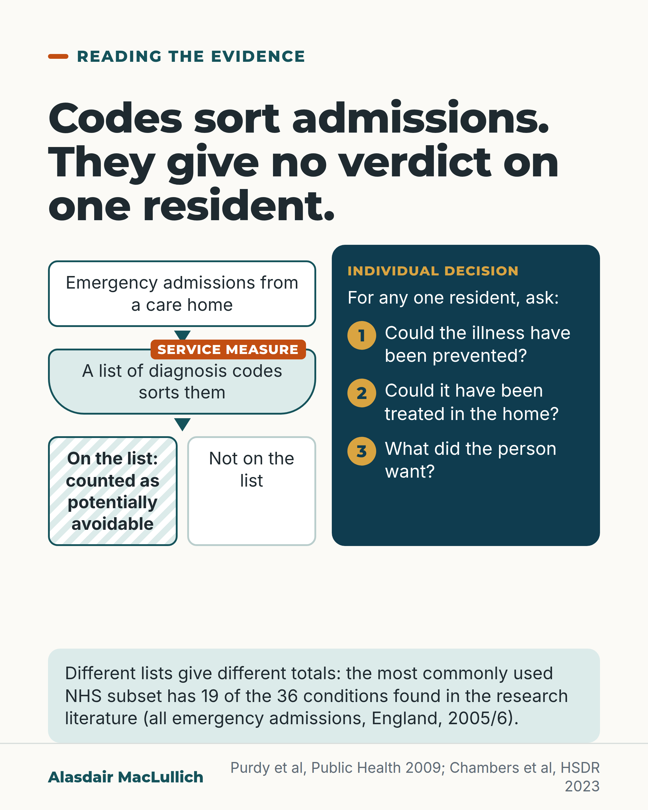

# G159: What 'potentially avoidable' admissions from care homes means

- Category: C16 Primary care, home care and care homes
- Audience: practitioners
- Series: Reading the evidence
- Post type: evidence_interpretation
- Visual format: single card
- Status: text text_final, visual final
- Working id: C16-P03 (candidate C16-18)

## Insight

'Potentially avoidable' emergency admissions are counted from lists of diagnosis codes, and different lists give different totals. The count is used to compare services; it gives no verdict on whether one resident should have gone to hospital.

## Angle and position

Defends fair treatment of the individual resident while accepting its use to compare services. The proportion reported by the Health Foundation is omitted because no opened copy was available.

Basis: Empirical: the code-list basis and variation (Purdy 2009), use as an outcome in care home evaluations (Lloyd 2019), and the 2023 review's note that admissions are often necessary and do-not-hospitalise orders were problematic. Judgement: the count is a service measure and should not be used to argue against one resident's transfer; the three questions are suggested.

## X (1117 characters)

```text
We should not use a count of 'potentially avoidable' admissions to argue against sending an individual resident to hospital. It is a service measure.

The label is put on emergency admissions using lists of diagnosis codes, and different lists give different totals. The most commonly used NHS list contained 19 of the 36 conditions found in the research literature. This comes from an analysis of all emergency admissions in England in 2005/6, not care homes specifically.

The measure is used to compare services and programmes for care homes. Because lists differ, totals from different lists are not directly comparable.

A 2023 systematic review of ways to reduce unplanned care home admissions described such admissions as 'often necessary' (the authors' framing, not a measured finding). It also found that advance care planning was key to the success of most quality improvement programmes, but do-not-hospitalise orders were problematic. Most of the evidence was low quality.

For any one case, ask: could the illness have been prevented, could it have been treated in the home, and what did the person want?
```

## LinkedIn (1621 characters)

```text
'Potentially avoidable' is a label put on emergency admissions using lists of diagnosis codes. A code-based count gives no verdict on whether one resident should have gone to hospital.

How the label works. Admissions are sorted by their diagnosis codes into those on a list of 'ambulatory care sensitive' conditions (the technical name for the list of diagnosis codes behind the label) and those not on it. The lists vary. In an analysis of all emergency admissions in England in 2005/6, the most commonly used NHS list contained 19 of the 36 conditions found in the research literature. The choice of list changed the proportion of admissions counted. That study covered all emergency admissions, not care homes specifically.

How it is used. 'Potentially avoidable emergency admissions' is an outcome in evaluations of support for care homes, for example in a matched cohort study in Rushcliffe, England.

What the 2023 NIHR systematic review noted. The review of ways to reduce unplanned care home admissions described such admissions as 'often necessary' (the authors' framing, not a measured finding). It found that advance care planning was key to the success of most quality improvement programmes, but do-not-hospitalise orders were problematic. The evidence in the review was mostly of low quality.

Our judgement: the count is used to compare services. We should not use it to argue against sending an individual resident to hospital when they need and want it. For any one case, three questions help: could the illness have been prevented, could it have been treated in the home, and what did the person want?
```

## Bluesky (298 characters)

```text
'Potentially avoidable' admissions from care homes are counted from diagnosis code lists, and different lists give different totals. The count measures services, not one resident's transfer. For one resident, ask: could it have been prevented? Could it be treated at home? What did the person want?
```

## Threads (478 characters)

```text
'Potentially avoidable' admissions from care homes are counted from lists of diagnosis codes, and different lists give different totals.

The count is used to compare services. A 2023 review described care home admissions as 'often necessary' (the authors' view, not a measured finding).

For one resident, ask: could it have been prevented, could it have been treated in the home, and what did the person want? We should not use the count to argue against a transfer they need.
```

## Source reply

Sources: Purdy et al, Public Health 2009 https://doi.org/10.1016/j.puhe.2008.11.001 | Lloyd et al, BMJ Qual Saf 2019 https://doi.org/10.1136/bmjqs-2018-009130 | Chambers et al, Health Soc Care Deliv Res 2023 https://doi.org/10.3310/KLPW6338

## Visual



Alt text: Flow diagram: emergency admissions from a care home are sorted by a list of diagnosis codes into on the list or not. A panel gives three questions for one resident: preventable, treatable at home, what the person wanted. The most used NHS list has 19 of 36 conditions.

Editable source: `visuals/src/G159.html`

Design instructions: Single card. Left flow: admissions box, arrow, funnel box with orange Service measure tab, arrow, hatched On the list box and plain Not on the list box. Right deep teal panel Individual decision with three numbered questions. Mint strip 19 of 36. Claim C16-18-a.

## Sources and verification

- C16-18-a (supported): 'Potentially avoidable' (ambulatory care sensitive) admissions are defined by lists of diagnosis codes, and the lists vary, which changes how many admissions are counted as avoidable.
  - Source: Purdy S, Griffin T, Salisbury C, Sharp D. Ambulatory care sensitive conditions: terminology and disease coding need to be more specific to aid policy makers and clinicians. Public Health. 2009;123(2):169-73.
  - Passage: "The underlying ICD10 codes used to define ACSCs vary widely across subsets of ACSCs used in the NHS. This impacts on rates of admission, length of stay and costs attributable to ACSCs. ... different conceptual interpretations of the term 'ACSC' and use of differing definitions and diagnostic codes impact on the proportion of admissions that are attributed as ACSCs." (Abstract, Results and Conclusions)
- C16-18-b (supported): The measure is used to judge services: 'potentially avoidable emergency admissions' is an outcome in evaluations of support to care homes.
  - Source: Lloyd T, Conti S, Santos F, Steventon A. Effect on secondary care of providing enhanced support to residential and nursing home residents: a subgroup analysis of a retrospective matched cohort study. BMJ Qual Saf. 2019;28(7):534-46.
  - Passage: "Residents of participating residential care homes showed lower rates of potentially avoidable emergency admissions (rate ratio 0.50, 95% CI 0.30 to 0.82), emergency admissions (rate ratio 0.60, 95% CI 0.42 to 0.86) and Accident & Emergency attendances (0.57, 95% CI 0.40 to 0.81) than matched controls." (Abstract, Results)
- C16-18-c (supported): Hospital admission from a care home is often necessary; blanket do-not-hospitalise approaches were problematic.
  - Source: Chambers D, Cantrell A, Preston L, Marincowitz C, Wright L, Conroy S, Lee Gordon A. Reducing unplanned hospital admissions from care homes: a systematic review. Health Soc Care Deliv Res. 2023;11(18):1-130.
  - Passage: "While often necessary, such admissions can be distressing and provide an opportunity cost as well as a financial cost. ... Advance care planning was key to the success of most quality improvement programmes but do-not-hospitalise orders were problematic." (Abstract, Background and Results)

Verification notes: C16-18-a: Purdy et al, Public Health 2009 (abstract): ACSC ICD-10 code lists vary; NHS subset used 19 of 36 conditions; all emergency admissions, England 2005/6, not care homes (carried). The 35% figure in the claim row is ambiguous and not used. C16-18-b: Lloyd et al, BMJ Qual Saf 2019 (abstract): potentially avoidable emergency admissions used as an outcome; rate ratio deliberately not quoted; observational. C16-18-c: Chambers et al, HSDR 2023 (abstract): 'often necessary' is the authors' framing; do-not-hospitalise orders problematic; evidence mostly low quality. C16-18-d not found: Wolters et al 2019 proportion omitted per editor guidance. The post does not say the classification involves no case review, because the sources do not state it. Access level: abstract.

## Attention and follow potential

Pause: Practitioners who hear the figure quoted in meetings get a precise reading of what it is built from.

Gain: A way to read the measure and three questions that keep the individual decision separate.

Follow: Evidence reading that protects fair treatment of individual residents.

## Open issues

- Wolters et al 2019 (Health Foundation) proportion not stated: no opened copy.
- Kept distinct from C15-22 by focusing on the code-list basis and the individual-resident questions; C15-22 text not checked by this writer.
