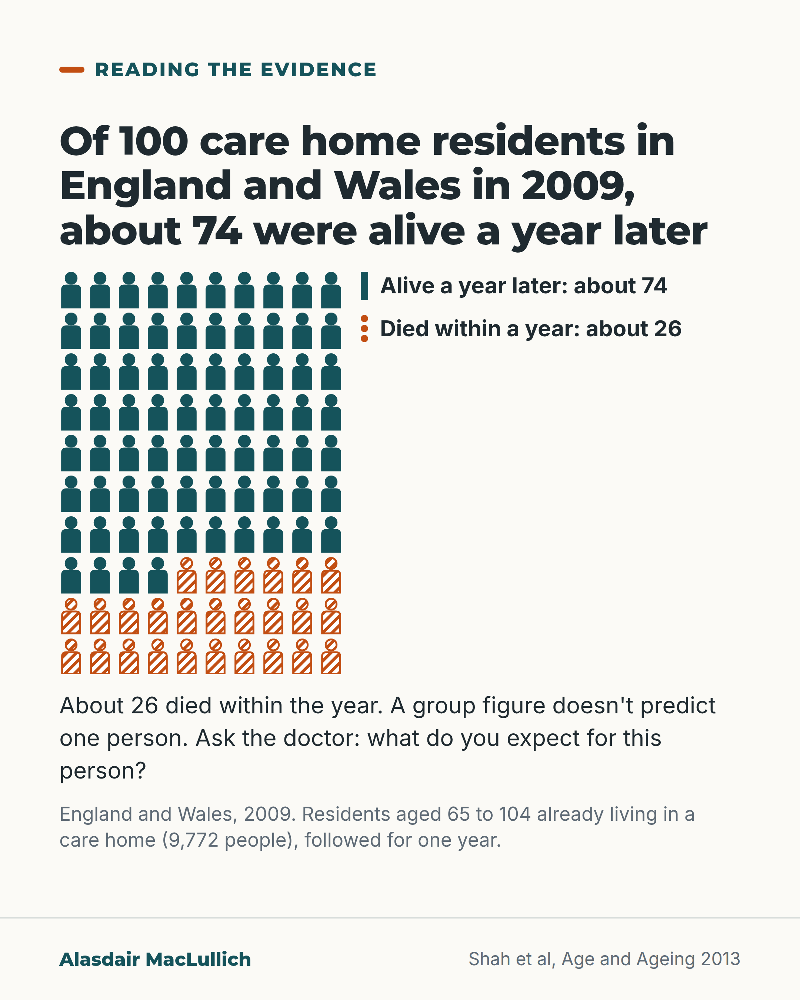

# G160: Reading survival figures for care home residents

- Category: C16 Primary care, home care and care homes
- Audience: public
- Series: Reading the evidence
- Post type: evidence_interpretation
- Visual format: single card
- Status: text text_final, visual final
- Working id: C16-P04 (candidate C16-12)

## Insight

About 26 in 100 care home residents in England and Wales died within a year (2009 data), so about 74 in 100 were alive a year later. A group figure can't tell a family about one person; the question to ask is what the doctor expects for this person.

## Angle and position

Families search for these numbers. The post gives the number in both directions, explains what a group figure and a median are, and ends on a question to put to a clinician. It avoids a length-of-stay histogram because none is verified.

Basis: Empirical finding: Shah 2013 one-year mortality and nursing versus residential difference. Clinical interpretation: a group figure does not predict one person; the study cannot show whether the type of home affects survival, because residents of the two kinds of home may differ in how unwell they are. Judgement: asking the clinician about this person is the useful next step.

## X (843 characters)

```text
About 26 in every 100 people aged 65 and over living in care homes in England and Wales died within a year (data from 2009). About 74 in 100 were still alive a year later.

The study counted residents who were already living in a home on one date. It did not follow people from the day they moved in. After allowing for differences in age and sex, death rates were higher in nursing homes than in residential homes. This study can't show whether the type of home affects how long people live. Residents of the two kinds of home may differ in how unwell they are.

A group figure can't tell you how long one person will live. If you see a median survival figure, it is the point where half the group lived longer and half lived for a shorter time.

If you are asking about someone you love, ask their doctor: what do you expect for this person?
```

## LinkedIn (1038 characters)

```text
About 26 in every 100 people aged 65 and over living in care homes in England and Wales died within a year. About 74 in 100 were still alive a year later. These figures come from 2009 data.

The study followed 9,772 care home residents aged 65 to 104 for one year. They were people already living in a home on one date. They were not counted from the day they moved in, so these figures do not show survival from the day someone moves in.

After allowing for differences in age and sex, death rates were higher in nursing homes than in residential homes. This study can't show whether the type of home affects how long people live: residents of the two kinds of home may differ in how unwell they are.

A group figure tells you about a group. It can't tell you how long one person will live. If you see a median survival figure, it is the point where half the group lived longer and half lived for a shorter time.

If you are asking about someone you love, ask their doctor: what do you expect for this person, and what would change that?
```

## Bluesky (245 characters)

```text
In England and Wales in 2009, about 26 in 100 care home residents aged 65 and over died within a year. About 74 in 100 were alive a year later. A group figure can't tell you about one person. Ask their doctor: what do you expect for this person?
```

## Threads (495 characters)

```text
About 26 in 100 people aged 65 and over in care homes in England and Wales died within a year (2009 data). About 74 in 100 were still alive a year later.

After allowing for differences in age and sex, death rates were higher in nursing homes than in residential homes. This study can't show whether the type of home affects survival: residents may differ in how unwell they are.

A group figure can't tell you how long one person will live. Ask their doctor: what do you expect for this person?
```

## Source reply

Source: Shah et al, Age Ageing 2013 https://doi.org/10.1093/ageing/afs174

## Visual



Alt text: Grid of 100 person icons: 74 solid teal marked alive a year later, 26 hatched orange marked died within a year. England and Wales, 2009, 9,772 care home residents aged 65 to 104. Text says a group figure does not predict one person and suggests asking the doctor.

Editable source: `visuals/src/G160.html`

Design instructions: Single card. 10x10 person icons drawn in custom SVG: 74 solid teal, 26 orange hatched (last 2.6 rows). Direct labels beside grid. Body text and setting note. Claim C16-12-a (26.2%, n=9,772).

## Sources and verification

- C16-12-a (supported_with_qualification): About 1 in 4 older care home residents died within one year; mortality was higher in nursing homes than residential homes, relative to the general population of the same age and sex.
  - Source: Shah SM, Carey IM, Harris T, DeWilde S, Cook DG. Mortality in older care home residents in England and Wales. Age Ageing. 2013;42(2):209-15.
  - Passage: "a total of 2,558 (26.2%) care home and 11,602 (3.3%) community residents died within 1 year. The age and sex standardised mortality ratio for nursing homes was 419 (95% CI: 396-442) and for residential homes was 284 (266-302)." (Abstract, Results)
- C16-12-b (supported): A median is the value that half the group exceeds.
  - Source: 
  - Passage: "" (Definition)

Verification notes: C16-12-a: Shah et al, Age Ageing 2013 (abstract): 2,558 (26.2%) care home residents and 11,602 (3.3%) community residents died within 1 year; age and sex standardised mortality ratio 419 for nursing homes and 284 for residential homes. Carried qualifications: prevalent residents, not counted from admission; 2009 data; the difference between home types is not explained in the abstract, so the post says the study cannot show whether the type of home affects survival. Nursing versus residential given as 'after allowing for age and sex, higher in nursing homes'. Community figure not used (not age-matched). 9,772 residents and 65 to 104 age range from the source record. C16-12-b: median definition, standard statistics, no source needed. C16-12-c not found: no median length of stay or spread given. Access level: abstract.

## Attention and follow potential

Pause: A number families may have searched for late at night, given both ways round and with a clear limit.

Gain: How to read a survival figure, and the question to put to a doctor instead.

Follow: Careful explanations of statistics for the people who have to live with them.

## Open issues

- No verified UK distribution of survival from admission, so no median figure or spread is given; the median is defined only.
- 'Counted from residents already living in a home' is used to carry the prevalent-resident qualification in plain words.
