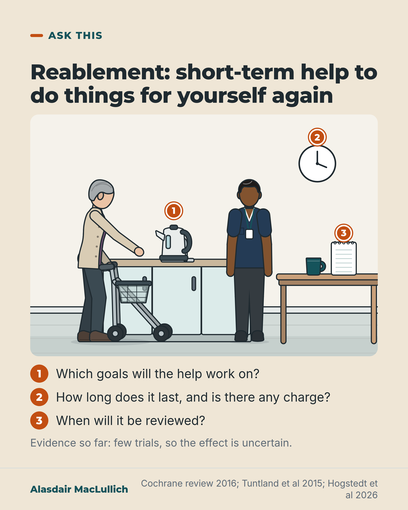

# G161: Reablement: what to ask when it is offered

- Category: C16 Primary care, home care and care homes
- Audience: both
- Series: Ask this
- Post type: public_explanation
- Visual format: single card
- Status: text text_final, visual final
- Working id: C16-P05 (candidate C16-28)

## Insight

Reablement is short-term help at home to do everyday things for yourself again. Trial evidence is thin and mixed, so the useful move is to ask which goals it will work on, how long it lasts, whether there is any charge, and when it will be reviewed.

## Angle and position

Explains an offer many families receive at discharge, states the evidence gap in plain words (not evidence of no benefit), and closes with four questions. The 'free for six weeks in England' claim was dropped because no opened source states it.

Basis: Empirical: definition and duration (Cochrane 2016), the small Norwegian trial, and the 2026 home rehabilitation review (reablement-based programmes). Judgement: reablement should be offered with clear personal goals and reviewed against them.

## X (1160 characters)

```text
Reablement is short-term help at home, usually lasting weeks rather than months, to help you do everyday things for yourself again. It works towards goals set with you.

There is little research on it. A 2016 Cochrane review (a careful summary of all the trials found on a question) found only 2 trials and was very uncertain whether reablement helps more than usual home care. One of those two trials was a small Norwegian trial of 61 people. Those offered 10 weeks of reablement rated their own performance of chosen activities somewhat better than people given usual care, at 3 and 9 months. There was no clear difference in physical capacity or quality of life.

A 2026 review of home rehabilitation trials combined the results of the programmes built on reablement. It did not show a clear difference in chosen activities or physical performance, and the certainty was low to very low. So the small trial's benefit for chosen activities is not firm.

Few trials exist and the certainty is low, so we do not know whether reablement helps more than usual care. If it is offered, ask: which goals, how long, is there any charge, and when will it be reviewed?
```

## LinkedIn (1699 characters)

```text
Reablement is short-term help at home, usually lasting weeks rather than months, to help you do everyday things for yourself again. It works towards goals set with you.

If you or someone you love is offered it after an illness or a hospital stay, this is what the evidence shows so far.

A 2016 Cochrane review (a careful summary of all the trials found on a question) found only 2 trials (811 people) and was very uncertain whether reablement helps more than usual home care. The evidence was of very low quality for all outcomes.

One of those two trials was a small Norwegian trial of 61 people. Those offered 10 weeks of reablement rated their own performance of the activities they had chosen about 1.5 points higher on a 10-point scale than people given usual care. This held at 3 months and at 9 months. The trial did not show a clear difference in physical capacity or quality of life.

A 2026 review of home rehabilitation trials combined the results of the programmes built on reablement. It did not show a clear difference in chosen daily activities or physical performance. The certainty of the evidence was low to very low, and few people were included in the combined results (291 for chosen activities, 555 for physical performance). The small trial's benefit for chosen activities is therefore not firm. This is a gap in the evidence, and we do not know whether reablement helps more than usual care.

Our judgement is that reablement should be offered with clear personal goals and reviewed against them. If it is offered to you, ask:

1. Which goals will the help work on?
2. How long will it last?
3. Is there any charge?
4. When will it be reviewed, and what happens at the end?
```

## Bluesky (288 characters)

```text
Reablement is short-term help at home to relearn everyday tasks. A 2016 Cochrane review (a summary of trials) found only 2 trials. A 2026 review found no clear difference from usual care for reablement programmes, with weak evidence. Ask: which goals, how long, any charge, when reviewed?
```

## Threads (496 characters)

```text
Reablement is short-term help at home to do everyday things for yourself again.

There is little research. A 2016 Cochrane review (a summary of trials) found only 2 trials. In one small trial, people offered reablement rated their own performance of chosen activities somewhat better than usual care. A 2026 review of trials found no clear difference (low to very low certainty), so that result is not firm.

If it is offered, ask: which goals, how long, any charge, and when will it be reviewed?
```

## Source reply

Sources: Cochrane review 2016 https://doi.org/10.1002/14651858.CD010825.pub2 | Tuntland et al, BMC Geriatr 2015 https://doi.org/10.1186/s12877-015-0142-9 | Hogstedt et al, BMC Geriatr 2026 https://doi.org/10.1186/s12877-026-07887-9

## Visual



Alt text: Kitchen scene: an older woman with a rollator fills a kettle herself while a care worker stands beside her, watching. Numbered pins mark the kettle, a wall clock and a notebook, matching three questions: goals, how long and any charge, and review. Evidence: few trials, effect uncertain.

Editable source: `visuals/src/G161.html`

Design instructions: Single sand card. Kit kitchen scene: older woman (grey pixie hair, plum, cardigan) with rollator reaching kettle on counter; care worker (brown skin, plum tunic) standing beside; table with cup and blank notepad; wall clock hands only. Orange pins 1 kettle, 2 clock, 3 notepad; numbered questions beneath. No data.

## Sources and verification

- C16-28-a (supported): Reablement is time-limited, goal-directed help at home to maximise independence.
  - Source: Cochrane A, Furlong M, McGilloway S, Molloy DW, Stevenson M, Donnelly M. Time-limited home-care reablement services for maintaining and improving the functional independence of older adults. Cochrane Database Syst Rev. 2016;10(10):CD010825.
  - Passage: "Unlike traditional home-care services, reablement is frequently time-limited (usually six to 12 weeks) and aims to maximise independence by offering an intensive multidisciplinary, person-centred and goal-directed intervention." (Abstract, Background)
- C16-28-c (supported_with_qualification): A 2016 Cochrane review found only two trials and very low certainty evidence.
  - Source: Cochrane A, Furlong M, McGilloway S, Molloy DW, Stevenson M, Donnelly M. Time-limited home-care reablement services for maintaining and improving the functional independence of older adults. Cochrane Database Syst Rev. 2016;10(10):CD010825.
  - Passage: "We are very uncertain as to the effects of reablement compared with usual care as the evidence was of very low quality for all of the outcomes reported." (Abstract, Main results)
- C16-28-d (supported_with_qualification): A Norwegian trial found reablement improved self-rated performance of, and satisfaction with, chosen daily activities.
  - Source: Tuntland H, Aaslund MK, Espehaug B, Forland O, Kjeken I. Reablement in community-dwelling older adults: a randomised controlled trial. BMC Geriatr. 2015;15:145.
  - Passage: "There were significant improvements in mean scores favouring reablement in COPM performance at 3 months with a score of 1.5 points (p = 0.02), at 9 months 1.4 points (p = 0.03) and overall treatment 1.5 points (p = 0.01), and for COPM satisfaction at 9 months 1.4 points (p = 0.03) and overall treatment 1.2 points (p = 0.04). No significant group differences were found concerning COPM satisfaction at 3 months, physical capacity or health-related quality of life." (Abstract, Results)
- C16-28-e (supported): The newest pooled evidence on reablement remains weak (evidence gap, not evidence of no benefit).
  - Source: Hogstedt K, Grooten WJA, Flink M, Baudin K, Guidetti S, Rydwik E. The components and effects of home rehabilitation on activities of daily living and physical performance of community dwelling older people with low physical performance - a systematic review and meta-analysis of randomized controlled trials. BMC Geriatr. 2026;26(1).
  - Passage: "Reablement-based interventions showed no significant effects on selected ADL tasks measured with Canadian Occupational Performance Measure (COPM) (n = 291, COPM performance MD 0.30, 95% CI - 0.25 to 0.86; COPM satisfaction MD 0.19, 95% CI - 0.04 to 0.42) or physical performance (n = 555, SMD 0.12, 95% CI - 0.05 to 0.28), with low to very low evidence according to GRADE. ... Evidence for other ADL outcomes and the Reablement-based remains limited." (Abstract, Results and Conclusions)

Verification notes: C16-28-a: Cochrane 2016 (abstract): time-limited, usually 6 to 12 weeks, goal-directed; worded as 'usually weeks rather than months'. C16-28-c: Cochrane 2016: 2 trials, 811 participants, very low certainty; old searches (2015) noted by naming the 2026 review. C16-28-d: Tuntland 2015 RCT (abstract): n=61, 10 weeks, COPM performance +1.5 at 3 months, +1.4 at 9 months on a 10-point scale; no significant difference in physical capacity or health-related quality of life; single small trial, self-rated. C16-28-e: Hogstedt 2026 (abstract): no significant pooled effect on COPM (n=291) or physical performance (n=555), low to very low certainty; stated as a gap, not evidence of no benefit. C16-28-b not found: no statement about the six-week rule or that reablement is free. Access level: abstract.

## Attention and follow potential

Pause: A recognisable offer at discharge, shown as a person doing the task herself, with questions to take away.

Gain: What reablement is, what the evidence does and does not show, and four questions to ask.

Follow: Evidence explained with its limits stated and a practical use.

## Open issues

- Editor's guidance allowed 'free for a limited period in England' if no evaluation states the six-week rule; the evidence file (C16-28-b not_found) does not support even that wording, so charging is left as a question to ask the council.
- Series changed from Reading the evidence (candidate) to Ask this because the post closes on questions to ask; two other posts in the set are Reading the evidence.
