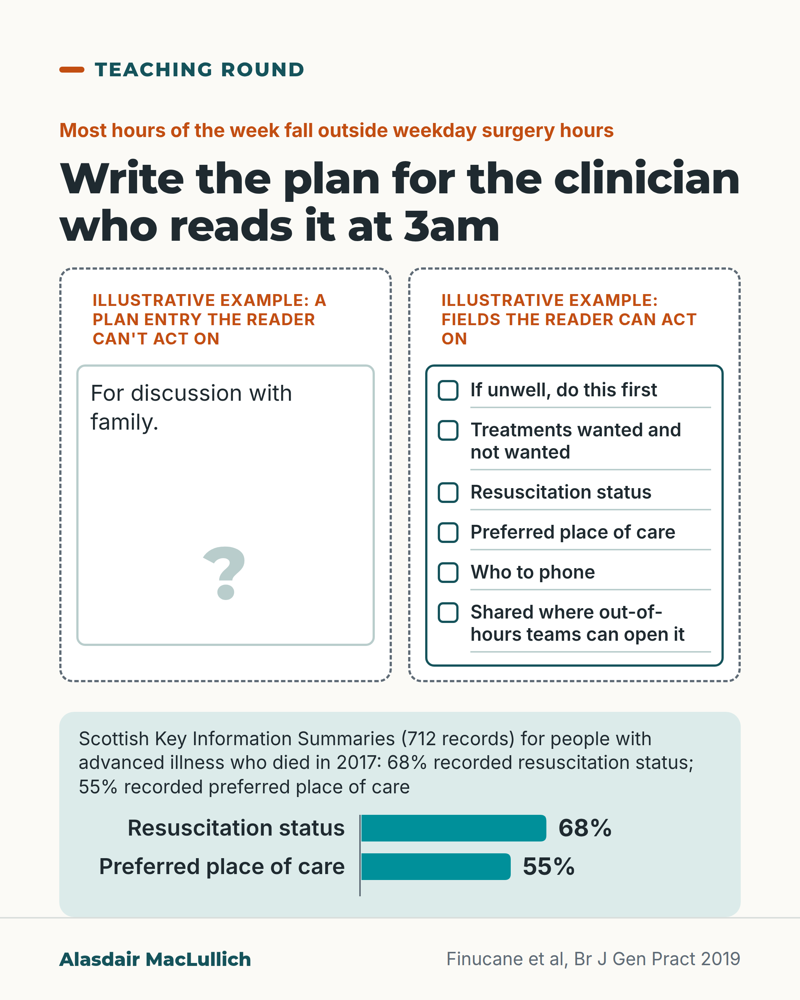

# G162: Write the care plan for the 3am reader

- Category: C16 Primary care, home care and care homes
- Audience: practitioners
- Series: Teaching round
- Post type: teaching
- Visual format: single card
- Status: text text_final, visual final
- Working id: C16-P06 (candidate C16-01)

## Insight

Anticipatory care plans are most useful when an out-of-hours clinician who has never met the person can find and act on them. In one Scottish study, a third of Key Information Summaries lacked resuscitation status and more than 4 in 10 lacked preferred place of care.

## Angle and position

Most hours of the week fall outside weekday surgery hours, so the usual reader of the plan is a stranger. The post names what that reader needs and uses a measured content gap to show it is not hypothetical.

Basis: Empirical: KIS role and content gaps (Finucane 2019, deaths in 2017). Judgement: plans should be written for an out-of-hours reader and shared on a record such as the KIS; the list of contents is suggested.

## X (783 characters)

```text
Most hours in a week fall outside weekday surgery hours, so write the care plan for the clinician who reads it at 3am.

In Scotland the Key Information Summary (KIS) is a shared record that out-of-hours and emergency clinicians can see, so a plan written there can reach the person who turns up at night.

One Scottish study looked at people with advanced illness who died in 2017. About 1 in 3 of their KIS did not record resuscitation status. More than 4 in 10 did not record preferred place of care. Those were people near the end of life, not all care home or housebound people.

We should write for a reader who has never met the person: what to do if they become unwell, which treatments they would and would not want, where they would prefer to be cared for, and who to phone.
```

## LinkedIn (1426 characters)

```text
Most hours in a week fall outside weekday surgery hours, so write the care plan for the clinician who reads it at 3am.

That reader may be a stranger to the person, working from a screen. In Scotland the Key Information Summary (KIS) is a shared electronic record that out-of-hours and emergency clinicians can see, so a plan written there can reach the person who turns up at night.

A Scottish study looked at 1,304 people who died in 18 general practices in 2017. Of 1,034 with advanced progressive illness, 712 (69%) had a KIS. Among those records, 68% included resuscitation status and 55% included preferred place of care. So about 1 in 3 did not record resuscitation status, and more than 4 in 10 did not record preferred place of care. These were people near the end of life, not all care home or housebound people, and the data are from 2017.

We should write the plan for the reader who has never met the person. A suggested minimum:

1. What to do first if the person becomes unwell.
2. Which treatments they would want and which they would not.
3. Resuscitation status.
4. Preferred place of care.
5. Who to phone.
6. Where the plan is shared, so out-of-hours teams can open it.

This study did not look at care home residents as a group, and it did not count out-of-hours contacts. It shows that key content can be missing from a shared plan. Before you finish a plan, check that an out-of-hours team can open it.
```

## Bluesky (299 characters)

```text
Most hours in a week fall outside weekday surgery hours, so write the care plan for the clinician reading at 3am. In a Scottish study of people with advanced illness who died in 2017, about 1 in 3 Key Information Summaries lacked resuscitation status and over 4 in 10 lacked preferred place of care.
```

## Threads (450 characters)

```text
Most hours in a week fall outside weekday surgery hours, so write the care plan for the clinician who reads it at 3am.

One Scottish study looked at people with advanced illness who died in 2017. About 1 in 3 Key Information Summaries did not record resuscitation status, and more than 4 in 10 did not record preferred place of care.

We should write for a reader who has never met the person, and share the plan where out-of-hours teams can open it.
```

## Source reply

Source: Finucane et al, Br J Gen Pract 2019 https://doi.org/10.3399/bjgp19X707117

## Visual



Alt text: Two illustrative plan cards. Left: a nearly empty entry reading For discussion with family. Right: a card with fields such as what to do if unwell, treatments, resuscitation status, preferred place of care and who to phone. Bars: 68% recorded resuscitation status, 55% place of care, of 712 Scottish records.

Editable source: `visuals/src/G162.html`

Design instructions: Single card. Two dashed illustrative panels (empty entry with question mark; six fields with empty boxes). Mint strip with text and two teal bars 68% and 55% on 0 to 100 scale (barChart). Claim C16-01-b.

## Sources and verification

- C16-01-a (supported): In Scotland the Key Information Summary is a shared electronic record available across settings, giving clinicians information for people likely to need emergency or out-of-hours care.
  - Source: Finucane AM, Davydaitis D, Horseman Z, Carduff E, Baughan P, Tapsfield J, et al. Electronic care coordination systems for people with advanced progressive illness: a mixed-methods evaluation in Scottish primary care. Br J Gen Pract. 2019;70(690):e20-e28.
  - Passage: "Electronic care coordination systems, known as the Key Information Summary (KIS) in Scotland, enable the creation of shared electronic records available across healthcare settings. A KIS provides clinicians with essential information to guide decision making for people likely to need emergency or out-of-hours care." (Abstract, Background)
- C16-01-b (supported_with_qualification): Many KIS records lacked key content: 68% included resuscitation status and 55% preferred place of care.
  - Source: Finucane AM, Davydaitis D, Horseman Z, Carduff E, Baughan P, Tapsfield J, et al. Electronic care coordination systems for people with advanced progressive illness: a mixed-methods evaluation in Scottish primary care. Br J Gen Pract. 2019;70(690):e20-e28.
  - Passage: "Overall, 68% (= 482) of KIS included resuscitation status and 55% (= 390) preferred place of care." (Abstract, Results)
- C16-01-c (not_found): Core hours 08:00-18:30 weekdays total 52.5 of 168 hours, so over two thirds of the week falls outside them.
  - Source: 
  - Passage: "" (Arithmetic only)

Verification notes: C16-01-a: Finucane et al 2019 (abstract): KIS is a shared electronic record across healthcare settings giving clinicians information for people likely to need emergency or out-of-hours care; worded as 'out-of-hours and emergency clinicians can see'; no named services beyond that. C16-01-b: 1,304 decedents, 18 practices, 2017; 712 of 1,034 with advanced progressive illness had a KIS (69%); 68% recorded resuscitation status and 55% preferred place of care; population is people near death, not all care home or housebound people; descriptive. C16-01-c not found: used only the safe wording 'most hours of the week fall outside weekday surgery hours', with no contract hours, no England routes and no admission-timing claim. Access level: abstract.

## Attention and follow potential

Pause: The plan that says 'for discussion with family' is familiar to anyone who has read one at night.

Gain: A six-point minimum for a plan that works for an out-of-hours reader and a measured gap to check in local plans.

Follow: Primary care teaching that attends to how records are actually used.

## Open issues

- Contract core hours not sourced; the opening states the arithmetic-level point only, and the post notes hours are not demand.
- Editor's guidance to add Finucane et al 2019 as a source: done, it is the only source.
- England shared record and ReSPECT routes not covered (unsourced).
