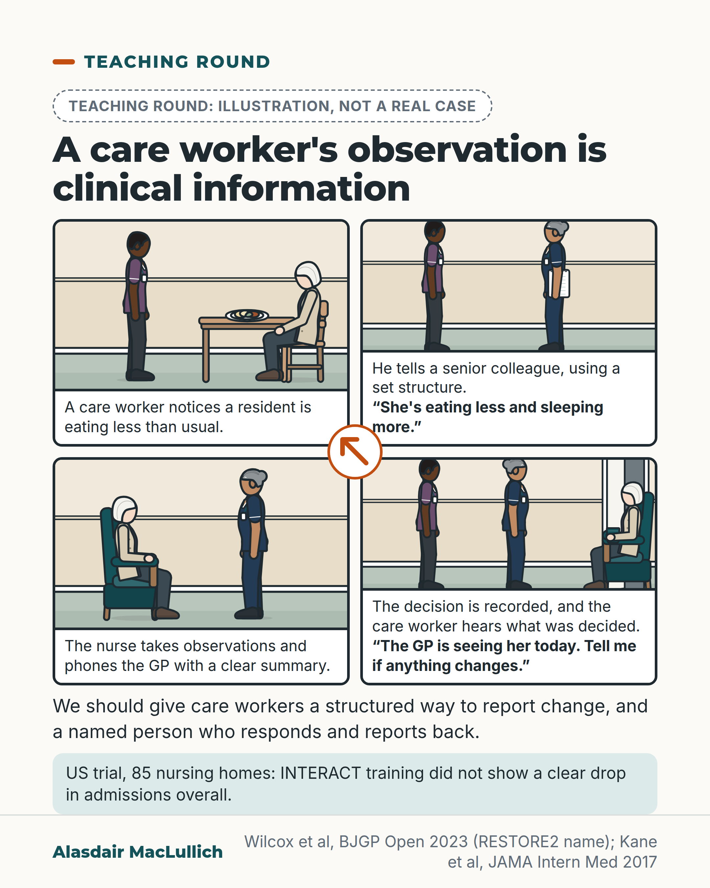

# G163: A care worker's observation is clinical information

- Category: C16 Primary care, home care and care homes
- Audience: practitioners
- Series: Teaching round
- Post type: teaching
- Visual format: single card
- Status: text text_final, visual final
- Working id: C16-P07 (candidate C16-15)

## Insight

Care workers who see someone every day are well placed to notice early change. What happens next depends on a structured handover and on whether the care worker hears what was decided. A US trial of the INTERACT tools did not show a clear drop in admissions overall.

## Angle and position

Respect for care workers shown through practical detail: the handover route and the feedback step. The post is honest that training in tools does not on its own reliably reduce admissions.

Basis: Empirical: INTERACT trial result and the existence of RESTORE2 with staff training concerns. Judgement: care workers are well placed to notice change, and services should give them a structured way to report and a named person who responds and reports back.

## X (1033 characters)

```text
Care workers are often in a good position to notice that someone is eating less, sleeping more or seems unlike themselves. What happens next depends on how that observation is handed over, and on whether anyone tells the care worker what was decided.

RESTORE2 (Recognise Early Soft Signs, Take Observations, Respond, Escalate) is a UK care home tool for monitoring residents. An interview study in the UK asked people about a proposed trial of antibiotics for suspected urine infection in care homes. Participants strongly supported using RESTORE2 to monitor residents. They worried about training night and temporary staff.

In a US trial across 85 nursing homes, training staff to use the INTERACT tools (a set of tools for staff to flag and respond to a resident getting worse) did not show a clear drop in hospital admissions overall. Our judgement is that a report changes little unless someone responds to it.

We should give care workers a structured way to report change, and a named person who must respond and report back.
```

## LinkedIn (1596 characters)

```text
Care workers are often in a good position to notice that someone is eating less, sleeping more or seems unlike themselves. A care worker's note that someone is eating less is clinical information.

What happens next depends on how the observation is handed over, and on whether the care worker hears what was decided.

RESTORE2 (Recognise Early Soft Signs, Take Observations, Respond, Escalate) is a UK care home tool for monitoring residents. In a qualitative study of 16 care home staff and 11 primary care clinicians, there was strong support for using it to monitor residents. There were concerns about training, especially for night and temporary staff. That study looked at views, and did not test whether the tool works.

In a US randomised trial across 85 nursing homes (36,717 residents), training and support for the INTERACT tools (a set of tools for staff to flag and respond to a resident getting worse) did not show a clear drop in hospital admissions overall. Fewer potentially avoidable admissions were seen in the trained homes than in the comparison homes, but the difference was not reliable after adjusting for multiple comparisons. The trial tested the training and support, in nursing homes that had not used INTERACT before.

Our judgement is that the useful test of how an observation is handed over is whether the observation leads to a decision, and whether the care worker is told. We should give care workers a structured way to report change, and a named person who must respond and report back.

Who tells your care workers what happened after they raised a concern?
```

## Bluesky (290 characters)

```text
Care workers are often in a good position to notice someone eating less or sleeping more. A US trial of INTERACT training (tools to flag a resident getting worse) in 85 nursing homes showed no clear drop in hospital admissions. Our judgement: a report helps only if a named person responds.
```

## Threads (497 characters)

```text
Care workers are often in a good position to notice someone eating less or sleeping more. What happens next depends on the handover and on whether they hear what was decided.

A US trial of INTERACT training (tools to flag a resident getting worse) in 85 nursing homes showed no clear drop in hospital admissions. Our judgement is that a report changes little unless someone responds.

We should give care workers a structured way to report change and a named person who responds and reports back.
```

## Source reply

Sources: Kane et al, JAMA Intern Med 2017 https://doi.org/10.1001/jamainternmed.2017.2657 | Wilcox et al, BJGP Open 2023 https://doi.org/10.3399/BJGPO.2023.0014

## Visual



Alt text: Four-panel illustrated comic, not a real case. A care worker notices a resident eating less, reports it to a nurse in a structured way, the nurse checks and phones the GP, then tells the care worker the decision. A note says INTERACT training did not clearly cut admissions in 85 US nursing homes.

Editable source: `visuals/src/G163.html`

Design instructions: Single card, 2x2 comic using Kit people in care home lounge (care worker, older resident, nurse), captions below panels with quoted dialogue, orange loop arrow at centre, dashed illustration badge, mint INTERACT note. No data; trial from Kane et al.

## Sources and verification

- C16-15-a (supported): The INTERACT implementation trial did not show a clear reduction in hospital admissions overall.
  - Source: Kane RL, Huckfeldt P, Tappen R, Engstrom G, Rojido C, Newman D, et al. Effects of an intervention to reduce hospitalizations from nursing homes: a randomized implementation trial of the INTERACT program. JAMA Intern Med. 2017;177(9):1257-64.
  - Passage: "Training and support for INTERACT implementation as carried out in this study had no effect on hospitalization or ED visit rates in the overall population of residents in participating NHs." (Abstract, Conclusions)
- C16-15-b (supported_with_qualification): RESTORE2 (Recognise Early Soft Signs, Take Observations, Respond, Escalate) is used in UK care homes; staff raised training concerns for night and temporary staff.
  - Source: Wilcox CR, Worswick L, Muller I, Moore A, Hayward G, Lown M, et al. Feasibility of a placebo-controlled trial of antibiotics for possible urinary tract infection in care homes: a qualitative interview study. BJGP Open. 2023;7(3):BJGPO.2023.0014.
  - Passage: "there was strong support for using the RESTORE2 (Recognise Early Soft Signs, Take Observations, Respond, Escalate) assessment tool to monitor residents; however, there were concerns about associated training requirements, especially for night and temporary staff." (Abstract, Results)

Verification notes: C16-15-a: Kane et al, JAMA Intern Med 2017 (abstract): 85 US nursing homes, 36,717 residents; no effect on hospitalisation or ED visit rates overall (net difference -0.13 per 1000 resident-days, P=.25); potentially avoidable admissions fell but not robust to multiple-comparison correction; no high-engagement claim made. C16-15-b: Wilcox et al, BJGP Open 2023 (abstract): RESTORE2 expansion; strong support for using it; concerns about training for night and temporary staff; 16 care home staff and 11 clinicians; views, not effectiveness. 'Care workers notice change first' is stated as judgement ('well placed'). NEWS2 and SBARD components not stated (unsourced). Access level: abstract.

## Attention and follow potential

Pause: Care staff see their observation named as clinical information, with the missing last step (feedback) drawn in.

Gain: A model for turning an observation into a decision, and a fair note on what a trial did not show.

Follow: Respect for care workers shown through practical detail.

## Open issues

- RESTORE2 effectiveness not evidenced; the post makes no claim about it.
- 'Well placed to notice' and the recommendation are judgement and are worded that way.
- The comic's dialogue is illustrative and labelled.
