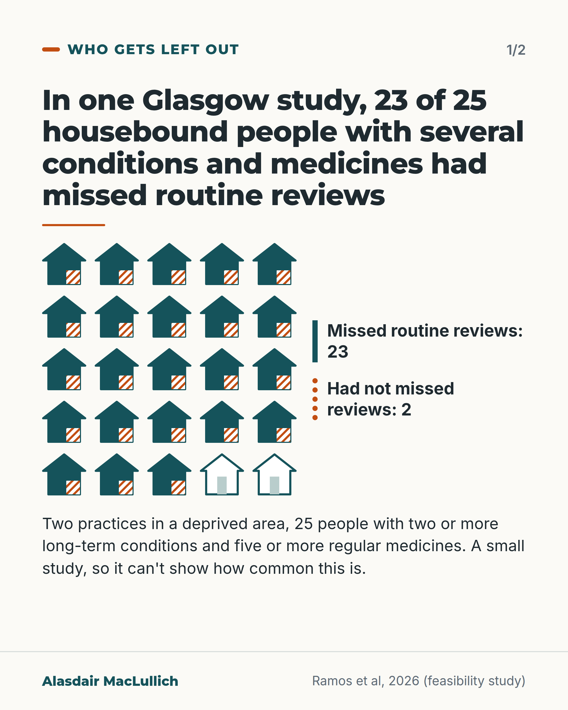
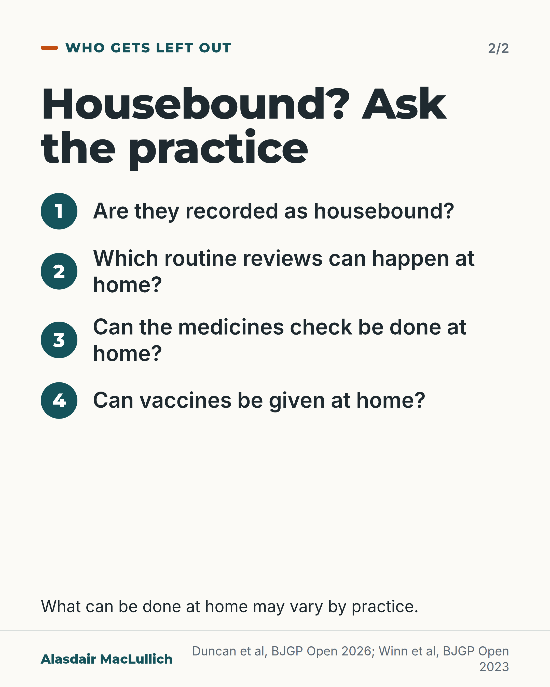

# G164: Housebound and missing from reviews

- Category: C16 Primary care, home care and care homes
- Audience: public
- Series: Who gets left out
- Post type: public_explanation
- Visual format: carousel (2 cards)
- Status: text text_final, visual final
- Working id: C16-P08 (candidate C16-26)

## Insight

Some housebound people go without routine reviews at their GP practice; in one small Glasgow study 23 of 25 housebound people had missed long-term condition reviews. If you or someone you care for no longer gets out, tell the practice and ask what can be done at home.

## Angle and position

Routine care is organised around attending the surgery. The post uses a small UK study honestly (not a prevalence), UK researchers' description of the group, and four questions to ask the practice. Entitlements such as home sight tests are not claimed.

Basis: Empirical: authors' descriptions of housebound people as under-researched with complex needs, and one small Glasgow study of missed reviews. Judgement: practices should plan routine care at home for housebound patients, and people and families can ask to be included.

## X (819 characters)

```text
Some housebound people go without routine reviews at their GP practice.

One small study in two Glasgow practices serving a deprived area looked at 25 housebound adults aged 60 and over. All had two or more long-term conditions and took five or more regular medicines. Of the 25, 23 had missed routine reviews of their long-term conditions since becoming housebound. Between them they had missed 91 reviews. That was a small, selected sample, so it can't tell us how common this is across the UK.

UK researchers describe housebound patients as a group who find it hard to get GP care, have complex needs and have been little studied.

If you or someone you care for no longer gets out, tell the practice. Ask whether they are recorded as housebound, and what can be done at home, such as vaccines and medicine reviews.
```

## LinkedIn (1253 characters)

```text
Some housebound people go without routine reviews at their GP practice, and routine care is organised around attending the surgery.

One small study looked at 25 housebound adults aged 60 and over from two Glasgow practices. Of the 25, 23 had missed routine reviews of their long-term conditions since becoming housebound. Between them they had missed 91 reviews. They all had two or more long-term conditions and took five or more regular medicines. It was a small, selected sample and it did not measure how common this is, so it should not be read as a UK figure.

UK researchers describe housebound patients as a group who find it hard to get GP care, have complex needs, and have been little studied. One research team called older housebound people a neglected group in research and clinical care. That is the authors' view, not a measured finding.

If you or someone you care for no longer gets out, tell the practice. Questions to ask:

1. Are they recorded as housebound?
2. Which routine reviews can happen at home?
3. Can the medicines check be done at home?
4. Can vaccines be given at home?

What can be done at home may vary, so ask the practice directly. Practices should plan routine care at home for people who can't get to the surgery.
```

## Bluesky (296 characters)

```text
Some housebound people go without routine GP reviews. In one small Glasgow study of 25 housebound adults with several conditions and medicines, 23 had missed reviews. It can't show how common this is. If someone you care for no longer gets out, tell the practice and ask what can be done at home.
```

## Threads (433 characters)

```text
Some housebound people go without routine reviews at their GP practice. In one small Glasgow study of 25 housebound adults with several conditions and medicines, 23 had missed reviews of their long-term conditions. It can't show how common this is.

If you or someone you care for no longer gets out, tell the practice. Ask whether they are recorded as housebound, and what can be done at home, such as vaccines and medicine reviews.
```

## Source reply

Sources: Ramos et al, Int J Clin Pharm 2026 https://doi.org/10.1007/s11096-026-02211-2 | Duncan et al, BJGP Open 2026 https://doi.org/10.3399/BJGPO.2025.0234 | Winn et al, BJGP Open 2023 https://doi.org/10.3399/BJGPO.2023.0114

## Visual



Alt text: Grid of 25 house icons: 23 solid teal with hatched marks for housebound people who had missed routine reviews, 2 outline only. A small Glasgow study in two practices that can't show how common this is.



Alt text: Four questions to ask the practice about housebound people: recorded as housebound, reviews at home, medicines check at home, vaccines at home. What can be done varies by practice.

Editable source: `visuals/src/G164.html`

Design instructions: Two cards. Card 1: 5x5 house icons, 23 solid teal with hatched corner, 2 outline, direct labels, orange rule. Card 2: teal numbered four questions. Claim C16-26-b (23 of 25, 91 reviews missed).

## Sources and verification

- C16-26-a (supported_with_qualification): Housebound older people are an under-researched group with complex needs who face challenges accessing primary care.
  - Source: Duncan P, Yung N, Dawson S, Howe LD, Cameron A, Sargent K, et al. What does 'housebound' mean? Mixed-methods study to develop a consensus definition. BJGP Open. 2026.; Winn E, Kissane M, Merriel SW, Brain T, Silverwood VA, Whitehead IO, et al. Using the Primary care Academic CollaboraTive to explore the characteristics and healthcare use of older housebound patients in England: protocol for a retrospective observational study and clinician survey (the CHiP study). BJGP Open. 2023;7(4):BJGPO.2023.0114.
  - Passage: "Duncan 2026: "Housebound patients are an under-researched group who face challenges accessing primary health care and have complex needs." Winn 2023: "Older housebound people are a neglected group both in terms of research and clinical care."" (Abstracts, Background and Conclusion)
- C16-26-b (supported_with_qualification): Housebound people often miss routine long-term condition reviews at the practice.
  - Source: Ramos T, Cochrane L, Verma A, Zhang L, Beattie A, Johnson CF, Lowrie R. Feasibility study of the Care-at-Home Pharmacotherapy Service (CAHPS): pharmacy technician-led home visits for people receiving polypharmacy who are housebound living in socioeconomically deprived areas. Int J Clin Pharm. 2026.
  - Passage: "People who are housebound frequently miss general practice-based long-term condition (LTC) reviews. ... In total, twenty-three patients had missed 91 LTC reviews since becoming housebound and were prescribed a median of 14 regular medications (range 9-27)." (Abstract, Background and Results)
- C16-26-c (not_found): Home NHS sight tests and home vaccination are available for eligible housebound people.
  - Source: 
  - Passage: "No source opened; NHS and UKHSA pages cannot be opened." (Not found)

Verification notes: C16-26-a: Duncan et al, BJGP Open 2026 (abstract) and Winn et al, BJGP Open 2023 (protocol abstract): housebound patients described as under-researched, facing challenges accessing primary care, with complex needs; 'neglected group' is the authors' view, not a result. C16-26-b: Ramos et al 2026 (abstract): 25 housebound adults 60+ with 2+ long-term conditions and 5+ medicines, two Glasgow practices; 23 had missed 91 reviews; small, uncontrolled, selected; not a prevalence; no effect of home visits claimed. C16-26-c not found: home sight tests, vaccination entitlements and Scottish eye examination rules not stated; vaccines and medicine reviews appear only as questions. Ornstein 2015 (US) not used. Access level: abstract.

## Attention and follow potential

Pause: Families caring for someone who has stopped going out see what may have been missed.

Gain: Four concrete questions to put to the practice.

Follow: Attention to people who drop out of sight of services.

## Open issues

- No UK figure on the size of the care gap; the post says so.
- Home sight test and dental entitlements not stated (unverified, England and Scotland differ).
