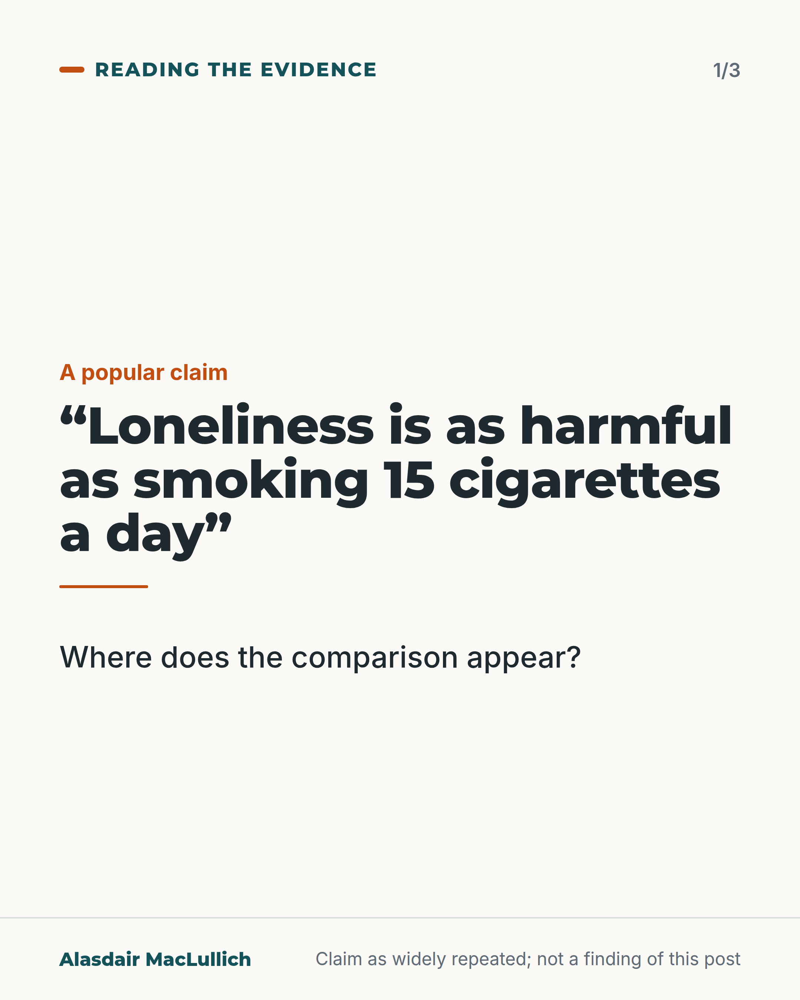
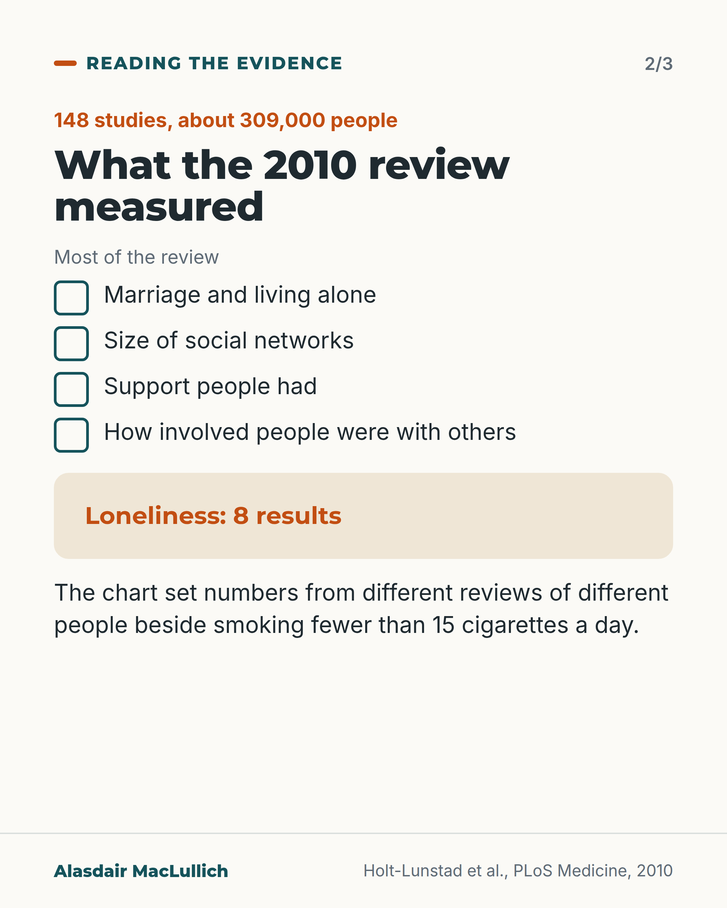
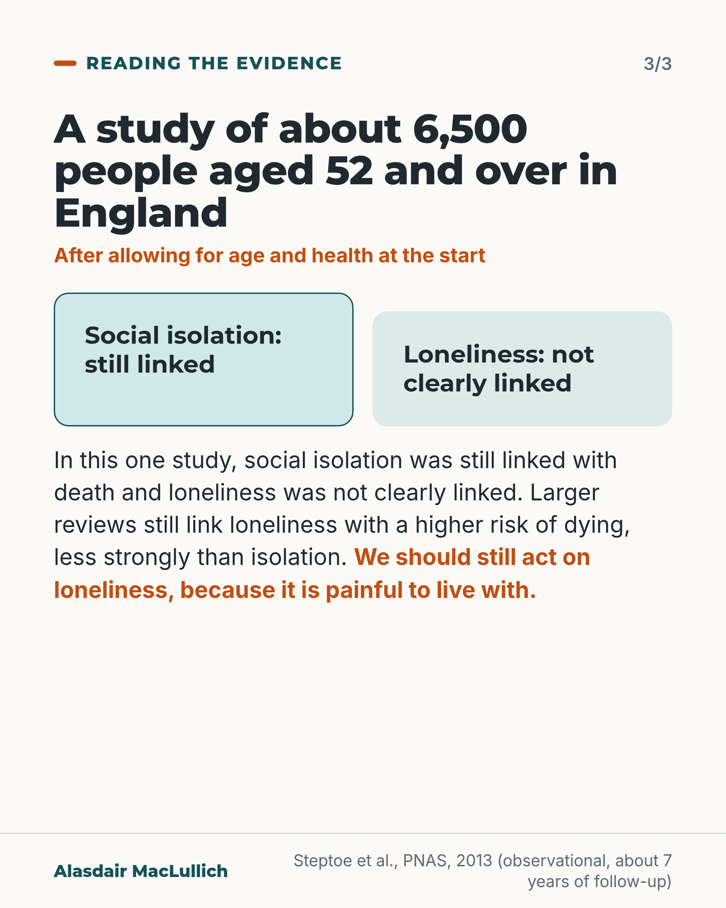

# G165: Where the cigarette comparison for loneliness appears

- Category: C17 Loneliness, relationships, housing and poverty
- Audience: both
- Series: Reading the evidence
- Post type: evidence_interpretation
- Visual format: carousel (3 cards)
- Status: text text_final, visual final
- Working id: C17-P01 (candidate C17-15)

## Insight

The comparison of loneliness with smoking appears in a 2010 review that mostly measured other social ties, using numbers from different reviews. Recent reviews still link loneliness with a higher risk of dying, less strongly than social isolation, and loneliness deserves action because it is painful.

## Angle and position

Check the slogan against the review it appears in and against a UK cohort, then argue that the case for helping lonely people rests on their distress and not on a cigarette comparison.

Basis: Mixed. The description of the 2010 review, the 2015 review, the English cohort and the recent reviews is empirical (observational data, association only). The statement that we should act on loneliness because it is painful is an ethical judgement, marked as one.

## X (1018 characters)

```text
A popular line says loneliness is as harmful as smoking 15 cigarettes a day.

The comparison with smoking appears in a 2010 review of 148 studies of about 309,000 people. A chart in it showed the link between social relationships and survival next to the effect of smoking fewer than 15 cigarettes a day (the slogan says 15). The numbers came from different reviews of different people. The chart did not test the two against each other in the same people.

Most of the studies in the review measured marriage, social networks and support. Only 8 of the results it pooled measured loneliness itself.

In about 6,500 people aged 52 and over in England, loneliness was no longer linked with death once age and health at the start were allowed for. Social isolation, meaning little contact with others, still was. Larger recent reviews still link loneliness with a higher risk of dying, less strongly than isolation.

We should act on loneliness because it is painful to live with, whatever any cigarette comparison says.
```

## LinkedIn (2065 characters)

```text
A popular line says loneliness is as harmful as smoking 15 cigarettes a day.

The comparison with smoking appears in a 2010 review that pooled 148 studies of about 309,000 people, followed for 7.5 years on average. People with stronger social relationships were more likely to be alive at the end. A chart in the paper showed that link next to other risk factors, including smoking fewer than 15 cigarettes a day (the slogan says 15). The numbers came from different reviews of different people. The chart did not test the two against each other in the same people.

Most of the studies in the review measured marriage, the size of social networks, the support people had and how involved they were with others. Only 8 of the results it pooled measured loneliness itself.

Later work gives a more careful picture:

1. A 2015 review of studies that allowed for other factors found loneliness linked with a higher chance of dying, about as strongly as social isolation (little contact with others) and living alone.
2. In about 6,500 people aged 52 and over in England, followed for about 7 years, loneliness was no longer linked with death once age, background and health at the start were allowed for. Social isolation still was. That does not show that loneliness has no effect on survival. The result was too uncertain to say either way. The data were compatible with both a slightly lower and a slightly higher risk of dying.
3. Two recent large reviews, one of them of older adults, found that lonely people have a somewhat higher risk of dying during follow-up. In these reviews the link for loneliness was smaller than for isolation and varied a lot between studies.

The reviews differ on how loneliness compares with isolation. All of this compares people as they are, without assigning them, so none of it shows cause.

We should take loneliness seriously because it is painful to live with and lowers quality of life, whatever any cigarette comparison says.

Next time you see the slogan, ask which measure it used and whether that measure was loneliness.
```

## Bluesky (298 characters)

```text
A popular line says loneliness is as harmful as 15 cigarettes a day. It traces to a 2010 review chart that set social relationships and survival beside smoking fewer than 15 a day. Most of its studies measured marriage and support, not loneliness. Lonely people deserve help; loneliness is painful.
```

## Threads (500 characters)

```text
A popular line says loneliness is as harmful as smoking 15 cigarettes a day. It traces to a chart in a 2010 review that set social relationships and survival next to smoking fewer than 15 a day, using numbers from different reviews of different people.

Most of that review's studies measured marriage and support, not loneliness. Later reviews link loneliness with a higher risk of dying, less strongly than isolation (little contact with others).

We should act on loneliness because it is painful.
```

## Source reply

Sources: https://doi.org/10.1371/journal.pmed.1000316 (2010 review), https://doi.org/10.1073/pnas.1219686110 (English cohort), https://doi.org/10.1177/1745691614568352 (2015 review), https://doi.org/10.1038/s41562-023-01617-6 and https://doi.org/10.1007/s40520-024-02925-1 (recent reviews)

## Visual



Alt text: Text card. The popular claim in quotation marks: loneliness is as harmful as smoking 15 cigarettes a day. Below it: where does the comparison appear? The card says this is a widely repeated claim and not a finding of this post.



Alt text: Card on what the 2010 review measured: 148 studies, about 309,000 people. Most results measured marriage and living alone, social networks, support and involvement with others. Loneliness: 8 results. The chart set numbers from different reviews beside smoking fewer than 15 cigarettes a day.



Alt text: Card on about 6,500 people aged 52 and over in England. After allowing for age and health, social isolation was still linked with death and loneliness was not clearly linked. Larger reviews still link loneliness with higher risk of dying. The card says we should still act on loneliness because it is painful.

Editable source: `visuals/src/G165.html`

Design instructions: Carousel 3 cards, light ground. Statement card with orange rule; list card with tick boxes and sand panel for 8 results; two panels (teal tint, mint). Claims C17-15-c.

## Sources and verification

- C17-15-a (supported): A 2010 meta-analysis of 148 studies (308,849 participants) found people with stronger social relationships had higher odds of survival (OR 1.50); strongest for complex measures of social integration, weakest for living alone.
  - Source: Holt-Lunstad J, Smith TB, Layton JB. Social relationships and mortality risk: a meta-analytic review. PLoS Med. 2010;7(7):e1000316.
  - Passage: ""Across 148 studies (308,849 participants), the random effects weighted average effect size was OR = 1.50 (95% CI 1.42 to 1.59), indicating a 50% increased likelihood of survival for participants with stronger social relationships. This finding remained consistent across age, sex, initial health status, cause of death, and follow-up period. Significant differences were found across the type of social measurement evaluated (p<0.001); the association was strongest for complex measures of social integration (OR = 1.91; 95% CI 1.63 to 2.23) and lowest for binary indicators of residential status (living alone versus with others) (OR = 1.19; 95% CI 0.99 to 1.44)." Full text (Results): "Participants were followed for an average of 7.5 years"" (Abstract (Results); full text, Results (study characteristics))
- C17-15-b (supported): The 2010 paper compared its effect size in a figure with other risk factors, including smoking fewer than 15 cigarettes a day, and described the effect as comparable with quitting smoking.
  - Source: Holt-Lunstad J, Smith TB, Layton JB. Social relationships and mortality risk: a meta-analytic review. PLoS Med. 2010;7(7):e1000316.
  - Passage: "Figure 6 bar label (as printed): "Smoking < 15 cigarettes daily". Figure 6 caption: "Comparison of odds (lnOR) of decreased mortality across several conditions associated with mortality. Note: Effect size of zero indicates no effect. The effect sizes were estimated from meta analyses: ; A = Shavelle, Paculdo, Strauss, and Kush, 2008 [205]; ..." Conclusion: "The magnitude of this effect is comparable with quitting smoking and it exceeds many well-known risk factors for mortality (e.g., obesity, physical inactivity)."" (Figure 6 (bar labels and caption, read from the PDF via Undermind); Discussion/Conclusion (also in PMC full text))
- C17-15-c (supported): Most results pooled in the 2010 review measured social networks, marriage, support or integration rather than loneliness; loneliness contributed only 8 effect sizes.
  - Source: Holt-Lunstad J, Smith TB, Layton JB. Social relationships and mortality risk: a meta-analytic review. PLoS Med. 2010;7(7):e1000316.
  - Passage: "Introduction: "three major components of social relationships are consistently evaluated: (a) the degree of integration in social networks, (b) the social interactions that are intended to be supportive (i.e., received social support), and (c) the beliefs and perceptions of support availability held by the individual (i.e., perceived social support)." Results: "...which resulted in a total of 230 unique effect sizes across 116 studies" (structural measures); "We extracted 87 unique effect sizes that were specific to measures of functional social relationships within 72 studies"; "We extracted 64 unique effect sizes that evaluated combined structural and functional measures of social relationships within 61 studies." Table 2 lists 'Perception of loneliness: Feelings of isolation, disconnectedness, and not belonging' as one functional measure; Table 4, 'Loneliness (inversed)': k = 8, OR = 1.45 (95% CI 1.08 to 1.94)." (Introduction; Results (metaregression sections, PMC full text); Tables 2 and 4 (read from PDF via Undermind))
- C17-15-d (supported_with_qualification): A 2015 meta-analysis found loneliness associated with higher odds of death in adjusted studies (OR 1.26), similar to social isolation (1.29) and living alone (1.32).
  - Source: Holt-Lunstad J, Smith TB, Baker M, Harris T, Stephenson D. Loneliness and social isolation as risk factors for mortality: a meta-analytic review. Perspect Psychol Sci. 2015;10(2):227-37.
  - Passage: ""Across studies in which several possible confounds were statistically controlled for, the weighted average effect sizes were as follows: social isolation odds ratio (OR) = 1.29, loneliness OR = 1.26, and living alone OR = 1.32, corresponding to an average of 29%, 26%, and 32% increased likelihood of mortality, respectively. We found no differences between measures of objective and subjective social isolation. ... Results also differ across participant age, with social deficits being more predictive of death in samples with an average age younger than 65 years."" (Abstract)
- C17-15-e (supported): In ELSA (about 6,500 people aged 52 and over), loneliness was not independently associated with mortality after adjustment for demographic factors and baseline health, while social isolation was.
  - Source: Steptoe A, Shankar A, Demakakos P, Wardle J. Social isolation, loneliness, and all-cause mortality in older men and women. Proc Natl Acad Sci U S A. 2013;110(15):5797-801.
  - Passage: "Abstract: "We found that mortality was higher among more socially isolated and more lonely participants. However, after adjusting statistically for demographic factors and baseline health, social isolation remained significantly associated with mortality (hazard ratio 1.26, 95% confidence interval, 1.08-1.48 for the top quintile of isolation), but loneliness did not (hazard ratio 0.92, 95% confidence interval, 0.78-1.09)." Discussion: "These results do not imply that loneliness is not important but rather indicate that the experience of loneliness may be characteristic of people who already have major health and mobility problems." and "Reducing both social isolation and loneliness are important for quality of life and well-being, but efforts to reduce isolation would be likely to have greater benefits in terms of mortality."" (Abstract; Discussion (read via Undermind))
- C17-15-f (supported): Recent large meta-analyses, including one in older adults, still find loneliness linked with higher mortality, but less strongly than social isolation, with wide variation between studies.
  - Source: Wang F, Gao Y, Han Z, Yu Y, Long Z, Jiang X, et al. A systematic review and meta-analysis of 90 cohort studies of social isolation, loneliness and mortality. Nat Hum Behav. 2023;7(8):1307-19.; Nakou A, Dragioti E, Bastas NS, Zagorianakou N, Kakaidi V, Tsartsalis D, et al. Loneliness, social isolation, and living alone: a comprehensive systematic review, meta-analysis, and meta-regression of mortality risks in older adults. Aging Clin Exp Res. 2025;37(1):29.
  - Passage: "Wang 2023: "A total of 90 prospective cohort studies including 2,205,199 individuals were included. Here we show that, in the general population, both social isolation and loneliness were significantly associated with an increased risk of all-cause mortality (pooled effect size for social isolation, 1.32; 95% confidence interval (CI), 1.26 to 1.39; P < 0.001; pooled effect size for loneliness, 1.14; 95% CI, 1.08 to 1.20; P < 0.001)". Nakou 2025: "Of 11,964 identified studies, 86 met the inclusion criteria. Loneliness was associated with increased all-cause mortality (HR 1.14, 95% CI 1.10-1.18), with substantial heterogeneity (I² = 84.0%). Similar associations were found for social isolation (HR 1.35, 95% CI 1.27-1.43) and living alone (HR 1.21, 95% CI 1.13-1.30)."" (Abstracts)
- C17-15-g (supported_with_qualification): Loneliness deserves attention because it is distressing and harms quality of life, whether or not the smoking comparison holds.
  - Source: Steptoe A, Shankar A, Demakakos P, Wardle J. Social isolation, loneliness, and all-cause mortality in older men and women. Proc Natl Acad Sci U S A. 2013;110(15):5797-801.
  - Passage: ""Reducing both social isolation and loneliness are important for quality of life and well-being, but efforts to reduce isolation would be likely to have greater benefits in terms of mortality."" (Discussion (read via Undermind))

Verification notes: C17-15-a, b, c from the 2010 PLoS Med review (full text and figure read): 148 studies, 308,849 people, mean follow-up 7.5 years, chart compares with smoking fewer than 15 a day (not 15), loneliness 8 effect sizes. Wording says the comparison 'appears in' the review and does not claim the slogan was proven to come from it. C17-15-d from the 2015 Perspect Psychol Sci abstract (adjusted, similar to isolation and living alone; odds ratios not quoted to avoid conversion). C17-15-e from Steptoe 2013 full text: loneliness HR 0.92 (0.78 to 1.09), isolation HR 1.26, one cohort, observational. C17-15-f from the abstracts of Wang 2023 and Nakou 2025: loneliness link smaller than isolation, high heterogeneity; no relative figure quoted. C17-15-g is a value judgement, written as 'We should'. The 2023 Surgeon General claim (C17-15-h, not_found) is omitted; the slogan is quoted as a popular claim without attribution.

## Attention and follow potential

Pause: A slogan many readers have seen on a slide or poster is traced to what the source chart actually compared.

Gain: How to read a borrowed statistic, and a better reason to act on loneliness than a cigarette comparison.

Follow: Careful reading of evidence on topics where slogans travel faster than studies.

## Open issues

None.
