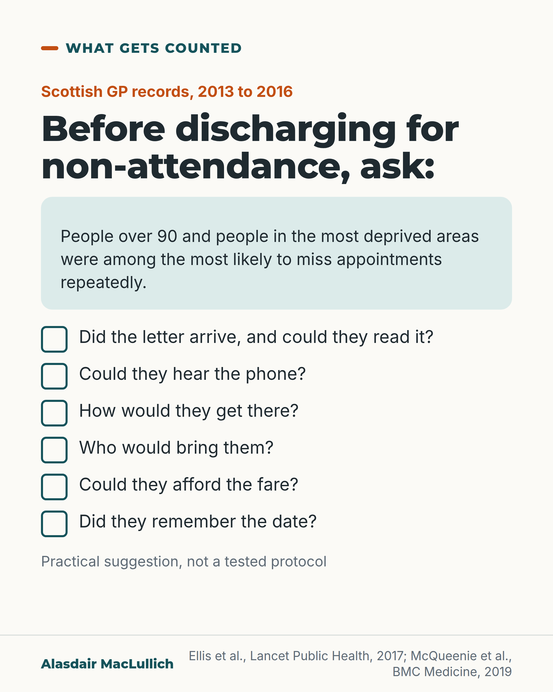

# G166: Did not attend: ask why

- Category: C17 Loneliness, relationships, housing and poverty
- Audience: practitioners
- Series: What gets counted
- Post type: criticism
- Visual format: single image
- Status: text text_final, visual final
- Working id: C17-P02 (candidate C17-22)

## Insight

In Scottish GP records, people over 90 and people in the most deprived areas were among the most likely to miss appointments repeatedly, and missed appointments were linked with higher death rates. A missed appointment is a risk marker that deserves a question, not only a discharge letter.

## Angle and position

A 'did not attend' entry records the absence and gives no reason. For older people it should prompt contact to find the reason first.

Basis: Mixed. The Scottish findings are empirical (observational, all ages for the mortality link). The recommendation to contact people before discharging is a judgement and is marked as one.

## X (841 characters)

```text
In Scottish GP records from 2013 to 2016, people over 90 were among the most likely to miss appointments repeatedly, even after allowing for how many appointments they made. So were people in the most deprived areas. Young adults aged 16 to 30 were also at higher risk, and how a practice ran its appointments contributed too.

In linked Scottish records, people who missed appointments were more likely to die in the following 16 months, especially those with long-term mental health conditions. A missed appointment is a risk marker. The study does not show that missing it causes death, and the figures cover all ages.

A "did not attend" entry records the absence and gives no reason. No study has tested contacting people first, so this is a judgement: for an older person, find out why they missed the appointment before any discharge.
```

## LinkedIn (1344 characters)

```text
In Scottish GP records from 2013 to 2016 (550,083 patients), people over 90 were among the most likely to miss appointments repeatedly, even after allowing for how many appointments they had made. So were people living in the most deprived areas. Young adults aged 16 to 30 were also at higher risk, and how a practice ran its appointments contributed too.

In linked Scottish records covering 824,374 patients of all ages, people with more long-term conditions missed more appointments. People who missed appointments were more likely to die in the following 16 months, especially those with long-term mental health conditions. A missed appointment is a risk marker, a sign that something may be wrong. The study does not show that missing it causes death, and the figures cover all ages, not only older people.

A "did not attend" entry records the absence and gives no reason. Before an older person is discharged back to the GP for not attending, ask:

1. Did the letter arrive, and could they read it?
2. Could they hear the phone?
3. How would they get there?
4. Who would bring them?
5. Could they afford the fare?
6. Did they remember the date?

These questions are a practical suggestion, not a tested protocol. Our judgement is that for older people, a missed appointment should prompt contact to find the reason before any discharge.
```

## Bluesky (286 characters)

```text
Scottish GP records: people over 90 and people in the most deprived areas were among the most likely to repeatedly miss appointments. Across all ages, missed appointments were linked with higher death risk: a risk marker, not proof of cause. Before discharging an older person, ask why.
```

## Threads (413 characters)

```text
In Scottish GP records, people over 90 and people in the most deprived areas were among the most likely to miss appointments repeatedly, even after allowing for how many they made. Missing appointments was linked with higher death rates across all ages, a risk marker and not proof of cause.

Our judgement, which no study has tested: before discharging an older person for not attending, contact them to ask why.
```

## Source reply

Sources: https://pubmed.ncbi.nlm.nih.gov/29253440/ (repeated non-attendance, Lancet Public Health 2017), https://pubmed.ncbi.nlm.nih.gov/30630493/ (missed appointments and mortality, BMC Medicine 2019)

## Visual



Alt text: Checklist card: before discharging for non-attendance, ask. Scottish GP records 2013 to 2016: people over 90 and people in the most deprived areas were among the most likely to miss appointments repeatedly. Six questions: letter arrived and readable, hearing the phone, getting there, who would bring them, the fare, remembering the date.

Editable source: `visuals/src/G166.html`

Design instructions: Single checklist card, ticks component, mint finding panel. No numbers beyond years.

## Sources and verification

- C17-22-a (supported_with_qualification): People over 90 and people in the most deprived areas were more likely to miss multiple GP appointments, after allowing for appointments made; young adults also at higher risk; practice factors mattered.
  - Source: Ellis DA, McQueenie R, McConnachie A, Wilson P, Williamson AE. Demographic and practice factors predicting repeated non-attendance in primary care: a national retrospective cohort analysis. Lancet Public Health. 2017;2(12):e551-e559.
  - Passage: "After controlling for the number of appointments made, patterns of non-attendance could be differentiated, with patients who were aged 16–30 years (relative risk ratio [RRR] 1·21, 95% CI 1·19–1·23) or older than 90 years (2·20, 2·09–2·29), and of low socioeconomic status (Scottish Index of Multiple Deprivation decile 1: RRR 2·27, 2·22–2·31) significantly more likely to miss multiple appointments. [Results:] ...more likely to miss multiple appointments than the reference group (patients aged 0–15 years)." (Abstract Findings; Results)
- C17-22-b (supported_with_qualification): More long-term conditions linked with more missed appointments; missing appointments linked with higher all-cause mortality, especially with mental health conditions; a risk marker, not a cause.
  - Source: McQueenie R, Ellis DA, McConnachie A, Wilson P, Williamson AE. Morbidity, mortality and missed appointments in healthcare: a national retrospective data linkage study. BMC Med. 2019;17(1):2.
  - Passage: "Patients with a greater number of long-term conditions had an increased risk of missing general practice appointments despite controlling for number of appointments made, particularly among patients with mental health conditions. These patients were at significantly greater risk of all-cause mortality, and showed a dose-based response with increasing number of missed appointments. ... Missed appointments represent a significant risk marker for all-cause mortality, particularly in patients with mental health conditions." (Abstract)

Verification notes: C17-22-a (Ellis 2017 full text): 550,083 patients, 2013 to 2016, over 90 and most deprived decile among most likely to miss multiple appointments after allowing for appointments made; young adults 16 to 30 also higher; practice factors contributed. Relative risk ratios (2.20, 2.27) are deliberately not quoted because the reference group is children aged 0 to 15. C17-22-b (McQueenie 2019 abstract): 824,374 patients, all ages, 16 months; risk marker, not cause; stated as all ages. 'Was not brought' claim omitted. The checklist questions and the discharge recommendation are labelled as a suggestion and a judgement.

## Attention and follow potential

Pause: Clinic staff who sign 'did not attend' letters meet the finding that the oldest and the poorest miss appointments most.

Gain: Evidence that non-attendance is a risk marker, and six questions to ask first.

Follow: Posts that look at what routine records leave out.

## Open issues

None.
