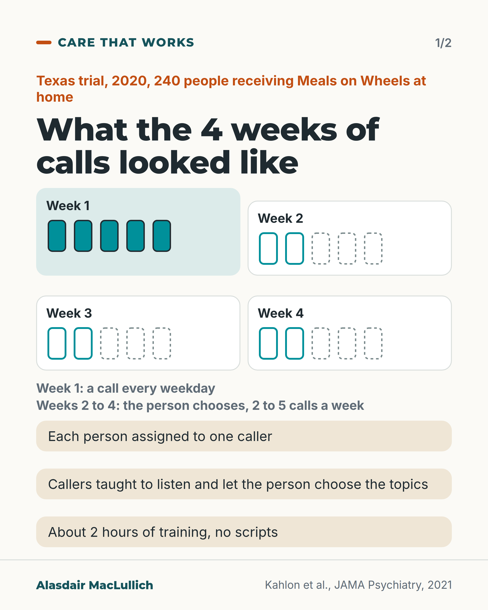
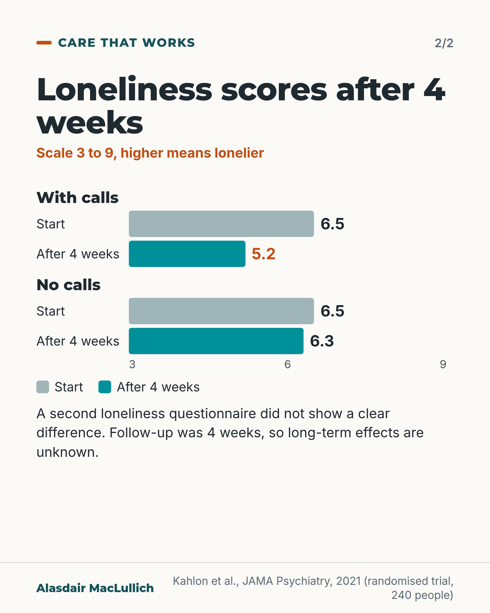

# G167: Phone calls that listen

- Category: C17 Loneliness, relationships, housing and poverty
- Audience: both
- Series: Care that works
- Post type: good_care
- Visual format: carousel (2 cards)
- Status: text text_final, visual final
- Working id: C17-P03 (candidate C17-16)

## Insight

In a randomised trial in Texas, regular phone calls from briefly trained callers aged 17 to 23, who listened and let the person choose the topics, lowered loneliness scores over 4 weeks in people receiving Meals on Wheels at home. The long-term effect is unknown.

## Angle and position

What the calls consisted of (training, schedule, no scripts) and the limits, so services can judge what to test.

Basis: Mixed. The trial results and design are empirical (randomised, 4 weeks, pandemic). The suggestion that services could test this model is clinical interpretation.

## X (944 characters)

```text
Callers aged 17 to 23 with about two hours of training lowered loneliness scores in a trial in Texas in 2020. In the trial, people were assigned to calls or no calls by chance.

The 240 people taking part were getting Meals on Wheels at home. Each person was assigned one caller. The caller phoned every weekday in the first week, then as often as the person chose, 2 to 5 times a week, for 4 weeks. Callers were taught to listen and let the person choose the topics. They had no scripts and no therapy training.

On a scale of 3 to 9, where higher means lonelier, loneliness scores fell from 6.5 to 5.2 with calls and from 6.5 to 6.3 without. A second loneliness questionnaire did not show a clear difference. Depression and anxiety scores improved. Physical health scores did not change.

Nobody yet knows whether the benefit lasts once calls stop. Befriending services could test regular calls from a trained listener before relying on them.
```

## LinkedIn (1849 characters)

```text
Callers aged 17 to 23 with about two hours of training lowered loneliness scores in a trial in Texas in 2020. In the trial, people were assigned to calls or no calls by chance.

The 240 people taking part were getting Meals on Wheels at home. They were aged 27 to 101 (about 6 in 10 were 65 or over), more than half lived alone, and all had at least one long-term condition. People with memory or thinking problems were not included.

The 16 callers were mostly university students. They were taught to listen, to let the person choose what to talk about and to ask about the things the person raised. They had no scripts and no therapy training. Each person was assigned to one caller. Calls came every weekday in the first week, then as often as the person chose, between 2 and 5 a week, for 4 weeks.

On a scale of 3 to 9, where higher means lonelier, loneliness scores fell from 6.5 to 5.2 with calls and from 6.5 to 6.3 without, a difference of about 1 point. A second loneliness questionnaire did not show a clear difference. Depression and anxiety scores improved. Physical health scores and the size of people's social networks did not change.

Limits: the trial lasted 4 weeks, in the summer of 2020 during the pandemic. 13 people dropped out of the group that got calls and 1 from the group that did not. The comparison group got no calls, so the trial gives no answer on whether the listening style or simply being called made the difference.

Nobody yet knows whether the benefit lasts once calls stop. A 2024 review of loneliness programmes for older adults found too little evidence to judge telephone programmes as a group. Its searches ended in June 2021.

This is one promising result from one trial. Befriending services could test the same elements: a regular caller, trained to listen, led by what the person wants to talk about.
```

## Bluesky (296 characters)

```text
In a 2020 Texas trial, 240 people getting Meals on Wheels were assigned calls or no calls. The callers were aged 17 to 23 and had 2 hours of listening training. After 4 weeks, one loneliness scale showed lower scores with calls; a second showed no clear difference. Long-term effects are unknown.
```

## Threads (495 characters)

```text
In a trial in Texas in 2020, 240 people getting Meals on Wheels at home were assigned by chance to calls or none. The callers were aged 17 to 23 and had about 2 hours of training in listening. On a 3-to-9 loneliness scale, scores fell from 6.5 to 5.2 with calls and from 6.5 to 6.3 without, over 4 weeks. A second loneliness questionnaire did not show a clear difference.

Nobody yet knows whether the benefit lasts once calls stop. Befriending services could test calls from a trained listener.
```

## Source reply

Sources: https://doi.org/10.1001/jamapsychiatry.2021.0113 (Kahlon et al., JAMA Psychiatry 2021) and https://doi.org/10.1007/s11606-023-08517-5 (review of loneliness interventions, 2024)

## Visual



Alt text: Four boxes for weeks 1 to 4 of phone calls in a Texas trial of 240 people receiving Meals on Wheels. Week 1: a call every weekday, shown as five phones. Weeks 2 to 4: the person chooses 2 to 5 calls a week. One caller each; callers taught to listen, about 2 hours of training, no scripts.



Alt text: Bar chart of loneliness scores, scale 3 to 9, higher is lonelier. With calls: 6.5 at start, 5.2 after 4 weeks. No calls: 6.5 at start, 6.3 after 4 weeks. A second questionnaire showed no clear difference. Follow-up was 4 weeks, so long-term effects are unknown.

Editable source: `visuals/src/G167.html`

Design instructions: Carousel 2. Card 1: four week boxes with phone icons (5 solid in week 1; 2 solid plus 3 dashed in weeks 2 to 4), three sand chips. Card 2: paired HTML bars on a 3 to 9 axis, grey start, teal after, orange 5.2 label. Claim C17-16-d.

## Sources and verification

- C17-16-a (supported): The trial randomised 240 Meals on Wheels clients in Central Texas in 2020; aged 27 to 101, 63% aged 65 or over, 56% living alone, all with at least one chronic condition.
  - Source: Kahlon MK, Aksan N, Aubrey R, Clark N, Cowley-Morillo M, Jacobs EA, et al. Effect of layperson-delivered, empathy-focused program of telephone calls on loneliness, depression, and anxiety among adults during the COVID-19 pandemic: a randomized clinical trial. JAMA Psychiatry. 2021;78(6):616-22.
  - Passage: ""From July 6 to September 24, 2020, we recruited and followed up 240 adults who were assigned to receive calls (intervention group) or no calls (control group) via block randomization." "The study included MOWCTX clients who fit their service criteria, including being homebound and expressing a need for food." "The 240 participants were aged 27 to 101 years, with 63% aged at least 65 years (n = 149 of 232), 56% living alone (n = 135 of 240), 79% women (n = 190 of 240), 39% Black or African American (n = 94 of 240), and 22% Hispanic or Latino (n = 52 of 240), and all reported at least 1 chronic condition." Methods: "All MOWCTX clients were eligible except those with cognitive impairments, previously assessed through family report or via a case manager, or those in a hospice program."" (Abstract (Design, Results); Methods (Population))
- C17-16-b (supported): Sixteen callers aged 17 to 23 had brief training in empathetic conversation: listen, and let the person choose the topics; no scripts or therapy training.
  - Source: Kahlon MK, Aksan N, Aubrey R, Clark N, Cowley-Morillo M, Jacobs EA, et al. Effect of layperson-delivered, empathy-focused program of telephone calls on loneliness, depression, and anxiety among adults during the COVID-19 pandemic: a randomized clinical trial. JAMA Psychiatry. 2021;78(6):616-22.
  - Passage: "Introduction: "Empathy was functionally defined as prioritizing listening and eliciting conversation from the participant on topics of their choice." Methods: "Sixteen people from ages 17 to 23 years, including 14 college undergraduates, 1 person entering community college, and 1 graduate student, were recruited to deliver calls to participants. Callers volunteered but were paid a stipend of $200 at the end of the program." "Callers were trained through a 1-hour videoconferenced session. The goal presented to callers was to learn from those they called by asking specific questions about topics raised by participants. No conversational prompts were provided nor training on CBT or its components. A short video was used to demonstrate techniques through role playing. Separately, callers received handouts and videotaped instructions on the logistics of the program (<1 hour)." Discussion: "our program required 2 hours of training for callers, no degree requirements"" (Introduction; Methods (Intervention Program); Discussion)
- C17-16-c (supported_with_qualification): Each caller had a panel of 6 to 9 participants; calls daily for the first 5 days, then at a frequency the participant chose (2 to 5 a week) for 4 weeks.
  - Source: Kahlon MK, Aksan N, Aubrey R, Clark N, Cowley-Morillo M, Jacobs EA, et al. Effect of layperson-delivered, empathy-focused program of telephone calls on loneliness, depression, and anxiety among adults during the COVID-19 pandemic: a randomized clinical trial. JAMA Psychiatry. 2021;78(6):616-22.
  - Passage: "Abstract: "Each called 6 to 9 participants over 4 weeks daily for the first 5 days, after which clients could choose to drop down to fewer calls but no less than 2 calls a week." Methods: "Each caller supported a panel of 6 to 9 participants over 4 weeks. Calls were targeted to be less than 10 minutes; however, callers reported that calls could run longer. We did not limit time with the participant." "Calls were placed at the time of day participants requested. All participants were called 5 days during the first week. After this, participants chose the frequency of calls, with a minimum of 2 and maximum of 5 a week. Most (58%; n = 70 of 120) chose to continue to be called 5 times a week for the remaining 3 weeks". Randomization: "In the intervention arm, participants were assigned to a caller's panel once a sufficient number had consented so that each caller began with a full panel."" (Abstract (Interventions); Methods (Intervention Program; Randomization and Blinding))
- C17-16-d (supported): Loneliness improved by 1.1 points on the 3-item UCLA scale (range 3 to 9); a second loneliness scale did not show a clear difference; depression and anxiety improved; physical health did not change.
  - Source: Kahlon MK, Aksan N, Aubrey R, Clark N, Cowley-Morillo M, Jacobs EA, et al. Effect of layperson-delivered, empathy-focused program of telephone calls on loneliness, depression, and anxiety among adults during the COVID-19 pandemic: a randomized clinical trial. JAMA Psychiatry. 2021;78(6):616-22.
  - Passage: "Abstract: "Postassessment differences between intervention and control after 4 weeks showed an improvement of 1.1 on the UCLA Loneliness Scale (95% CI, 0.5-1.7; P < .001; Cohen d of 0.48), and improvement of 0.32 on De Jong (95% CI, -0.20 to 0.81; P = .06; Cohen d, 0.17) for loneliness; an improvement of 1.5 on the Personal Health Questionnaire for Depression (95% CI, 0.22-2.7; P < .001; Cohen d, 0.31) for depression; and an improvement of 1.8 on the Generalized Anxiety Disorder scale (95% CI, 0.44 to 3.2; P < .001; Cohen d, 0.35) for anxiety. General physical health on the Short Form Health Questionnaire Survey showed no change, but mental health improved by 2.6". Results: "Participants in the intervention group improved from a mean of 6.5 to 5.2 on the UCLA Scale and in the control group from 6.5 to 6.3". "Results were consistent with significant reductions in anxiety, with 50% of those with mild or greater anxiety (n = 60 of 120) in the intervention arm reducing to 36% (n = 38 of 107), while 49% of those with mild or greater anxiety (n = 59 of 120) in the control arm increased to 50% (n = 59 of 119)". "Although there was a reduction in those with mild or greater depression in the intervention arm relative to the control arm, it was not statistically significant (group difference of 9%; 95% CI, -3% to 23%". Statistical Analysis: "there are currently no prespecified clinically meaningful differences established for these measures."" (Abstract (Results); Results (Main Analysis); Table 2; Methods (Statistical Analysis))
- C17-16-e (supported): Follow-up lasted only 4 weeks, during the COVID-19 pandemic; benefits beyond 4 weeks are unknown.
  - Source: Kahlon MK, Aksan N, Aubrey R, Clark N, Cowley-Morillo M, Jacobs EA, et al. Effect of layperson-delivered, empathy-focused program of telephone calls on loneliness, depression, and anxiety among adults during the COVID-19 pandemic: a randomized clinical trial. JAMA Psychiatry. 2021;78(6):616-22.
  - Passage: "Limitations: "A major limitation of this study is that it is unclear whether benefits are sustained after 4 weeks." "Another limitation is that we cannot distinguish between the effect of being called vs the empathetic nature of the engagement." "We also observed higher dropouts in the intervention arm (n = 13) relative to control (n = 1), 7 occurring after only 2 connections, citing time and interest." "Additionally, a strength and potential limitation of this study is that it was implemented during the COVID-19 pandemic."" (Discussion (Limitations))
- C17-16-f (supported): Across trials, the evidence for telephone-delivered loneliness interventions in older adults is still insufficient for a firm conclusion.
  - Source: Shekelle PG, Miake-Lye IM, Begashaw MM, Booth MS, Myers B, Lowery N, et al. Interventions to reduce loneliness in community-living older adults: a systematic review and meta-analysis. J Gen Intern Med. 2024;39(6):1015-28.
  - Passage: ""Evidence was insufficient to reach conclusions about group-based activities, individual in-person interactions, internet-delivered interventions, and telephone-delivered interventions."" (Abstract (Results))

Verification notes: All from Kahlon 2021 (full text read): C17-16-a population (240, Meals on Wheels, Central Texas, 2020, aged 27 to 101, about 6 in 10 aged 65 or over, 56% living alone, cognitive impairment excluded); C17-16-b callers (16, aged 17 to 23, mostly students, about 2 hours of training, no scripts); C17-16-c schedule worded as 'each person was assigned to one caller' (not 'same caller each time'); C17-16-d results (UCLA-3 6.5 to 5.2 vs 6.5 to 6.3; second scale not clearly different; anxiety and depression improved; physical health and social network size unchanged); C17-16-e limits (4 weeks, pandemic, dropouts 13 vs 1, no-call comparison). C17-16-f from the Shekelle 2023 review abstract (insufficient evidence for telephone programmes as a group; search ended June 2021). The suggestion to test the elements is a judgement. The follow invitation is general and promises no schedule.

## Attention and follow potential

Pause: Services looking for a tested approach to loneliness see the ingredients and the schedule, not only a headline.

Gain: A model with its active elements, its modest size of effect and its limits.

Follow: Care that works posts that say what made the difference and what was left unmeasured.

## Open issues

None.
