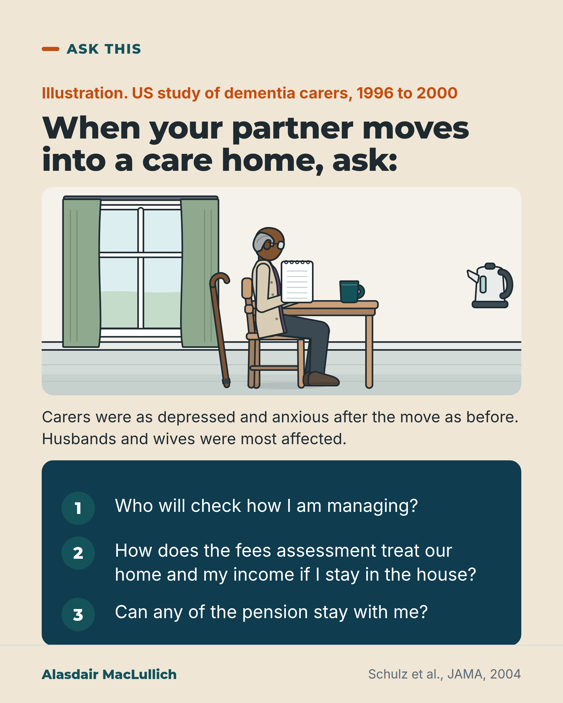

# G168: The partner who stays at home

- Category: C17 Loneliness, relationships, housing and poverty
- Audience: public
- Series: Ask this
- Post type: public_explanation
- Visual format: single image
- Status: text text_final, visual final
- Working id: C17-P04 (candidate C17-07)

## Insight

In a US study, family carers were as depressed and anxious after a relative with dementia moved into a care home as before, and husbands and wives were most affected. The partner who stays at home should be offered their own conversation about how they are coping.

## Angle and position

A care home plan is built around the resident. The person who stays at home often continues to visit and help, and has questions of their own, including about money.

Basis: Mixed. The Schulz 2004 findings are empirical (US, dementia carers, 1996 to 2000). The recommendation to offer the partner their own conversation is a judgement, since support after placement is untested. The money questions are questions only; no rule is stated.

## X (829 characters)

```text
After a relative with dementia moved into a care home, carers' depression and anxiety scores stayed about the same on average.

That is from a US study of 1,222 pairs of family carers and relatives with dementia, from 1996 to 2000. In 180 pairs the relative moved into long-term care. Nearly half of those 180 carers were then at risk of clinical depression. The effects were strongest in husbands and wives: almost half of spouses visited every day and still helped with their partner's physical care.

We should offer the partner who stays at home their own conversation about how they are managing. That is a judgement. Only a few small trials have looked at support after a move. They did not show clear effects on depression or strain, and the evidence is of very low quality.

You can ask: who will check how I am managing?
```

## LinkedIn (1273 characters)

```text
After a relative with dementia moved into a care home, carers' depression and anxiety scores stayed about the same on average.

That is from a US study of 1,222 pairs of family carers and relatives with dementia, at 6 sites from 1996 to 2000. In 180 pairs the relative moved into long-term care. After the move, nearly half of those carers were at risk of clinical depression. The effects were strongest in husbands and wives: almost half of spouses visited every day and still helped with their partner's physical care.

We should offer the partner who stays at home their own conversation about how they are managing. That is a judgement. Only a few small trials have looked at support for carers after a care home move, and they did not show clear effects on depression or strain. The study was done in the US and covered carers of people with dementia only. It says nothing about money rules.

Questions you can ask before and after the move:

1. Who will check how I am managing?
2. How does the fees assessment treat our home and my income if I stay in the house?
3. Can any of the pension stay with me?

The fees assessment is the check of what you can afford to pay towards the cost of the care home. Ask whoever carries it out for the answers to questions 2 and 3.
```

## Bluesky (293 characters)

```text
In a US study, carers' depression and anxiety stayed about the same after a relative with dementia moved into a care home. Effects were strongest in husbands and wives. We should offer the partner at home their own conversation; that is a judgement. Small support trials found no clear effect.
```

## Threads (499 characters)

```text
In a US study of 1,222 pairs of family carers and relatives with dementia, the relative moved into a care home in 180 pairs. On average those carers' depression and anxiety scores stayed about the same, and nearly half were at risk of clinical depression. Effects were strongest in husbands and wives.

Small trials of support after a move have shown no clear effects on depression or strain. We should offer the partner at home their own conversation about how they are coping; that is a judgement.
```

## Source reply

Sources: https://doi.org/10.1001/jama.292.8.961 (Schulz et al., JAMA 2004), https://doi.org/10.11124/JBISRIR-2017-003634 (review of support after placement)

## Visual



Alt text: Drawn illustration of an older man with grey hair and glasses at a kitchen table with a notepad and a mug, a walking stick on his chair. Text: when your partner moves into a care home, ask who will check how I am managing, how fees treat our home and income, and whether any pension can stay. US carers were as depressed after the move as before.

Editable source: `visuals/src/G168.html`

Design instructions: Single card, sand ground. Kit kitchen scene: older brown-skinned man seated at table with notepad and mug, stick on chair. Deep teal panel with 3 questions. Source Schulz 2004.

## Sources and verification

- C17-07-a (supported): In a US prospective study of 1,222 carer and patient pairs, carers' depression and anxiety did not fall after their relative with dementia moved into long-term care; effects were most pronounced in spouses; nearly half of spouses visited daily and still helped with physical care.
  - Source: Schulz R, Belle SH, Czaja SJ, McGinnis KA, Stevens A, Zhang S. Long-term care placement of dementia patients and caregiver health and well-being. JAMA. 2004;292(8):961-7.
  - Passage: ""Prospective study from 1996 to 2000 of the placement transition in a sample of 1222 caregiver-patient dyads recruited from 6 US sites. A total of 180 patients were placed in a long-term care facility during the 18-month follow-up period." "Caregivers who institutionalized their relative reported depressive symptoms and anxiety to be as high as they were while in-home caregivers. Overall CES-D scores for depression did not change from before to after placement (median [IQR], 15.0 [8-24.5] and 15.0 [7.7-28]; P =.64). Overall anxiety scores on the State Trait Inventory also did not change significantly (median [IQR], 22.0 [19-27] before vs 21.1 [18-27] after; P =.21). These effects were most pronounced among caregivers who were married to the patient (P =.02 for depression), visited more frequently (P =.01 for depression and P<.001 for anxiety), and were less satisfied with the help they received from others (P =.003 for depression and P<.001 for anxiety)." "The use of anxiolytics before to after placement increased from 14.6% to 19% (P =.02), and nearly half of caregivers (48.3%) were at risk for clinical depression following placement of their relative." "The transition to institutional care is particularly difficult for spouses, almost half of whom visit the patient daily and continue to provide help with physical care during their visits."" (Abstract (Design, Results, Conclusions))
- C17-07-b (supported_with_qualification): Carers commonly experience stress, guilt, grief and depression after placement, but trial evidence that specific interventions after placement reduce carer depression or burden is sparse and very low grade.
  - Source: Brooks D, Fielding E, Beattie E, Edwards H, Hines S. Effectiveness of psychosocial interventions on the psychological health and emotional well-being of family carers of people with dementia following residential care placement: a systematic review. JBI Database System Rev Implement Rep. 2018;16(5):1240-68.
  - Passage: ""Many carers experience stress, guilt, grief and depression following placement of a relative with dementia into residential care." "Four studies were eligible for inclusion." "Meta-analyses indicated there was no overall effect at three to four months post-intervention on carer burden (weighted mean difference 2.38; 95% CI -7.72 to 12.48), and depression (weighted mean difference 2.17; 95% CI -5.07 to 9.40)." "There is insufficient evidence that individualized or group interventions improve carer depression, burden or satisfaction. However, due to substantial heterogeneity between studies and methodological flaws, the grade of this evidence is very low."" (Abstract (Background, Results, Conclusions))

Verification notes: C17-07-a from the Schulz 2004 JAMA abstract: 1,222 pairs, 6 sites, 1996 to 2000, 180 placements within 18 months, depression and anxiety not lower after placement, 48.3% at risk of clinical depression, effects most pronounced in spouses, almost half of spouses visited daily and helped with physical care. 'Physical care' is not expanded with examples. C17-07-b from Brooks 2018 abstract: few small trials, no clear effects, very low grade; recommendation written as a judgement. Following the editor's guidance, no home or pension rule for England or Scotland is stated (C17-07-c, d, e are not_found); the money lines are questions only, not tied to a body or jurisdiction. The post names the study as US and about dementia carers.

## Attention and follow potential

Pause: Husbands and wives at the point of a care home move, and their adult children, learn that the partner at home is expected to be under strain.

Gain: Evidence that their strain is expected, and three concrete questions to ask.

Follow: Posts that notice the people services forget to count.

## Open issues

None.
