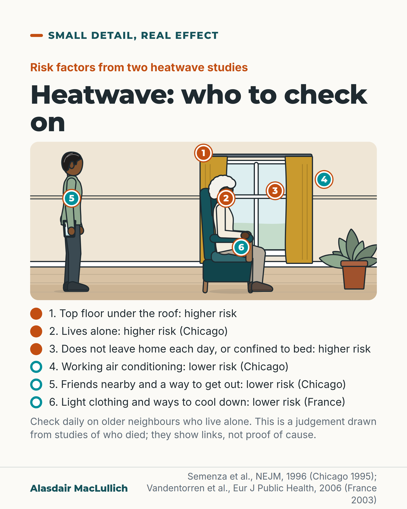

# G169: In a heatwave, check on the person who lives alone

- Category: C17 Loneliness, relationships, housing and poverty
- Audience: public
- Series: Small detail, real effect
- Post type: public_explanation
- Visual format: single image
- Status: text text_final, visual final
- Working id: C17-P05 (candidate C17-24)

## Insight

In two big heatwaves, older people who died were more likely to live alone, stay in bed or not leave home, and live on the top floor; friends nearby, working air conditioning, transport and cooling were linked with lower risk. Relatives and neighbours can check daily.

## Angle and position

The heat risk profile is also an isolation and housing profile. The advice to check is a judgement from studies of who died.

Basis: Mixed. The risk and protective factors are empirical (two case-control studies, association only). The advice that relatives and neighbours should check daily is a judgement drawn from them.

## X (849 characters)

```text
Check on older neighbours who live alone when the weather turns hot.

In the 1995 Chicago heatwave, people with medical problems who were confined to bed were the most likely to die. So were people who did not leave home each day. Living on the top floor and living alone were also linked with higher risk. Friends nearby, working air conditioning and access to transport were linked with lower risk.

In France in 2003, a study looked at people aged 65 and over living at home. Being unable to get about, poor insulation and sleeping on the top floor right under the roof were linked with dying. Dressing lightly and using ways to cool down were linked with surviving.

These studies compared people who died with others who lived, so they show links only. Our judgement from them: check every day on older neighbours who live alone when it is hot.
```

## LinkedIn (1436 characters)

```text
Check on older neighbours who live alone when the weather turns hot.

In the July 1995 Chicago heatwave, researchers compared 339 people who died with 339 matched neighbours who did not. The people most likely to die were those with medical problems who were confined to bed, and those who did not leave home each day. Living on the top floor and living alone were also linked with higher risk. Having friends nearby or group activities, working air conditioning and access to transport were linked with lower risk.

In the August 2003 heatwave in France, a similar study looked at people aged 65 and over living at home. Being unable to get about, living in a poorly insulated home and sleeping on the top floor right under the roof were linked with dying. Dressing lightly and using ways to cool down were linked with surviving.

Both studies compared people who died with others who lived, so they show links and not proof of cause. The French study covered people aged 65 and over living at home; the Chicago abstract gives no age limit. They were done in the United States in 1995 and France in 2003.

Our judgement from these studies is that relatives and neighbours should check daily during a heatwave on older people who live alone or rarely go out, especially those in top-floor flats. They should also help them find ways to cool down.

Who on your street lives alone and rarely goes out? Say hello before the next hot spell.
```

## Bluesky (298 characters)

```text
In the 1995 Chicago heatwave, people who died were more likely to live alone, be confined to bed or live on the top floor. In France in 2003, being unable to get about and sleeping under the roof were linked with dying. Our judgement: older neighbours who live alone need a daily check in the heat.
```

## Threads (500 characters)

```text
Check on older neighbours who live alone when the weather turns hot.

In the 1995 Chicago heatwave, people who died were more likely to live on the top floor or to live alone. Among people with medical problems, being confined to bed was linked with higher risk. So was not leaving home each day. Friends nearby, working air conditioning and transport were linked with lower risk.

These studies show links only. Our judgement from them: check daily on older neighbours who live alone when it is hot.
```

## Source reply

Sources: https://pubmed.ncbi.nlm.nih.gov/8649494/ (Chicago 1995, NEJM 1996), https://pubmed.ncbi.nlm.nih.gov/17028103/ (France 2003, Eur J Public Health 2006)

## Visual



Alt text: Drawing of a room with an older woman in a light top sitting in an armchair by a window, and a man standing at the left holding a glass. Six numbered keys: top floor, living alone, not leaving home or confined to bed raised heatwave risk; air conditioning, friends and a way out, light clothing lowered it. Links, not proof.

Editable source: `visuals/src/G169.html`

Design instructions: Single card, scene with Kit home_living: older woman in armchair by window, man standing with glass, 6 pins (orange higher risk, teal lower) plus legend with filled vs ring markers. Not a rebuild of the brief's top-floor cutaway.

## Sources and verification

- C17-24-a (supported): Chicago 1995: bed confinement, not leaving home daily, top floor, living alone raised risk; social contacts, air conditioning, transport protective.
  - Source: Semenza JC, Rubin CH, Falter KH, et al. Heat-related deaths during the July 1995 heat wave in Chicago. N Engl J Med. 1996;335(2):84-90.
  - Passage: "The risk of heat-related death was increased for people with known medical problems who were confined to bed (odds ratio as compared with those who were not confined to bed, 5.5) or who were unable to care for themselves (odds ratio, 4.1). Also at increased risk were those who did not leave home each day (odds ratio, 6.7), who lived alone (odds ratio, 2.3), or who lived on the top floor of a building (odds ratio, 4.7). Having social contacts such as group activities or friends in the area was protective. In a multivariate analysis, the strongest risk factors for heat-related death were being confined to bed (odds ratio, 8.2) and living alone (odds ratio, 2.3); the risk of death was reduced for people with working air conditioners (odds ratio, 0.3) and those with access to transportation (odds ratio, 0.3)." (Abstract)
- C17-24-b (supported): France 2003: lack of mobility, no insulation, sleeping on top floor under roof linked with death; dressing lightly and cooling protective.
  - Source: Vandentorren S, Bretin P, Zeghnoun A, et al. August 2003 heat wave in France: risk factors for death of elderly people living at home. Eur J Public Health. 2006;16(6):583-91.
  - Passage: "Lack of mobility was a major risk factor along with some pre-existing medical conditions. Housing characteristics associated with death were lack of thermal insulation and sleeping on the top floor, right under the roof. The temperature around the building was a major risk factor. Behaviour such as dressing lightly and use of cooling techniques and devices were protective factors." (Abstract)

Verification notes: C17-24-a from the Semenza 1996 NEJM abstract (339 pairs; bed confinement, not leaving home daily, top floor, living alone raised risk; social contacts, air conditioning, transport protective); no odds ratios converted to 'times more likely'. C17-24-b from the Vandentorren 2006 abstract (France 2003, age 65 and over at home; lack of mobility, poor insulation, top floor under the roof linked with death; dressing lightly and cooling measures protective). UK heat guidance (C17-24-c) is not cited. The daily-check advice is written as a judgement from studies of who died, and nothing is asserted about trials. In the visual the objects shown (air conditioning unit, light dress, neighbour, bus stop) match factors named in the claims; nothing else (fan, curtains) is labelled as protective.

## Attention and follow potential

Pause: Neighbours and relatives of older people who live alone, at the start of a hot spell, see a concrete list of who was at highest risk.

Gain: Who to check on, and what was linked with lower risk.

Follow: Seasonal posts that link housing and isolation to health.

## Open issues

None.
