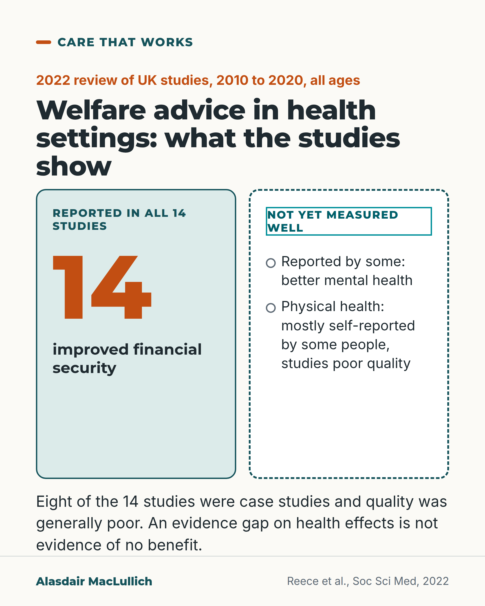

# G170: Welfare advice in health settings

- Category: C17 Loneliness, relationships, housing and poverty
- Audience: practitioners
- Series: Care that works
- Post type: good_care
- Visual format: single image
- Status: text text_final, visual final
- Working id: C17-P06 (candidate C17-17)

## Insight

All 14 UK studies of welfare rights advice in GP surgeries and other health settings reported improved financial security; health effects are not yet measured well because the studies are mostly of poor quality.

## Angle and position

A service model with an honest reading: the money gain is shown, the health benefit is an evidence gap and not a finding of no benefit.

Basis: Mixed. The review findings are empirical (studies of all ages, mostly poor quality). That health services serving older people on low incomes should offer a route to this advice is a judgement.

## X (872 characters)

```text
All 14 UK studies of welfare rights advice offered in GP surgeries and other health settings reported improved financial security for the people who used it. Welfare rights advice is help to claim the benefits a person is entitled to.

That is from a 2022 review of studies from 2010 to 2020. Some also reported better mental health, and some people said their physical health improved. Eight of the 14 studies were case studies, and the review rated their quality as generally poor. The money gain is not firmly established, and the health effects are not yet measured well.

A second 2022 review of 15 articles on UK free advice services found advice often linked with better mental health and wellbeing. Both reviews covered all ages, not only older people.

Health services that see older people on low incomes should offer a route to this advice. That is a judgement.
```

## LinkedIn (1456 characters)

```text
All 14 UK studies of welfare rights advice offered in GP surgeries and other health settings reported improved financial security for the people who used it. Welfare rights advice means help to claim the benefits and support a person is entitled to.

That is from a 2022 review of UK studies from 2010 to 2020. Some also reported better mental health, and some people said their physical health improved. Eight of the 14 studies were case studies, and the review rated their quality as generally poor, so neither the money gain nor the health effects are firmly established. That leaves an evidence gap. Weak studies leave open whether advice improves health.

A second 2022 review, of 15 articles on UK free advice services, agreed that advice services are often linked with better mental health and wellbeing. It noted that earlier reviews had described the evidence on health as weak, and that placing advice in health settings looks promising.

Both reviews covered all ages, and the second mainly covered working-age people on low incomes, so neither is a study of older people only.

Our judgement is that health services that see older people on low incomes should offer a route to welfare rights advice, and that better studies should measure the health effects. All 14 studies reported a money gain, but their quality was generally poor, so even that result is not firm.

Does your practice or ward know where to send someone with a money problem?
```

## Bluesky (277 characters)

```text
All 14 UK studies of welfare rights advice in GP surgeries and other health settings reported improved financial security. Most were of poor quality, so neither the money gain nor the health effects are firm. Health services should offer a route to advice; that is a judgement.
```

## Threads (382 characters)

```text
All 14 UK studies of welfare rights advice (help to claim benefits) in health settings reported improved financial security (2022 review, studies 2010 to 2020). The studies were mostly of poor quality, so neither the money gain nor the health effects are firm. They covered all ages.

Our judgement: services that see older people on low incomes should offer a route to this advice.
```

## Source reply

Sources: https://pubmed.ncbi.nlm.nih.gov/35123370/ (Reece et al., Soc Sci Med 2022), https://pubmed.ncbi.nlm.nih.gov/35307896/ (Young and Bates, Health Soc Care Community 2022)

## Visual



Alt text: Two-column card on welfare advice in UK health settings, a 2022 review of studies from 2010 to 2020, all ages. Left: reported in all 14 studies, improved financial security. Right, dashed: not yet measured well; better mental health reported by some, physical health mostly self-reported. Quality was poor; a gap is not evidence of no benefit.

Editable source: `visuals/src/G170.html`

Design instructions: Single comparison card: mint solid column with big orange 14; dashed hatched column. Claim C17-17-a.

## Sources and verification

- C17-17-a (supported_with_qualification): 14 UK studies of welfare advice co-located in health settings; all showed improved financial security; quality poor.
  - Source: Reece S, Sheldon TA, Dickerson J, Pickett KE. A review of the effectiveness and experiences of welfare advice services co-located in health settings: a critical narrative systematic review. Soc Sci Med. 2022;296:114746.
  - Passage: "The review identified 14 studies employing a range of study designs, including: one non-randomised controlled trial; one pilot randomised controlled trial; one before-and-after-study; three qualitative studies; and eight case studies. ... All studies demonstrated improved financial security for participants, generating an average of £27 of social, economic and environmental return per £1 invested. Some studies reported improved mental health for individuals accessing services. Several studies attributed subjective improvements in physical health to the service addressing key social determinants of health. ... However, given the generally poor scientific quality of the studies, care must be taken in drawing firm conclusions." (Abstract)
- C17-17-b (supported_with_qualification): Earlier reviews found weak evidence on health outcomes; later review finds mental health improvements commonly attributed.
  - Source: Young D, Bates G. Maximising the health impacts of free advice services in the UK: a mixed methods systematic review. Health Soc Care Community. 2022;30(5):1713-1725.
  - Passage: "Previous systematic reviews investigating the link between advice services and health outcomes have found a weak evidence base and cover the period up until 2010. ... Our synthesis suggested that improvements in mental health and well-being measures are commonly attributed to advice service interventions. However, there is little insight to explain these impacts... Co-locating services in health settings appears promising" (Abstract)

Verification notes: C17-17-a from the Reece 2022 abstract: 14 UK studies, 2010 to 2020, all showed improved financial security, some better mental health, physical improvements mostly subjective, poor overall quality; all ages. C17-17-b from the Young and Bates 2022 abstract: 15 articles, advice often linked with better mental health and wellbeing, earlier reviews described the evidence as weak (the paper's introduction, cited as such), placing advice in health settings looks promising; mainly working-age low-income people. The modelled return of 27 pounds per pound and the Scottish practice claim are omitted. The one-line definition of welfare rights advice is a definition of the term and not a factual claim about services. The recommendation is written as a judgement.

## Attention and follow potential

Pause: GPs, practice managers and hospital teams who meet money problems daily see a consistent result with its honest limit.

Gain: A service model with the strength and the limit of its evidence stated.

Follow: Posts that treat poverty as a clinical problem with practical responses.

## Open issues

None.
