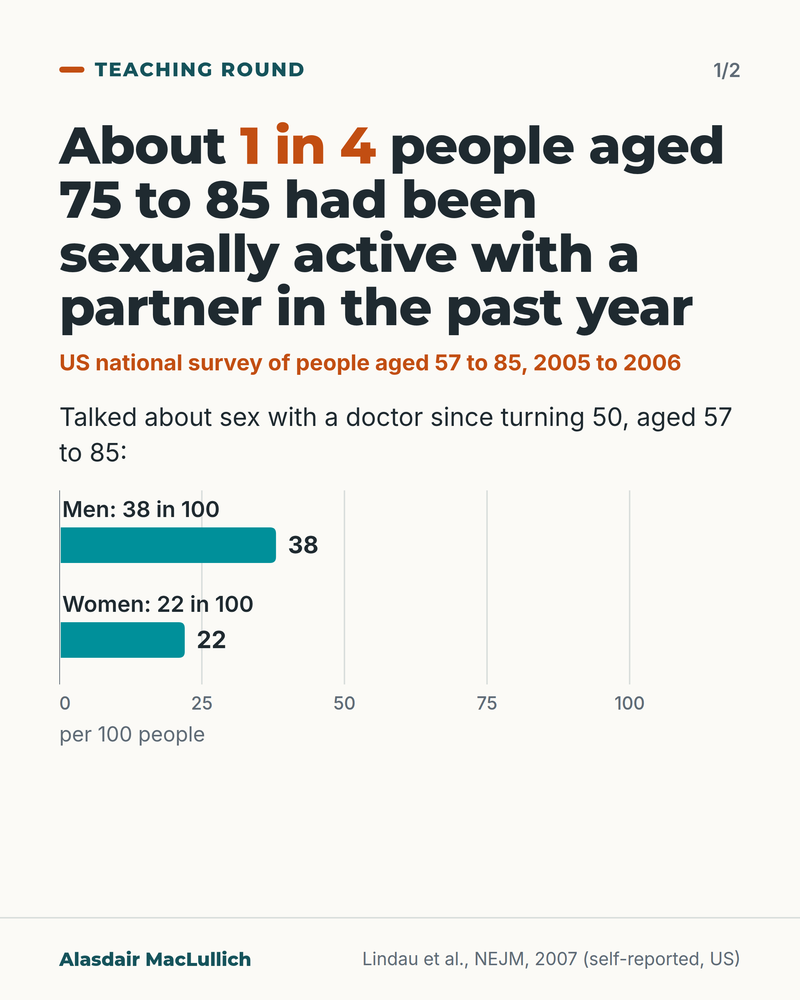
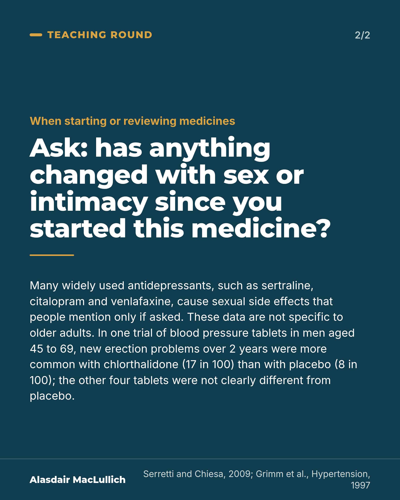

# G171: Ask about sex and intimacy

- Category: C17 Loneliness, relationships, housing and poverty
- Audience: practitioners
- Series: Teaching round
- Post type: teaching
- Visual format: carousel (2 cards)
- Status: text text_final, visual final
- Working id: C17-P07 (candidate C17-19)

## Insight

In a US national survey, about 1 in 4 people aged 75 to 85 had been sexually active with a partner in the past year, yet most people aged 57 to 85 had not discussed sex with a doctor since turning 50. Clinicians should ask, especially when starting or reviewing medicines.

## Angle and position

Not asking is a default that leaves sexual problems and medicine side effects unspoken. The data make the question ordinary, and a form of words makes it easy.

Basis: Mixed. The survey figures and medicine findings are empirical (US self-report from 2005 to 2006; antidepressant meta-analysis; one blood pressure trial). That clinicians should ask is a clinical judgement, marked as one.

## X (801 characters)

```text
About 1 in 4 people aged 75 to 85 had been sexually active with a partner in the past year, in a US national survey of people aged 57 to 85 (interviewed 2005 to 2006). Among all the sexually active people in the survey (aged 57 to 85), about half had a sexual problem that bothered them.

In the same survey, only about 4 in 10 men and 1 in 5 women had talked about sex with a doctor since turning 50.

Sexual side effects are common with some antidepressants, such as sertraline, citalopram and venlafaxine, and people tend not to mention them unless asked. The antidepressant data are not specific to older adults.

We should ask older patients about sex and intimacy, especially when starting or reviewing medicines. Try: "Has anything changed with sex or intimacy since you started this medicine?"
```

## LinkedIn (1990 characters)

```text
About 1 in 4 people aged 75 to 85 had been sexually active with a partner in the past year, in a US national survey of 3,005 people aged 57 to 85 (interviewed 2005 to 2006). That was about 4 in 10 men and 1 in 6 women, and women were less likely to have a partner. Among all the sexually active people in the survey (aged 57 to 85), about half had at least one sexual problem that bothered them.

In the same survey, only about 4 in 10 men and 1 in 5 women said they had talked about sex with a doctor since turning 50. The authors noted that both patients and doctors were reluctant to raise it.

Data from England also show a sizeable minority of men and women still sexually active in their 70s and 80s. In the English Longitudinal Study of Ageing (6,201 people aged 50 and over, 2012 to 2013), among those who were sexually active, about 4 in 10 men reported erection problems and about 1 in 3 women reported difficulty with arousal.

Medicines are one reason to ask:

1. Sexual side effects are common with many widely used antidepressants, such as sertraline, citalopram and venlafaxine, and people tend not to mention them unless asked directly. Mirtazapine did not show a clear difference from placebo. These antidepressant data are not specific to older adults.
2. In a blinded trial of five blood pressure tablets in people aged 45 to 69, men on chlorthalidone had more new erection problems over 2 years than men on placebo. About 17 in 100 had a new problem on chlorthalidone compared with 8 in 100 on placebo. The other four medicines did not differ clearly from placebo, and by 4 years the chlorthalidone difference was no longer clear. The trial included people from age 45, so it is not specific to older adults. A new problem should not automatically be blamed on a blood pressure tablet.

We should ask older patients about sex and intimacy, especially when starting or reviewing medicines. Try: "Has anything changed with sex or intimacy since you started this medicine?"
```

## Bluesky (267 characters)

```text
In a US survey, about 1 in 4 people aged 75 to 85 had been sexually active with a partner in the past year. Only about 4 in 10 men and 1 in 5 women aged 57 to 85 had discussed sex with a doctor since 50. We should ask, especially when starting or reviewing medicines.
```

## Threads (472 characters)

```text
In a US national survey, about 1 in 4 people aged 75 to 85 had been sexually active with a partner in the past year. Among all the sexually active people in the survey (aged 57 to 85), about half had a problem that bothered them. Only about 4 in 10 men and 1 in 5 women aged 57 to 85 had talked about sex with a doctor since 50.

Sexual side effects of some antidepressants often go unmentioned unless asked. We should ask, especially when starting or reviewing medicines.
```

## Source reply

Sources: https://doi.org/10.1056/NEJMoa067423 (Lindau et al., NEJM 2007), https://doi.org/10.1007/s10508-014-0465-1 (ELSA, 2016), https://doi.org/10.1097/JCP.0b013e3181a5233f (antidepressants), https://doi.org/10.1161/01.hyp.29.1.8 (blood pressure tablets)

## Visual



Alt text: Bar chart from a US survey of people aged 57 to 85, with headline that about 1 in 4 people aged 75 to 85 were sexually active with a partner in the past year. Talked about sex with a doctor since turning 50: men 38 in 100, women 22 in 100. Self-reported.



Alt text: Question card: ask, has anything changed with sex or intimacy since you started this medicine? Some antidepressants cause sexual side effects. Blood pressure trial, men 45 to 69, 2 years: new erection problems 17 in 100 on chlorthalidone, 8 in 100 on placebo; other four not clearly different.

Editable source: `visuals/src/G171.html`

Design instructions: Carousel 2. Card 1: barChart men 38 women 22 (teal), max 100. Card 2: dark question card. Claim C17-19-b.

## Sources and verification

- C17-19-a (supported): In a US national probability sample of 3,005 adults aged 57 to 85, 26% of those aged 75 to 85 reported sexual activity in the previous year; about half of sexually active people reported at least one bothersome sexual problem.
  - Source: Lindau ST, Schumm LP, Laumann EO, Levinson W, O'Muircheartaigh CA, Waite LJ. A study of sexuality and health among older adults in the United States. N Engl J Med. 2007;357(8):762-74.
  - Passage: "Abstract: "We report the prevalence of sexual activity, behaviors, and problems in a national probability sample of 3005 U.S. adults (1550 women and 1455 men) 57 to 85 years of age". "The prevalence of sexual activity declined with age (73% among respondents who were 57 to 64 years of age, 53% among respondents who were 65 to 74 years of age, and 26% among respondents who were 75 to 85 years of age); women were significantly less likely than men at all ages to report sexual activity. Among respondents who were sexually active, about half of both men and women reported at least one bothersome sexual problem." Methods: "In-home interviews were conducted in English and Spanish by professional interviewers between July 2005 and March 2006." Table 2, sexual activity with a partner in previous 12 months, aged 75 to 85: men 38.5% (95% CI 33.6 to 43.5), women 16.7% (12.5 to 21.0)." (Abstract; Methods (Study Population); Table 2 (read via Undermind))
- C17-19-b (supported): In the same sample, 38% of men and 22% of women had discussed sex with a physician since age 50.
  - Source: Lindau ST, Schumm LP, Laumann EO, Levinson W, O'Muircheartaigh CA, Waite LJ. A study of sexuality and health among older adults in the United States. N Engl J Med. 2007;357(8):762-74.
  - Passage: "Abstract: "A total of 38% of men and 22% of women reported having discussed sex with a physician since the age of 50 years." "Sexual problems are frequent among older adults, but these problems are infrequently discussed with physicians." Methods: "Communication with a physician about sex was ascertained in the leave-behind questionnaire with the following question: 'Since you turned 50, have you ever discussed sex with a doctor?'" Discussion: "Reasons for poor communication include the unwillingness of patients and physicians to initiate such discussions and sex and age differences between patients and their physicians."" (Abstract; Methods (Measures); Discussion (read via Undermind))
- C17-19-c (supported_with_qualification): In ELSA wave 6 (6,201 people aged 50 to over 90), a sizeable minority remained sexually active into their 70s and 80s; erectile difficulty was reported by 39% of sexually active men and arousal difficulty by 32% of sexually active women.
  - Source: Lee DM, Nazroo J, O'Connor DB, Blake M, Pendleton N. Sexual health and well-being among older men and women in England: findings from the English Longitudinal Study of Ageing. Arch Sex Behav. 2016;45(1):133-44.
  - Passage: ""a total of 6,201 core ELSA participants (56 % women) aged 50 to >90 completed a comprehensive Sexual Relationships and Activities questionnaire (SRA-Q) included in ELSA Wave 6 (2012/13)." "Difficulties most frequently reported by sexually active women related to becoming sexually aroused (32 %) and achieving orgasm (27 %), while for men it was erectile function (39 %)." "Levels of sexual activity decline with increasing age, although a sizable minority of men and women remain sexually active until the eighth and ninth decades of life. Problems with sexual functioning were relatively common, but overall levels of sexual health concerns were much lower."" (Abstract)
- C17-19-d (supported_with_qualification): Commonly prescribed antidepressants (SSRIs and SNRIs) often cause sexual side effects, which patients rarely report unless asked directly.
  - Source: Serretti A, Chiesa A. Treatment-emergent sexual dysfunction related to antidepressants: a meta-analysis. J Clin Psychopharmacol. 2009;29(3):259-66.
  - Passage: ""Sexual dysfunction (SD) is an important underestimated adverse effect of antidepressant drugs. Patients, in fact, if not directly questioned, tend to scarcely report them." "Our analyses indicated a significantly higher rate of total and specific treatment-emergent SD and specific phases of dysfunction compared with placebo for the following drugs in decreasing order of impact: sertraline, venlafaxine, citalopram, paroxetine, fluoxetine, imipramine, phenelzine, duloxetine, escitalopram, and fluvoxamine, with SD ranging from 25.8% to 80.3% of patients. No significant difference with placebo was found for the following antidepressants: agomelatine, amineptine, bupropion, moclobemide, mirtazapine, and nefazodone."" (Abstract)
- C17-19-e (supported_with_qualification): Some blood pressure medicines are associated with sexual dysfunction.
  - Source: Grimm RH, Grandits GA, Prineas RJ, McDonald RH, Lewis CE, Flack JM, et al. Long-term effects on sexual function of five antihypertensive drugs and nutritional hygienic treatment in hypertensive men and women. Treatment of Mild Hypertension Study (TOMHS). Hypertension. 1997;29(1 Pt 1):8-14.
  - Passage: ""Participants randomized to chlorthalidone reported a significantly higher incidence of erection problems through 24 months than participants randomized to placebo (17.1% versus 8.1%, P = .025). Incidence rates through 48 months were more similar among treatment groups than at 24 months, with nonsignificant differences between the chlorthalidone and placebo groups. Incidence was lowest in the doxazosin group but was not significantly different from the placebo group. Incidence for acebutolol, amlodipine, and enalapril groups was similar to that in the placebo group." "Similar incidence rates of erection dysfunction in placebo and most active drug groups caution against routine attribution of erection problems to antihypertensive medication."" (Abstract)

Verification notes: C17-19-a and b from Lindau 2007 (full text): 3,005 people aged 57 to 85, interviews 2005 to 2006; 26% of 75 to 85 sexually active with a partner (38.5% men, 16.7% women); about half of the sexually active had a bothersome problem; 38% of men and 22% of women had discussed sex with a doctor since 50 (the figure covers ages 57 to 85, stated as such). C17-19-c from the ELSA 2016 abstract: 6,201 people aged 50 and over, 39% of sexually active men with erection difficulty, 32% of sexually active women with arousal difficulty; no figure given for people in their 80s. C17-19-d from Serretti 2009 meta-analysis abstract (SSRIs and venlafaxine common, unreported unless asked; mirtazapine not clearly different; not specific to older adults). C17-19-e from the Grimm 1997 TOMHS abstract (men, aged 45 to 69, chlorthalidone 17 in 100 vs 8 in 100 at 2 years; four others not clearly different). Antiandrogens omitted. The recommendation to ask is a judgement; the form of words is a suggestion.

## Attention and follow potential

Pause: Clinicians who have never asked a patient over 75 about sex see that most people have not been asked by anyone.

Gain: Data that make the question ordinary, and a form of words to use.

Follow: Teaching that treats older people as whole people, including their relationships.

## Open issues

None.
