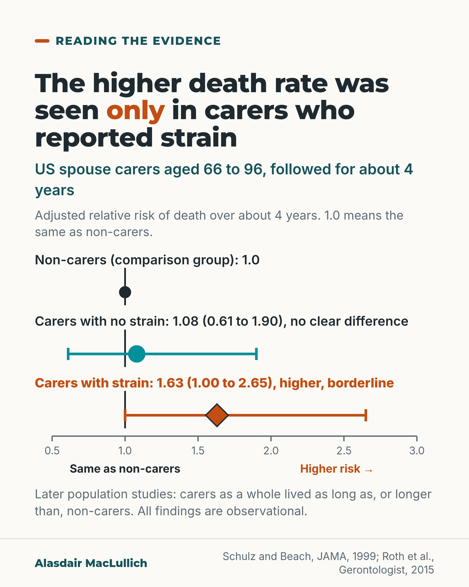

# G172: The higher death rate was seen only in carers who reported strain

- Category: C18 Unpaid carers and the care workforce
- Audience: practitioners
- Series: Reading the evidence
- Post type: evidence_interpretation
- Visual format: chart (interval plot)
- Status: text text_final, visual final
- Working id: C18-P01 (candidate C18-11)

## Insight

In the 1999 study usually cited for caring harming health, the higher death rate over 4 years was seen only in spouse carers who reported strain, and that estimate was borderline. Later population studies found carers as a whole lived as long as or longer than non-carers.

## Angle and position

Correct a common reading of Schulz and Beach 1999. The label 'carer' does not identify who needs help first; reported strain is the more useful signal. Position: ask every carer about strain and offer support first to those who report it.

Basis: Mixed. Empirical finding: Schulz and Beach 1999 (borderline estimate), Roth 2015 and Janson 2022 reviews (observational). Clinical interpretation and judgement: reported strain is the more useful signal, so ask about it and prioritise support.

## X (772 characters)

```text
A 1999 study is widely cited as evidence that caring for a spouse harms health. The detail supports a narrower reading.

In 392 US spouse carers and 427 non-carers aged 66 to 96, 103 of the 819 people (12.6%) died within 4 years. The higher death rate was seen only in carers who reported mental or emotional strain (adjusted relative risk 1.63, 95% confidence interval 1.00 to 2.65, so borderline). Carers without strain showed no clear difference from non-carers.

Five later population studies found carers as a whole lived as long as, or longer than, non-carers. That does not show caring protects health. In cross-sectional studies, carers also report more depression and anxiety.

Ask each carer directly about strain, and offer support first to those who report it.
```

## LinkedIn (1479 characters)

```text
A 1999 study is widely cited as evidence that caring for a spouse harms health. The detail supports a narrower reading.

Schulz and Beach followed 392 spouse carers and 427 non-carers, aged 66 to 96, in four US communities for about 4 years. The higher death rate was seen only in carers who reported mental or emotional strain from caring (adjusted relative risk 1.63, 95% confidence interval 1.00 to 2.65). The lower end of that interval is 1.00, so the finding is borderline.

Carers who reported no strain showed no clear difference from non-carers (relative risk 1.08, 95% confidence interval 0.61 to 1.90).

A 2015 review by Roth, Fredman and Haley then found five later population-based studies in which carers as a whole lived as long as, or longer than, non-carers. The review also notes that most carers report some benefit from caring, and many report little or no strain.

This does not show that caring protects health. These are observational studies, and a 2022 systematic review of 22 studies says the lower mortality may be due to healthier people taking on caring. The same review found that carers still report more depression and anxiety in cross-sectional studies.

Two points follow, both clinical judgement rather than findings. The label of carer does not tell us who needs help first. Reported strain is the more useful signal.

So ask each carer directly whether caring is causing strain, record the answer, and offer support first to those who say yes.
```

## Bluesky (282 characters)

```text
The 1999 study cited as showing that caring harms health found a higher 4-year death rate than in non-carers, only among spouse carers who reported strain. The result was borderline. Later population studies found carers overall lived as long or longer. Ask each carer about strain.
```

## Threads (488 characters)

```text
A 1999 US study is widely cited as showing that caring for a spouse harms health. In it, the higher death rate over 4 years was seen only in carers who reported strain, and the result was borderline. Carers without strain showed no clear difference from non-carers.

Five later population studies found carers as a whole lived as long as, or longer than, non-carers. Healthier people may take on caring, so that does not show caring protects health.

Ask each carer directly about strain.
```

## Source reply

Sources: Schulz and Beach, JAMA 1999 https://doi.org/10.1001/jama.282.23.2215 ; Roth et al., Gerontologist 2015 https://doi.org/10.1093/geront/gnu177 ; Janson et al., Int J Environ Res Public Health 2022 https://doi.org/10.3390/ijerph19105864

## Visual



Alt text: Interval chart of relative risk of death over about 4 years in US spouse carers aged 66 to 96, with non-carers at 1.0. Carers with no strain: 1.08, range 0.61 to 1.90, no clear difference. Carers with strain: 1.63, range 1.00 to 2.65, higher but borderline. Observational; later studies found carers overall lived as long or longer.

Editable source: `visuals/src/G172.html`

Design instructions: Interval plot on off-white; axis 0.5 to 3.0 with solid reference line at 1.0; teal circles for comparison and no-strain rows, burnt orange diamond with bold label for strain row; claim C18-11-a.

## Sources and verification

- C18-11-a (supported_with_qualification): Among older spouse carers, only those reporting strain had higher adjusted 4-year mortality than non-carers.
  - Source: Schulz R, Beach SR. Caregiving as a risk factor for mortality: the Caregiver Health Effects Study. JAMA. 1999;282(23):2215-9.
  - Passage: "participants who were providing care and experiencing caregiver strain had mortality risks that were 63% higher than noncaregiving controls (relative risk [RR], 1.63; 95% confidence interval [CI], 1.00-2.65). Participants who were providing care but not experiencing strain (RR, 1.08; 95 % CI, 0.61-1.90) and those with a disabled spouse who were not providing care (RR, 1.37; 95% CI, 0.73-2.58) did not have elevated adjusted mortality rates" (Abstract, Results)
- C18-11-b (supported_with_qualification): The 1999 study is widely cited; five later population studies found lower mortality for carers as a whole; most carers report benefits.
  - Source: Roth DL, Fredman L, Haley WE. Informal caregiving and its impact on health: a reappraisal from population-based studies. Gerontologist. 2015;55(2):309-19.
  - Passage: "A landmark study by Schulz and Beach that reported higher mortality rates for strained spouse caregivers has been widely cited as evidence for the physical health risks of caregiving ... However, 5 subsequent population-based studies have found reduced mortality and extended longevity for caregivers as a whole compared with noncaregiving controls. Most caregivers also report benefits from caregiving, and many report little or no caregiving-related strain." (Abstract)
- C18-11-c (supported_with_qualification): Lower mortality in carers compared with non-carers in longitudinal observational studies may reflect healthy people taking on caring (healthy-carer bias), and carers still show more depression and anxiety in cross-sectional studies.
  - Source: Janson P, Willeke K, Zaibert L, et al. Mortality, morbidity and health-related outcomes in informal caregivers compared to non-caregivers: a systematic review. Int J Environ Res Public Health. 2022;19(10):5864.
  - Passage: "The lower mortality rates compared to non-caregivers may be due to a healthy-carer bias in longitudinal observational studies; however, these and other potential benefits of informal caregiving deserve further attention by researchers. ... In cross-sectional evaluations, informal caregiving seemed to be associated with a higher occurrence of depression and of anxiety (ranging from 4 to 51% and 2 to 38%, respectively), pain, hypertension, diabetes and reduced quality of life." (Abstract, Results and Conclusions)

Verification notes: C18-11-a (PMID 10605972, abstract): RR 1.63 (1.00 to 2.65) strained carers, RR 1.08 (0.61 to 1.90) carers without strain, 392 carers and 427 non-carers, aged 66 to 96, about 4 years; borderline lower limit and observational design carried in every caption; no 'X times more likely' or '63% higher' wording. C18-11-b (PMID 26035608, abstract): five later population studies, carers as a whole lived as long as or longer; 'most carers report benefits' used in LinkedIn only. C18-11-c (PMID 35627399, abstract): healthy-carer explanation given as 'may be due to' (22 studies), carers still report more depression and anxiety in cross-sectional studies. Access level: abstract only for all three. Judgement (reported strain is the more useful signal; ask and prioritise) marked as judgement in LinkedIn; not stated as a finding.

## Attention and follow potential

Pause: A practitioner who has repeated that caring shortens life sees that the higher death rate sat in one subgroup, and that its estimate was borderline.

Gain: A correct reading of a much-quoted study, and a concrete action: ask about strain.

Follow: Careful reading of evidence that is often misquoted, without playing down carer strain.

## Open issues

None.
