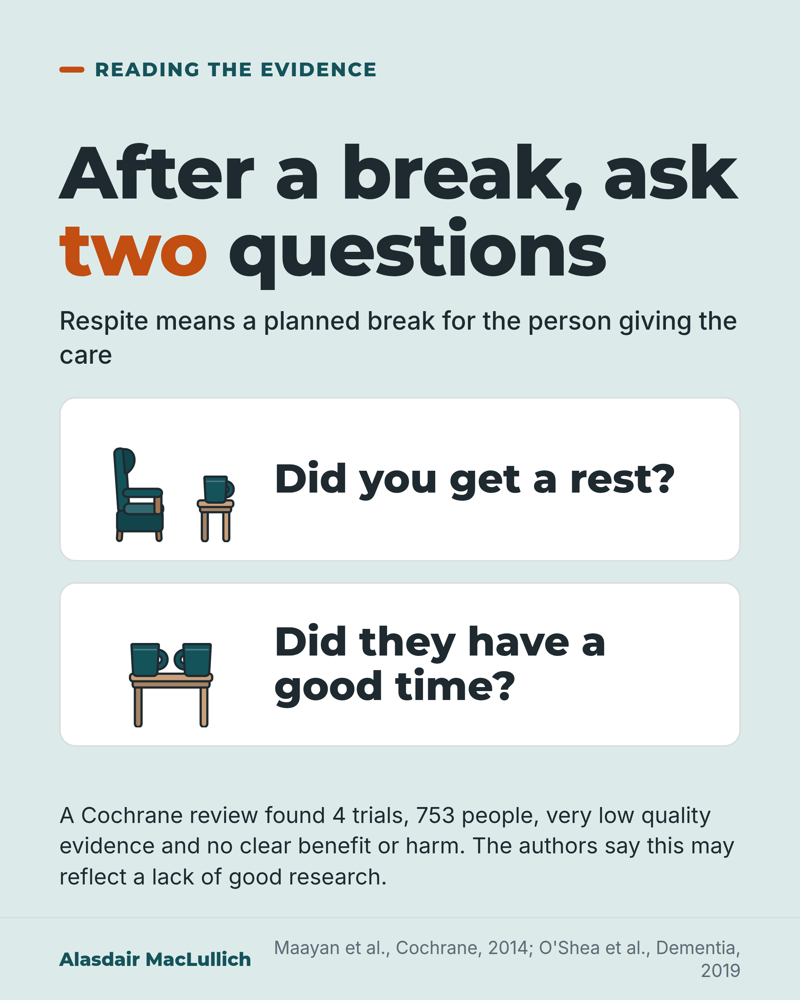

# G173: Few weak trials of respite are a gap, not proof that breaks fail

- Category: C18 Unpaid carers and the care workforce
- Audience: both
- Series: Reading the evidence
- Post type: evidence_interpretation
- Visual format: question card
- Status: text text_final, visual final
- Working id: C18-P02 (candidate C18-13)

## Insight

A Cochrane review found only four trials of respite for people with dementia and their carers, with very low quality evidence and no clear benefit or harm. The authors say this may reflect a lack of good research. Research on carers' experiences suggests a break feels like a rest when the carer believes the person is benefiting too.

## Angle and position

Separate a gap in the evidence from evidence of no benefit, and give carers and practitioners two questions to judge a break. Position: weak trials are not a reason to withhold breaks.

Basis: Mixed. Empirical: Cochrane review (2014) and concept analysis (2019); 2026 review as preliminary. Ethical and practical judgement: we should not withhold breaks because trials are weak; the two questions are a suggestion.

## X (804 characters)

```text
A review of trials by the Cochrane group found only four trials of respite care for people with dementia and their carers, with 753 people in all. Respite means a planned break for the person giving the care.

The evidence was rated very low quality. The trials were too different to combine. The review found no clear difference between respite and no respite on any measure for carers. The review authors say this may reflect a lack of good research rather than a lack of benefit. Our judgement, not a finding: we should not withhold breaks because the trials are weak.

Research on carers' experiences suggests a break feels like a real rest when the carer believes the person they care for is benefiting too. After a break, ask yourself two questions: did I get a rest, and did they have a good time?
```

## LinkedIn (1584 characters)

```text
A review of trials by the Cochrane group found only four trials of respite care for people with dementia and their carers, with 753 people in all. Respite means a planned break for the person giving the care.

The review, published in 2014, rated the evidence as very low quality. The trials were too different to combine. The review found no clear difference between respite and no respite on any measure for carers, and no usable results for the people with dementia themselves. The authors say the result may reflect a lack of good research rather than a lack of benefit. A 2026 search of the main medical research database found no later update from the Cochrane group.

A 2026 review looked at eight studies of respite programmes for carers of people with disability or dementia. Three were randomised trials and five used other designs. It found that respite may be linked with better outcomes for carers. Every one of the eight studies had a flaw that could make its results unreliable, so those findings are preliminary and do not confirm a benefit.

A 2019 review of research based on carers' own accounts describes respite as both a service and a feeling of being rested. A break feels like a real rest when the carer believes the person they care for is benefiting too.

Our judgement, not a finding: we should not withhold breaks because the trials are weak. Having only a few weak trials is a gap in the evidence. It does not show that breaks fail.

To judge a break, ask yourself two questions. Did I get a rest? Did they have a good time, or at least find it tolerable?
```

## Bluesky (297 characters)

```text
A review by the Cochrane group found only four trials of respite (a planned break) for dementia carers. The evidence was very low quality and showed no clear benefit or harm. The authors say that may reflect missing research. After a break, ask yourself: did I rest, and did they have a good time?
```

## Threads (491 characters)

```text
A review by the Cochrane group found only four trials of respite (a planned break for the person giving care) for people with dementia. The evidence was rated very low quality and showed no clear benefit or harm.

The authors say this may reflect a lack of good research rather than a lack of benefit.

Research on carers' experiences suggests a break feels like a rest when the carer believes the person is benefiting too. After one, ask yourself: did I rest, and did they have a good time?
```

## Source reply

Sources: Maayan et al., Cochrane 2014 https://doi.org/10.1002/14651858.CD004396.pub3 ; O'Shea et al., Dementia 2019 https://doi.org/10.1177/1471301217715325 ; Liu et al., Gerontologist 2026 https://doi.org/10.1093/geront/gnag174

## Visual



Alt text: Question card headed: after a break, ask two questions. Did you get a rest? Did they have a good time? Respite means a planned break for the person giving the care. A Cochrane review found 4 trials with 753 people, very low quality evidence and no clear benefit or harm; the authors say this may reflect a lack of good research.

Editable source: `visuals/src/G173.html`

Design instructions: Question card on mint ground; two white panels each with a small Kit drawing (armchair and cup; table with two cups); evidence strip below; claim C18-13-a.

## Sources and verification

- C18-13-a (supported): Cochrane review: 4 trials, 753 participants, very low quality, no significant effect on carer outcomes; may reflect lack of research rather than lack of benefit.
  - Source: Maayan N, Soares-Weiser K, Lee H. Respite care for people with dementia and their carers. Cochrane Database Syst Rev. 2014;(1):CD004396.
  - Passage: "Four trials are now included in the review, with 753 participants... Overall, the quality of the evidence was rated as very low. Re-analysis ... found no significant effects of respite care compared to no respite care on any caregiver variable... These results should be treated with caution, however, as they may reflect the lack of high quality research in this area rather than an actual lack of benefit." (Abstract, Results and Conclusions)
- C18-13-b (supported): Respite is both a service and a psychological outcome; a positive experience depends on the carer perceiving mutual benefit.
  - Source: O'Shea E, Timmons S, O'Shea E, Fox S, Irving K. Respite in dementia: an evolutionary concept analysis. Dementia (London). 2019;18(4):1446-65.
  - Passage: "Respite is understood both as a service that provides a physical break for the carer and as a psychological outcome, i.e. a mental break for the carer... The key antecedent for a positive respite experience is that the carer perceives that mutual benefit is garnered from service use." (Abstract, Results)
- C18-13-c (supported_with_qualification): A 2026 systematic review of 8 studies of respite care models found possible improvements in carer outcomes, but all studies were at high risk of bias or had some concerns.
  - Source: Liu M, Yang Y, Chen Y, et al. Effectiveness and cost-related outcomes of respite care models for people with functional disability and dementia and their caregivers: a systematic review. Gerontologist. 2026;66(9).
  - Passage: "Eight studies (three randomized controlled trials, five quasi-experimental), including 1,420 care recipients and 1,610 caregivers, were analyzed. Four studies were judged to be at high risk of bias and four had some concerns. ... Home-based and day-care programs may be associated with improvements in caregiver outcomes, although evidence regarding their cost-related outcomes remains limited. Overall, the findings should be interpreted cautiously given the generally high risk of bias among included studies." (Abstract, Methods and Conclusions)

Verification notes: C18-13-a (PMID 24435941, abstract): four trials, 753 participants, very low quality, no significant effects on any carer variable, authors' statement about lack of high quality research; 2014 date and 'no later Cochrane update found' (PubMed search 8 Oct 2026, from the batch file) stated; 'no usable outcomes for people with dementia' from the batch qualification. C18-13-b (PMID 28659025, abstract): concept analysis, mutual benefit perceived by the carer; described as research on carers' experiences, not a trial. C18-13-c (PMID 42568209, abstract): 8 studies, 3 RCTs and 5 quasi-experimental, 4 high risk of bias and 4 some concerns; used in LinkedIn only and framed as preliminary. C18-13-d (under-use) NOT used, as it is a background sentence. Judgement ('we should not withhold breaks', the two questions) marked as judgement. Access: abstract only.

## Attention and follow potential

Pause: Carers and practitioners who assume respite is proven, or who have had a break that did not feel like one, see both explained.

Gain: The difference between a gap in the evidence and evidence of no benefit, and two questions to judge a break.

Follow: Reads evidence carefully without dismissing what carers need.

## Open issues

None.
