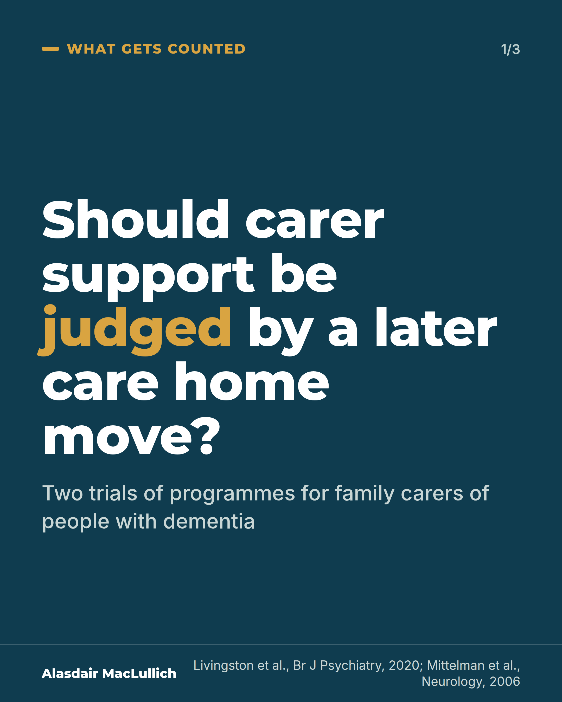
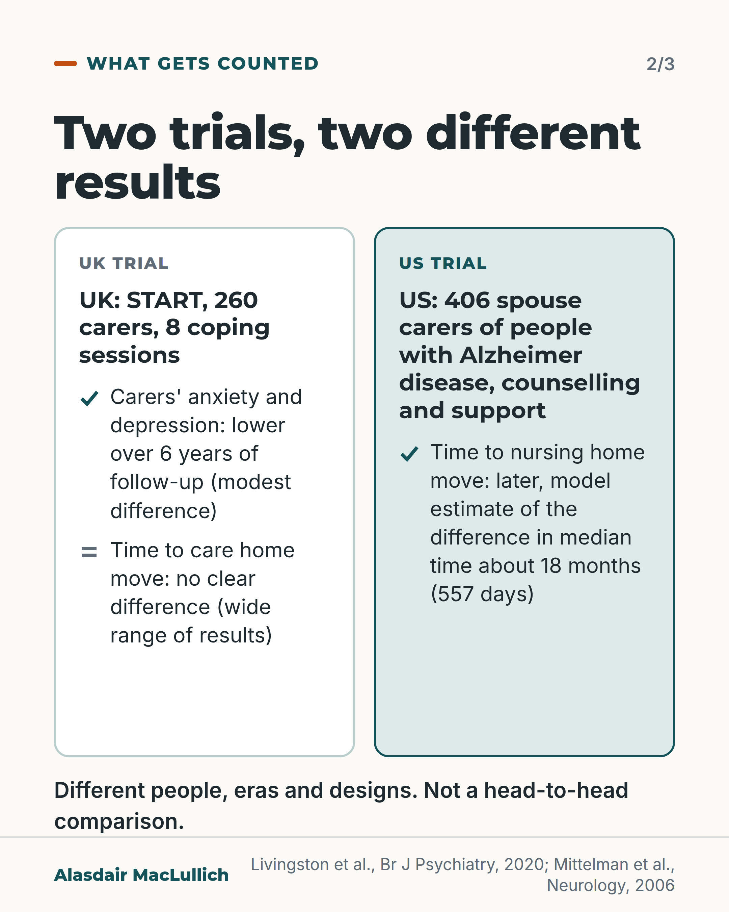
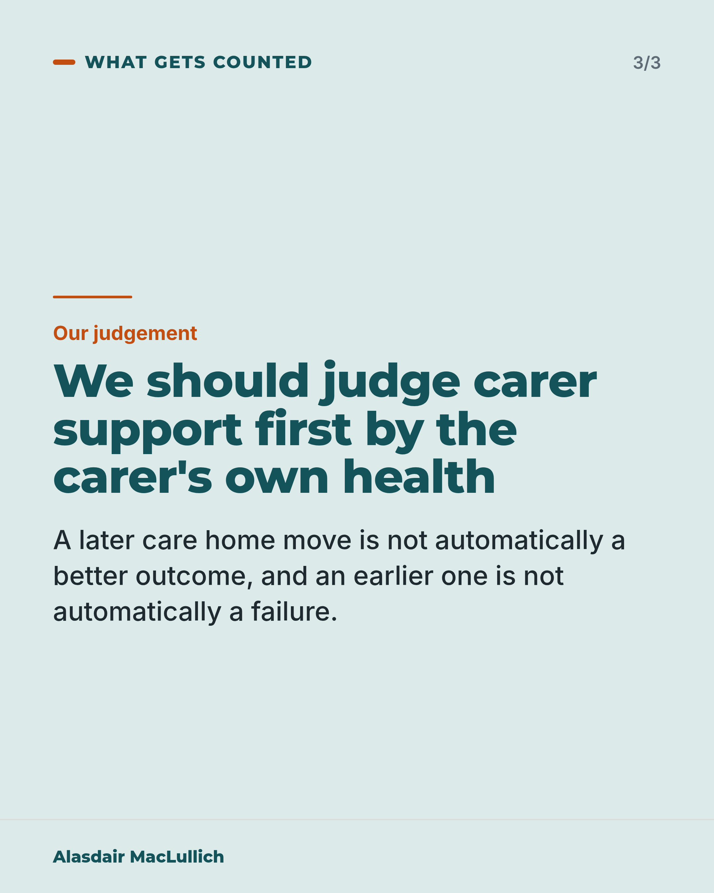

# G174: Judge carer support by the carer's health, not only the care home move

- Category: C18 Unpaid carers and the care workforce
- Audience: both
- Series: What gets counted
- Post type: evidence_interpretation
- Visual format: carousel
- Status: text text_final, visual final
- Working id: C18-P03 (candidate C18-04)

## Insight

A UK programme for family carers of people with dementia improved carers' anxiety and depression over six years of follow-up, with a modest average difference, and did not show a clear difference in time to a care home move. A separate US programme for spouse carers was linked with a later nursing home move. The two should not be ranked against each other.

## Angle and position

Carer support is often judged by whether it delays a care home move. Counted only that way, START would look like a failure although carers benefited. Position: judge carer support first by the carer's own health and quality of life.

Basis: Mixed. Empirical: START 6-year follow-up (RCT, care home admission a secondary outcome) and the US spouse-carer RCT (557 days model-predicted). Ethical judgement: carer support should be judged first by the carer's health and quality of life.

## X (993 characters)

```text
Carers who had a coping programme had fewer symptoms of anxiety and depression over six years. The programme did not show a clear difference in when the person with dementia moved into a care home.

This was a UK trial of 260 family carers of people with dementia. They were chosen by chance to have an eight-session coping programme (START) or usual care. The average difference in anxiety and depression was modest. The range of results for the care home move was wide, so this is not evidence that the programme has no effect on it.

A separate US trial included 406 spouse carers of people with Alzheimer disease. Counselling and support was linked with a later nursing home move for the person with the disease. A statistical estimate put the typical delay at about 18 months.

The two trials differ in people, era and design, so they should not be ranked against each other. Our judgement, not a finding: we should judge carer support first by the carer's own health and quality of life.
```

## LinkedIn (1635 characters)

```text
Carers who had a coping programme had fewer symptoms of anxiety and depression over six years. The programme did not show a clear difference in when the person with dementia moved into a care home.

Two trials of programmes for family carers of people with dementia looked at different outcomes in different people.

In the UK START trial, 260 family carers were chosen by chance. Some had an eight-session coping programme and some had usual care. Over six years, and after allowing for other differences between the groups, carers who had the programme scored on average 2 points lower on a 42-point score for anxiety and depression symptoms (a lower score means fewer symptoms). That is a modest difference. Care home admission was not the main thing the trial set out to measure. The trial did not show a clear difference in how soon the person with dementia moved into a care home. The range of results was wide. That is not evidence of no effect.

In a US trial of 406 spouse carers of people with Alzheimer disease, counselling and support was linked with a later nursing home move for the person with the disease. A statistical estimate put the typical delay at about 18 months (557 days).

The two trials differ in people, era and programme, so they should not be compared head to head. Counted only by care home admission, START would show no clear result, although carers' own symptoms were lower.

Our judgement, not a finding: we should judge carer support first by the carer's own health and quality of life. A later care home move is not automatically a better outcome, and an earlier one is not automatically a failure.
```

## Bluesky (298 characters)

```text
In a UK trial, a coping programme for family carers of people with dementia left them less anxious and depressed than usual care over six years (a modest difference). It did not show a clear difference in time to a care home move. Our judgement: judge carer support first by the carer's own health.
```

## Threads (477 characters)

```text
Carers who had a coping programme had fewer symptoms of anxiety and depression over six years. The programme did not show a clear difference in when the person with dementia moved into a care home.

This was a UK trial of 260 family carers of people with dementia, compared with usual care. The average difference was modest, and the range of results for the care home move was wide.

Our judgement, not a finding: we should judge carer support first by the carer's own health.
```

## Source reply

Sources: Livingston et al., START 6-year follow-up, Br J Psychiatry 2020 https://doi.org/10.1192/bjp.2019.160 ; Mittelman et al., Neurology 2006 https://doi.org/10.1212/01.wnl.0000242727.81172.91

## Visual



Alt text: Statement card on dark teal: should carer support be judged by a later care home move? Two trials of programmes for family carers of people with dementia.



Alt text: Two-column comparison. UK START trial, 260 carers, 8 coping sessions: carers' anxiety and depression lower over 6 years, a modest difference; no clear difference in time to care home move. US trial, 406 spouse carers: later nursing home move, about 18 months by model estimate. Not a head-to-head comparison.



Alt text: Statement card marked as our judgement: we should judge carer support first by the carer's own health. A later care home move is not automatically a better outcome, and an earlier one is not automatically a failure.

Editable source: `visuals/src/G174.html`

Design instructions: 3-card carousel: dark teal statement, two-column comparison (UK hollow, US mint) with tick or equals marks, mint judgement card; claims C18-04-a, C18-04-c.

## Sources and verification

- C18-04-a (supported): START, an eight-session coping programme for family carers of people with dementia, improved carers' anxiety and depression over six years.
  - Source: Livingston G, Manela M, O'Keeffe A, Rapaport P, Cooper C, Knapp M, et al. Clinical effectiveness of the START (STrAtegies for RelaTives) psychological intervention for family carers and the effects on the cost of care for people with dementia: 6-year follow-up of a randomised controlled trial. Br J Psychiatry. 2020;216(1):35-42.
  - Passage: "A total of 260 self-identified family carers of people with dementia were randomised 2:1 to START, an eight-session manual-based coping intervention delivered by supervised psychology graduates, or to treatment as usual (TAU). ... Over 72 months, compared with TAU, the intervention group had improved scores on HADS-T (adjusted mean difference -2.00 points, 95% CI -3.38 to -0.63)." (Abstract)
- C18-04-b (supported_with_qualification): START did not show a clear difference in time to care home admission.
  - Source: Livingston G, Manela M, O'Keeffe A, Rapaport P, Cooper C, Knapp M, et al. Clinical effectiveness of the START (STrAtegies for RelaTives) psychological intervention for family carers and the effects on the cost of care for people with dementia: 6-year follow-up of a randomised controlled trial. Br J Psychiatry. 2020;216(1):35-42.
  - Passage: "Patient-related costs ... and carer-related costs ... were not significantly different between groups nor were group differences in time until care home (intensity ratio START:TAU was 0.88, 95% CI 0.58-1.35)." (Abstract)
- C18-04-c (supported_with_qualification): A US counselling and support programme for spouse carers was linked with later nursing home placement.
  - Source: Mittelman MS, Haley WE, Clay OJ, Roth DL. Improving caregiver well-being delays nursing home placement of patients with Alzheimer disease. Neurology. 2006;67(9):1592-9.
  - Passage: "Patients whose spouses received the intervention experienced a 28.3% reduction in the rate of nursing home placement compared with usual care controls (hazard ratio = 0.717 after covariate adjustment, p = 0.025). The difference in model-predicted median time to placement was 557 days." (Abstract)

Verification notes: C18-04-a (PMID 31298169, abstract): 260 carers randomised 2:1, eight-session manual-based programme, HADS-T adjusted mean difference -2.00 (-3.38 to -0.63) over 72 months; described as 'modest' per the qualification (no minimal clinically important difference verified), '2 points on a 42-point scale' taken from the batch qualification. C18-04-b (same source): intensity ratio 0.88 (0.58 to 1.35), secondary outcome, wide interval so not evidence of no effect; stated as 'no clear difference' with wide range. C18-04-c (PMID 17101889, abstract): 406 spouse carers, HR 0.717, 557 days model-predicted, converted to about 18 months in the safe wording; programmes kept separate (different population, era, programme). Judgement about which outcome to value is marked as judgement. Invitation to follow is the single such invitation in this set. Access: abstracts.

## Attention and follow potential

Pause: Practitioners and families who assume that delaying a care home move is the test of good carer support see a well-known yardstick questioned with two trials.

Gain: A way to read carer-support trials, and a way to explain to a carer what such a programme can offer them.

Follow: Careful evidence reading about which outcomes are counted.

## Open issues

None.
