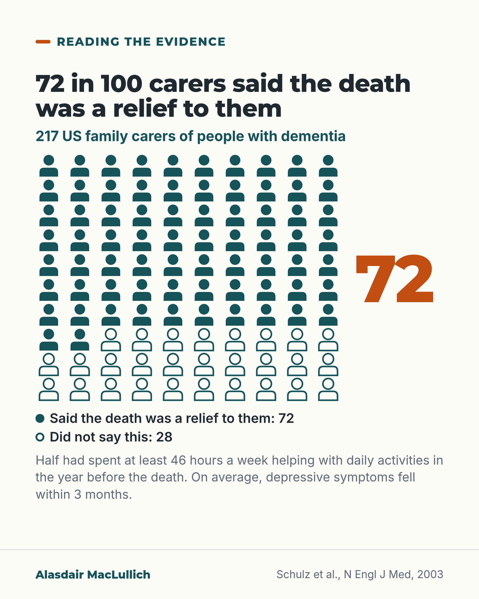

# G175: In one US study, most carers said the death was a relief after long, demanding care

- Category: C18 Unpaid carers and the care workforce
- Audience: public
- Series: Reading the evidence
- Post type: evidence_interpretation
- Visual format: chart (icon array)
- Status: text text_final, visual final
- Working id: C18-P04 (candidate C18-17)

## Insight

In a US study of 217 family carers of people with dementia, 72 in 100 said the death was a relief to them, after long and demanding care. On average their depressive symptoms fell within three months, and the researchers concluded that support was needed most before the death.

## Angle and position

Carers can feel guilty about relief. Measured evidence shows it was the majority response in this group, and it points attention to support during the caring years.

Basis: Mixed. Empirical: Schulz et al. 2003 (single US trial sample, self-reported). Judgement: feeling relief and grief together is understandable; the practical suggestion to ask about support now is advice, not a finding.

## X (729 characters)

```text
In a US study of 217 family carers of people with dementia, 72 in 100 said the person's death was a relief to them.

This followed long, demanding care: half had spent at least 46 hours a week helping with daily activities in the year before the death. On average, carers' depressive symptoms (low mood and loss of interest) fell within three months of the death.

The researchers concluded that support was needed most before the death. The carers took part in a US trial and reported their own feelings, so the figures may not describe every carer.

Our judgement, not a finding: feeling relief and grief together is understandable. If you are caring now, ask your council or a local carers' centre what support they can offer.
```

## LinkedIn (1115 characters)

```text
In a US study of 217 family carers of people with dementia, 72 in 100 said the person's death was a relief to them.

That followed a long and demanding period of care. Half of the carers had spent at least 46 hours a week helping with daily activities in the year before the death.

On average, within three months of the death, carers had less low mood and loss of interest in things (depressive symptoms), by enough to make a real difference in practice. Within a year, symptoms were substantially lower than while the carers were still caring.

The researchers concluded that intervention and support were needed most before the death.

Three limits. The carers took part in a US trial, so they may not describe all carers. Relief was self-reported. The figures are group averages, and some carers do not follow that pattern.

If you felt relief, many carers in this study did too. Our judgement, not a finding: feeling relief and grief together is understandable. If you are caring now, you do not have to wait for a death to ask for help. Ask your council or a local carers' centre what support they can offer.
```

## Bluesky (286 characters)

```text
In a US study of 217 family carers of people with dementia, 72 in 100 said the person's death was a relief, after long, demanding care. On average, low mood and loss of interest fell within 3 months. Support was needed most before the death, the researchers concluded. Ask for help now.
```

## Threads (492 characters)

```text
In a US study of 217 family carers of people with dementia, 72 in 100 said the person's death was a relief. It followed long, demanding care: half had spent at least 46 hours a week helping with daily activities.

On average, their low mood and loss of interest fell within three months. The researchers concluded that support was needed most before the death. Carers reported their own feelings.

If you are caring now, ask your council or a local carers' centre what support they can offer.
```

## Source reply

Source: Schulz et al., N Engl J Med 2003 https://doi.org/10.1056/NEJMsa035373

## Visual



Alt text: Icon array of 100 people, 72 filled and 28 outlined. In a US study of 217 family carers of people with dementia, 72 in 100 said the death was a relief to them. Half had spent at least 46 hours a week helping with daily activities in the year before the death. Depressive symptoms fell within 3 months on average.

Editable source: `visuals/src/G175.html`

Design instructions: 10 by 10 icon array of head and shoulders icons, 72 filled teal and 28 outline, large orange 72 beside it, legend with fill and outline markers; claim C18-17-a.

## Sources and verification

- C18-17-a (supported_with_qualification): Of 217 US dementia carers, 72% said the death was a relief to them (and more than 90% believed it was a relief to the patient).
  - Source: Schulz R, Mendelsohn AB, Haley WE, et al. End-of-life care and the effects of bereavement on family caregivers of persons with dementia. N Engl J Med. 2003;349(20):1936-42.
  - Passage: "Seventy-two percent of caregivers reported that the death was a relief to them, and more than 90 percent reported belief that it was a relief to the patient." (Abstract, Results)
- C18-17-b (supported): Depressive symptoms fell within three months of death and were substantially lower within a year; support was needed most before death.
  - Source: Schulz R, Mendelsohn AB, Haley WE, et al. End-of-life care and the effects of bereavement on family caregivers of persons with dementia. N Engl J Med. 2003;349(20):1936-42.
  - Passage: "Within three months of the death, caregivers had clinically significant declines in the level of depressive symptoms, and within one year the levels of symptoms were substantially lower than levels reported while they were acting as caregivers... Intervention and support services were needed most before the patient's death." (Abstract, Results and Conclusions)

Verification notes: C18-17-a (PMID 14614169, abstract): 217 carers, 72% said the death was a relief to them, half spent at least 46 hours a week in the year before the death. The '>90% believed it was a relief to the person who died' figure is deliberately omitted (values concern in the batch). C18-17-b (same source): depressive symptoms fell within three months and were substantially lower within a year; researchers concluded support was needed most before the death; group averages, some carers differ. Limits carried: US trial sample, self-report. Complicated-grief figure not used (not verified). 'Feeling relief and grief together is understandable' and the advice to ask the council or a carers' centre are judgement or advice and not drawn from the study; no scheme is named.

## Attention and follow potential

Pause: A carer who has felt relief, and guilt about it, sees a measured finding that describes their experience.

Gain: An accurate account of a common response and a reason to seek support before the death.

Follow: The account handles hard subjects with evidence and without platitudes.

## Open issues

None.
