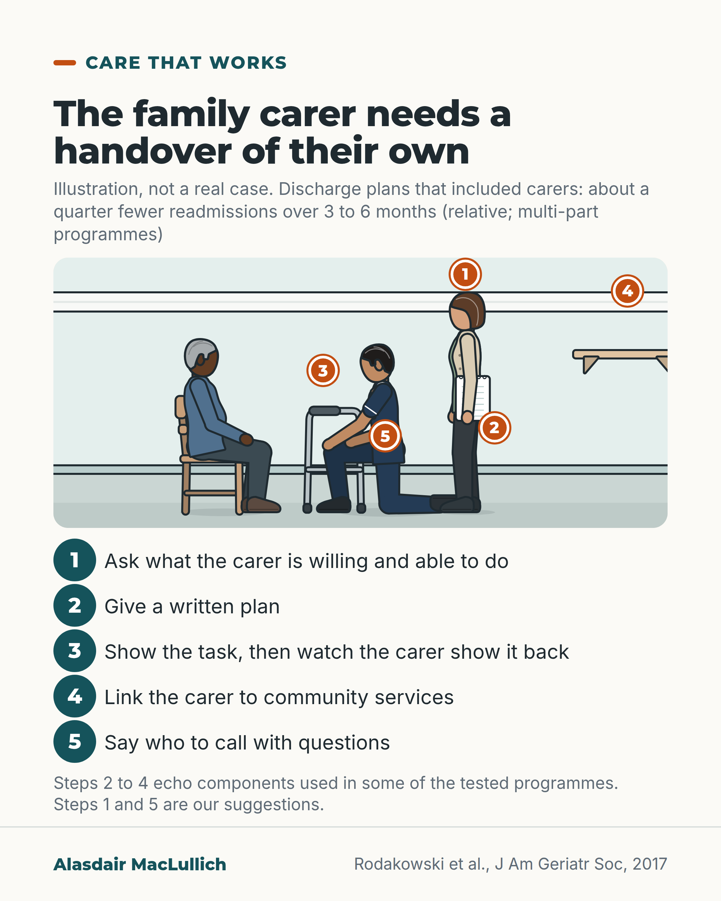

# G176: A handover for the family carer at discharge

- Category: C18 Unpaid carers and the care workforce
- Audience: practitioners
- Series: Care that works
- Post type: good_care
- Visual format: annotated scene
- Status: text text_final, visual final
- Working id: C18-P05 (candidate C18-01)

## Insight

A review of 15 randomised trials found that discharge plans that brought family carers in were linked with about a quarter fewer readmissions over 3 to 6 months (a relative reduction), though the programmes had several parts. The tested programmes often included a written care plan, links to community services, and demonstration with teach-back.

## Angle and position

Treat the family carer as a recipient of the discharge handover. Position: ask what the carer is willing and able to do before assigning tasks, and give them a written plan, a demonstrated task and a person to call.

Basis: Mixed. Empirical: Rodakowski 2017 meta-analysis (relative reductions, multicomponent, quality often unclear). Clinical judgement: the handover should begin by asking what the carer is willing and able to do, and say who to call; these two items are suggestions, not tested components.

## X (827 characters)

```text
A family member who will give the care after discharge needs a handover of their own.

A review pooled 15 randomised study reports (13 distinct trial populations) in older adults discharged to the community. Discharge plans that included family carers were linked with about a quarter fewer readmissions than in comparison groups over the next 3 to 6 months (a relative reduction; the review gives no actual readmission rates). The programmes had several parts, so the carer element is hard to separate out, and trial quality was often unclear.

Of the 15 studies, 13 linked carers to community services and 9 gave a written care plan. Seven used teach-back (the carer shows the task back) and five used demonstration. The review could not say which part works best. We should also ask what the carer is willing and able to do.
```

## LinkedIn (1496 characters)

```text
A family member who will give the care after discharge needs a handover of their own.

Rodakowski and colleagues pooled randomised trials of discharge planning for older adults discharged to the community (15 study reports covering 13 distinct trial populations, 4,361 patients). Plans that integrated family carers were linked with about a quarter fewer readmissions. At 90 days the reduction was 25% (relative risk 0.75, 95% confidence interval 0.62 to 0.91, from 6 studies). At 180 days it was 24% (relative risk 0.76, 95% confidence interval 0.64 to 0.90, from 5 studies). These are relative reductions. The review text gives no pooled absolute rates.

Three limits. The programmes had several parts, so the carer element could not be isolated. Trial quality was often unclear. The authors say it is not possible to determine the most effective method of carer integration.

What the tested programmes contained: a written care plan (9 of 15 studies), links to community resources (13 of 15), live or video demonstration of care tasks (5 of 15), and teach-back, where the carer shows the task back (7 of 15).

A handover for the carer, built from those parts. Items 1 and 5 are good practice we suggest, not components shown to work.

1. Ask what the carer is willing and able to do, before assigning tasks (our suggestion).
2. Give a written plan.
3. Show each new task, then watch the carer do it.
4. Link the carer to community services.
5. Say who to call with questions (our suggestion).
```

## Bluesky (297 characters)

```text
A family member who will give care after discharge needs a handover of their own. Plans that included carers were linked with about a quarter fewer readmissions than comparison groups over 3 to 6 months (a relative reduction; plans had several parts). Ask what the carer is willing and able to do.
```

## Threads (486 characters)

```text
A family member who will give care after discharge needs a handover of their own.

A review pooled 15 randomised study reports (13 distinct trial populations) of discharge plans. Plans that included family carers were linked with about a quarter fewer readmissions than in comparison groups over 3 to 6 months (a relative reduction). The programmes had several parts, and trial quality was often unclear.

We should ask what the carer is willing and able to do, and give a written plan.
```

## Source reply

Source: Rodakowski et al., J Am Geriatr Soc 2017 https://doi.org/10.1111/jgs.14873

## Visual



Alt text: Illustration, not a real case. A hospital discharge bay: an older man seated beside his walking frame, a nurse kneeling to show the daughter how to help him, and the daughter holding a folder. Five numbered steps for a carer handover. Discharge plans that included carers: about a quarter fewer readmissions at 3 to 6 months.

Editable source: `visuals/src/G176.html`

Design instructions: Annotated scene on hospital bay: older Black man seated with frame, South Asian nurse kneeling, daughter holding folder, shelf; five numbered pins matching list; source Rodakowski 2017.

## Sources and verification

- C18-01-a (supported_with_qualification): In a meta-analysis of randomised trials, discharge planning that integrated family carers was linked with fewer readmissions at 90 and 180 days.
  - Source: Rodakowski J, Rocco PB, Ortiz M, Folb B, Schulz R, Morton SC, et al. Caregiver integration during discharge planning for older adults to reduce resource use: a metaanalysis. J Am Geriatr Soc. 2017;65(8):1748-55.
  - Passage: "Discharge planning interventions with caregiver integration were associated with a 25% fewer readmissions at 90 days (relative risk (RR) = 0.75, 95% confidence interval (CI) = 0.62-0.91) and 24% fewer readmissions at 180 days (RR = 0.76, 95% CI = 0.64-0.90)." (Abstract; Results (full text))
- C18-01-b (supported): Common components included written care plans, demonstration of care tasks and teach-back.
  - Source: Rodakowski J, Rocco PB, Ortiz M, Folb B, Schulz R, Morton SC, et al. Caregiver integration during discharge planning for older adults to reduce resource use: a metaanalysis. J Am Geriatr Soc. 2017;65(8):1748-55.
  - Passage: "Of the 15 studies, 13 had an intervention component that linked caregivers to external or community resources ... and nine included written care plans. Caregiver assessment was a component in eight studies ... Live or video demonstrations of care tasks was included in five studies, and seven included so-called "teach back" techniques" (Results, Intervention Components)

Verification notes: C18-01-a (PMID 28369687, full text read per batch): RR 0.75 (0.62 to 0.91) at 90 days from 6 trials, RR 0.76 (0.64 to 0.90) at 180 days from 5 trials, 15 RCTs and 4361 patients; stated as relative reductions only, no 'N in 100' because pooled arm-level rates are not in the text; multicomponent design, unclear trial quality and 'linked with' (not 'reduces') carried. C18-01-b: written care plans 9 of 15, links to community resources 13 of 15, demonstrations 5 of 15, teach-back 7 of 15; authors say the most effective method cannot be determined. NICE NG150 and Carers (Scotland) Act clauses omitted (C18-01-c not found). Callouts 1 and 5 labelled as suggestions. The carer element could not be isolated (batch qualification); no GP or pharmacy handover claim is made.

## Attention and follow potential

Pause: A ward doctor or nurse who completes discharge paperwork every day is asked who will receive the handover for the person giving the care.

Gain: A five-part carer handover, with the evidence base and its limits stated.

Follow: Turns a meta-analysis into a change the reader can make at the next discharge, with the limits shown.

## Open issues

None.
