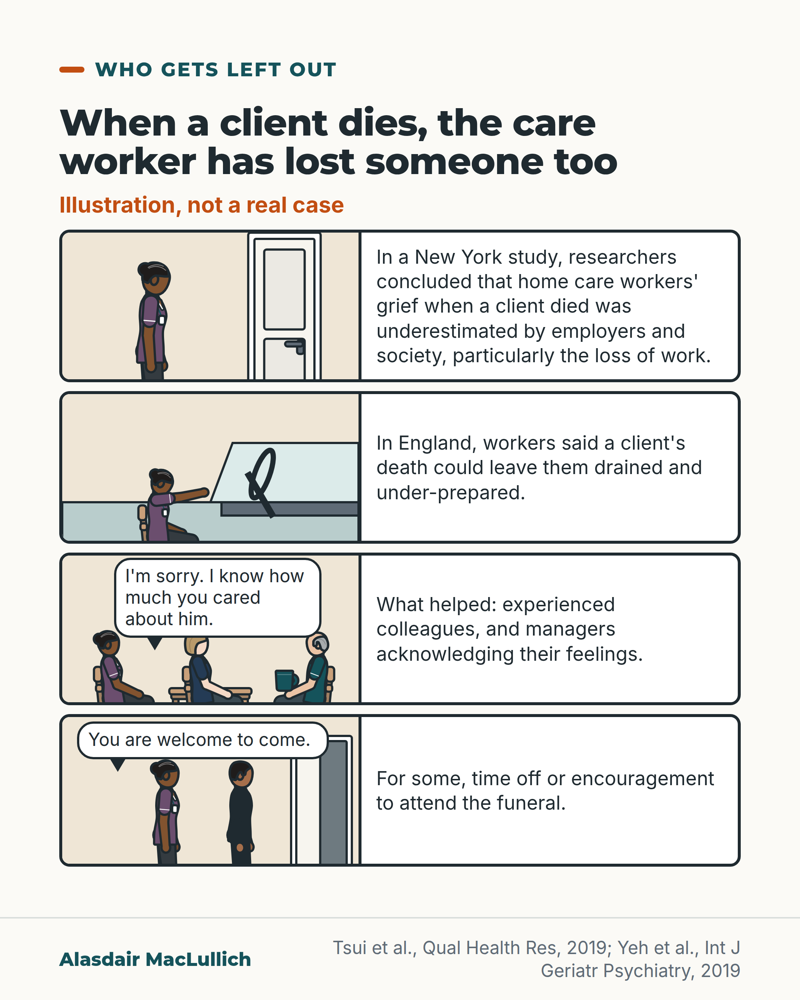

# G177: When a client dies, the home care worker has lost someone too

- Category: C18 Unpaid carers and the care workforce
- Audience: both
- Series: Who gets left out
- Post type: criticism
- Visual format: comic strip
- Status: text text_final, visual final
- Working id: C18-P06 (candidate C18-03)

## Insight

Interview studies found that, in New York, researchers concluded employers and society underestimate home care workers' grief when a client dies, particularly the loss of work, and that in England experienced colleagues, managers acknowledging their feelings, time off and encouragement to attend the funeral were described as supportive.

## Angle and position

Bereavement support is organised around families. The paid care worker who visited regularly is rarely thought of as someone who has lost a person. Position: agencies should tell workers promptly and personally, and relatives can tell the worker themselves.

Basis: Mixed. Empirical (qualitative only): Tsui 2019 (New York) and Yeh 2019 (England). Ethical and practical judgement: tell care workers promptly and personally; relatives can tell them and invite them to the funeral. These are not study findings.

## X (934 characters)

```text
Home care workers are paid carers who visit people at home. A New York City study used focus groups and peer interviews. The researchers concluded that employers and society underestimate home care workers' grief when a client dies, particularly the loss of the work with that client.

In England, 29 home care workers and 13 managers were interviewed about caring for people with dementia at the end of life. Workers said a client's death could leave them drained and under-prepared. What helped: support from experienced colleagues, managers acknowledging their feelings, and for some, time off or encouragement to attend the funeral.

These were interview studies, not tests of support schemes, and the finding about loss of work comes from New York only. Our judgement, not a finding: we should tell care workers promptly and personally when a client dies. Relatives can tell them too, and invite them to the funeral if they wish.
```

## LinkedIn (1354 characters)

```text
Home care workers are paid carers who visit people at home. A New York City study used focus groups and peer interviews. The researchers concluded that employers and society underestimate home care workers' grief when a client dies, particularly the loss of the work with that client.

In England, researchers interviewed 29 home care workers and 13 home care managers about caring for people with dementia at the end of life. Workers said a client's death, or getting caught up in a client's family conflict, could leave them emotionally drained, under-prepared and overwhelmed.

What the workers described as supportive: encouragement and learning from experienced colleagues, and managers at their agency acknowledging their feelings. Some were offered time off or were encouraged to attend the client's funeral.

Two limits. Both are qualitative studies, which describe experience and do not test support schemes. The finding about loss of work comes from the New York study; neither study shows that it applies in England.

From this, we suggest three things. These are judgements, not findings.

1. Agencies should tell a care worker promptly and personally when a client dies.
2. Managers should acknowledge the loss, and allow time off where possible.
3. Relatives can tell the care worker themselves, and invite them to the funeral if they wish.
```

## Bluesky (291 characters)

```text
In a New York study, researchers concluded that employers and society underestimate home care workers' grief when a client dies, especially losing the work with that client. In England, workers found colleagues and managers acknowledging feelings supportive. We should tell workers promptly.
```

## Threads (496 characters)

```text
In a New York study, researchers concluded that employers and society underestimate home care workers' grief when a client dies, particularly the loss of the work with that client. In England, workers said a client's death could leave them drained and under-prepared. What was described as supportive: experienced colleagues, managers acknowledging their feelings, and for some, time off or encouragement to attend the funeral.

Our judgement: we should tell care workers promptly and personally.
```

## Source reply

Sources: Tsui et al., Qual Health Res 2019 https://doi.org/10.1177/1049732318800461 ; Yeh et al., Int J Geriatr Psychiatry 2019 https://doi.org/10.1002/gps.5027

## Visual



Alt text: Four-panel illustration, not a real case. A home care worker outside a client's door; tired in her car; in an agency office with a colleague and a manager who says sorry; walking with the client's relative to a funeral gathering. Studies: grief underestimated by employers; colleagues and managers helped.

Editable source: `visuals/src/G177.html`

Design instructions: Four stacked comic rows, art left (Kit people: care worker at door, in car, in office with manager and older colleague, walking with relative to open door) and caption right; two illustrative speech bubbles; no claim numbers.

## Sources and verification

- C18-03-a (supported_with_qualification): In a New York qualitative study, home care workers often lost both a close relationship and a job when a client died, and their grief was disenfranchised by employer and societal underestimation of the relationship.
  - Source: Tsui EK, Franzosa E, Cribbs KA, Baron S. Home care workers' experiences of client death and disenfranchised grief. Qual Health Res. 2019;29(3):382-92.
  - Passage: "When a client dies, home care workers often lose both a close relationship and a job. ... Our findings suggest that home care workers' grief is disenfranchised via employer and societal underestimations of their relationships with clients and their losses when clients die, particularly job loss." (Abstract)
- C18-03-b (supported_with_qualification): In interviews with 29 home care workers and 13 managers in England, a client's death left workers emotionally drained and under-prepared; peer support, manager acknowledgement, time off and encouragement to attend the funeral were supportive.
  - Source: Yeh IL, Samsi K, Vandrevala T, Manthorpe J. Constituents of effective support for homecare workers providing care to people with dementia at end of life. Int J Geriatr Psychiatry. 2019;34(2):352-9.
  - Passage: "Qualitative semi-structured interviews were conducted with 29 homecare workers and 13 homecare managers in England. ... When their work entailed high levels of emotion, such as a client's death or getting embroiled in a client's family conflict, they felt emotionally drained, under-prepared, and overwhelmed. Supportive elements include receiving encouragement and learning from experienced peers and their feelings being acknowledged by managers at their employing homecare agency. Some workers were offered time off or encouraged to attend the client's funeral as a means of supporting the process of bereavement." (Abstract, Methods and Results)

Verification notes: C18-03-a (PMID 30264669, abstract): New York qualitative study, lost both a close relationship and a job, grief disenfranchised by employer and societal underestimation; kept as a New York finding only and not extended to England. C18-03-b (PMID 30430628, abstract): 29 home care workers and 13 managers in England, dementia end-of-life context, drained, under-prepared and overwhelmed; supports named are those in the abstract (experienced peers, managers acknowledging feelings, time off for some, encouragement to attend the funeral for some). The zero-hours claim (C18-03-c) is not used and nothing implies English workers lose income. 'Told promptly and personally' and the relatives' invitation are marked as judgement. The comic's two lines of dialogue are labelled as illustrative. Access: abstracts. Both studies are qualitative.

## Attention and follow potential

Pause: Care workers and managers see an experience they recognise described accurately; relatives realise the worker who came regularly may be grieving too.

Gain: Specific actions an agency or a family can take, labelled as suggestions.

Follow: The account notices people that most health posts leave out.

## Open issues

None.
