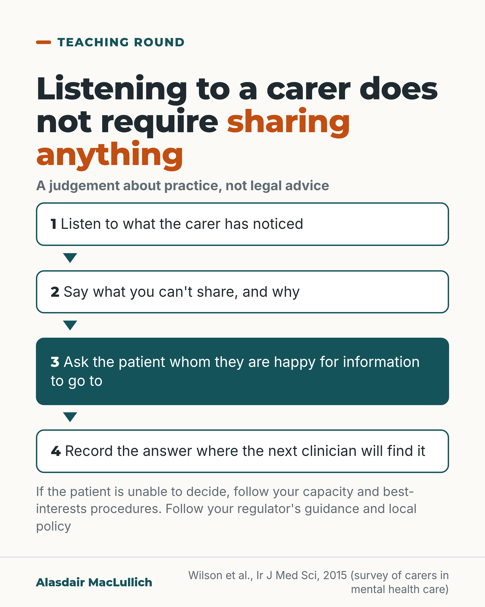

# G178: Listen to the carer, then ask the patient what may be shared

- Category: C18 Unpaid carers and the care workforce
- Audience: practitioners
- Series: Teaching round
- Post type: teaching
- Visual format: diagram (flow)
- Status: text text_final, visual final
- Working id: C18-P07 (candidate C18-14)

## Insight

Carers sometimes struggle to get information from care teams, and lack of the patient's consent is one of the reasons they are given. Listening to a carer does not require sharing anything about the patient. Asking the patient whom they are happy for information to go to, and recording the answer, removes the problem for the next clinician.

## Angle and position

A clinical-practice judgement, not a legal citation: always listen; say what you cannot share and why; ask the patient and record the answer. Backed by a carer survey from mental health services.

Basis: Ethical and clinical judgement ('We should...'), illustrated by one survey (carers of people with mental illness in Ireland, carers recruited through a support group). No regulator's guidance is quoted or attributed.

## X (858 characters)

```text
We should always listen to a carer. Listening does not require sharing anything about the patient.

An Irish survey of 159 carers of people with mental illness found that over half had struggled to get information from the care team. Lack of the patient's consent was one of the two commonest reasons they were given; the other was that no team member was available. This was mental health care and the carers were recruited through a support group, so it may not describe the care of older people.

Follow your regulator's guidance and local policy. If the patient is unable to decide, follow your capacity and best-interests procedures.

We should hear what the carer has noticed. We should say what we can't share and why. We should ask the patient whom they are happy for information to go to, and record the answer where the next clinician will find it.
```

## LinkedIn (1221 characters)

```text
We should always listen to a carer. Listening does not require sharing anything about the patient.

In our judgement, a carer may have noticed changes that the team has not seen, and may want to say what worries them.

An Irish survey of 159 carers of people with mental illness found that 56% had struggled to get information from the treating team. Lack of the patient's consent was one of the two commonest reasons they were given; the other was that no team member was available. The survey was in mental health services, not older people's services, and the carers were recruited through a support group, so it may not describe our own settings.

This is a judgement about practice, not legal advice. Follow your regulator's guidance and your organisation's policy on sharing information.

What we suggest, as clinical practice rather than as a finding:

1. Listen to what the carer has noticed.
2. Say what we can't share, and why.
3. Ask the patient whom they are happy for information to go to, and for what. If the patient may lack capacity to decide, follow your capacity and best-interests procedures.
4. Record the answer where the next clinician will find it, so the refusal is not repeated at every contact.
```

## Bluesky (300 characters)

```text
We should listen to carers. Listening does not mean sharing patient information. In an Irish survey, over half of 159 carers of people with mental illness struggled to get information. Ask the patient whom they are happy to share with, and record it. If they can't decide, follow capacity procedures.
```

## Threads (493 characters)

```text
We should listen to a carer. Listening does not require sharing anything about the patient.

In an Irish survey of 159 carers of people with mental illness (recruited from a support group), over half struggled to get information. Lack of patient consent was one of the two commonest reasons; the other was an unavailable team member.

Ask the patient whom they are happy for information to go to, and record it. If they are unable to decide, follow your capacity and best-interests procedures.
```

## Source reply

Source: Wilson et al., Ir J Med Sci 2015 https://doi.org/10.1007/s11845-014-1172-6

## Visual



Alt text: Four-step flow. 1 Listen to what the carer has noticed. 2 Say what you can't share, and why. 3 Ask the patient whom they are happy for information to go to. 4 Record the answer where the next clinician will find it. If the patient can't decide, follow capacity procedures. A practice judgement, not legal advice.

Editable source: `visuals/src/G178.html`

Design instructions: Vertical flow of four steps with arrows, step 3 filled teal; regulator caveat below; practitioner judgement.

## Sources and verification

- C18-14-b (supported_with_qualification): Carers report being refused information on confidentiality grounds.
  - Source: Wilson LS, Pillay D, Kelly BD, Casey P. Mental health professionals and information sharing: carer perspectives. Ir J Med Sci. 2015;184(4):781-90.
  - Passage: "the majority (56.3%) of respondents stated that they have specifically encountered difficulties accessing information from the treating mental health team. The main reasons given to them by the mental health team for withholding information include: lack of patient consent (46.2%) and unavailability of a team member (46.2%)." (Abstract)

Verification notes: C18-14-b (PMID 25018144, abstract): 159 carers, 56.3% reported difficulty accessing information, and lack of patient consent (46.2%) and unavailability of a team member (46.2%) were the two main reasons given. The batch's suggested safe wording said 'the commonest reason'; because the two reasons were tied at 46.2%, the posts say 'one of the two commonest reasons' and the 46.2% figure is not quoted (its denominator is not stated in the abstract). Limits carried: mental health, not older people's services; carers recruited through a support group. C18-14-a (GMC guidance) was not found: the post neither quotes nor attributes anything to the GMC and presents the position as a judgement ('We should'). The line 'follow your regulator's guidance and local policy' is a caution, not a legal claim. Access: abstract.

## Attention and follow potential

Pause: A clinician who has said 'I can't discuss that' to a carer at the bedside recognises the moment.

Gain: A clear separation between listening and disclosing, and a step that stops the refusal being repeated.

Follow: Teaching that removes a common barrier between clinicians and families, without overreaching on the law.

## Open issues

None.
