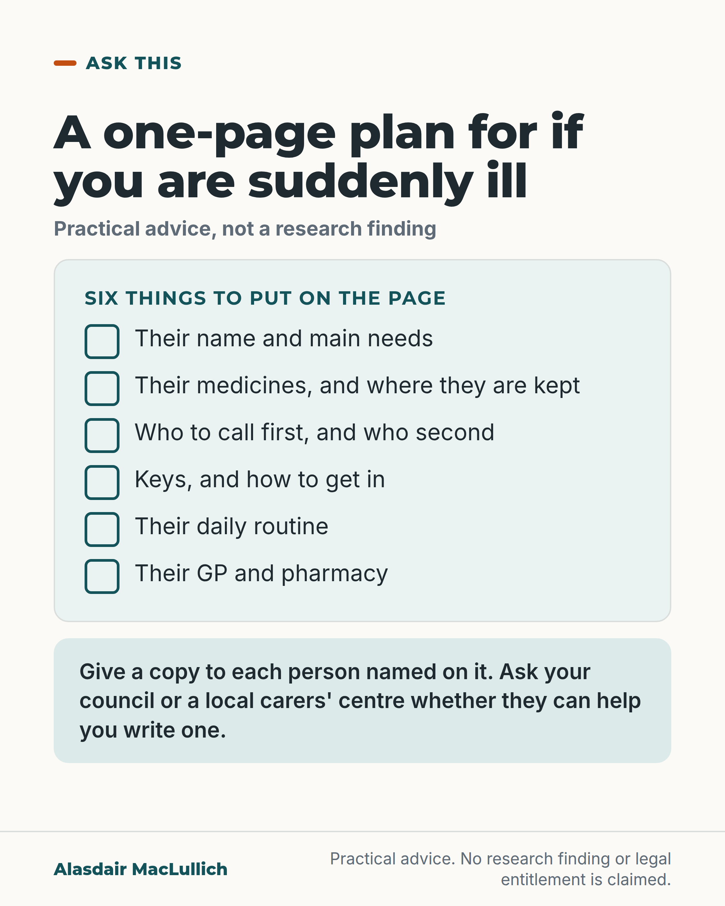

# G179: A one-page plan for if you, the carer, are suddenly ill

- Category: C18 Unpaid carers and the care workforce
- Audience: public
- Series: Ask this
- Post type: public_explanation
- Visual format: checklist
- Status: text text_final, visual final
- Working id: C18-P08 (candidate C18-22)

## Insight

A carer can write a one-page plan in advance, covering the person's needs, medicines, who to call, keys, routine, GP and pharmacy, and give a copy to each person named on it, so that others know what to do if the carer is suddenly ill.

## Angle and position

The worry carers have about being suddenly ill can be answered in writing before it happens. Practical advice, not a research finding or a legal entitlement.

Basis: Practical advice. No empirical finding, legal entitlement or guideline is claimed, and no scheme is named. The fallback for C18-15 under the editor's instructions (Carers (Scotland) Act and NICE clauses dropped as unverified).

## X (687 characters)

```text
A one-page plan can tell others what the person you care for needs if you are suddenly taken ill.

You can write it in advance and give a copy to each person named on it. It can cover their name and main needs, their medicines and where they are kept, and who to call first and second. It can also cover keys and how to get in, their daily routine, and their GP and pharmacy.

This is practical advice rather than a research finding. A 2026 search of the main medical research database found no study that tests whether having a plan changes what happens. The lack of a study leaves open whether plans help. Ask your council or a local carers' centre whether they can help you write one.
```

## LinkedIn (935 characters)

```text
A one-page plan can tell others what the person you care for needs if you are suddenly taken ill.

You can write it in advance. A one-page plan, with a copy given to each person named on it, can cover:

1. Their name and main needs.
2. Their medicines, and where they are kept.
3. Who to call first, and who second.
4. Keys, and how to get into the home.
5. Their daily routine.
6. Their GP and pharmacy.

Write it in plain words, as if for someone who has never met them. Keep a copy where the people named on it can reach it, and check the page every few months and whenever anything changes.

This is practical advice rather than a research finding. A 2026 search of the main medical research database found no study that tests whether having such a plan changes what happens. The lack of a study leaves open whether plans help.

If you would like help to write one, ask your council or a local carers' centre whether they can help.
```

## Bluesky (252 characters)

```text
A one-page plan can tell others what the person you care for needs if you are suddenly taken ill. It can list needs, medicines, who to call, keys, routine and GP. Give a copy to each person named on it. This is practical advice, not a research finding.
```

## Threads (380 characters)

```text
A one-page plan can tell others what the person you care for needs if you are suddenly taken ill.

You can write it in advance. It can cover their needs, medicines, who to call, keys, routine, GP and pharmacy. Give a copy to each person named on it.

This is practical advice, not a research finding. Ask your council or a local carers' centre whether they can help you write one.
```

## Source reply

Sources: none, because this is practical advice rather than a research finding. For help writing a plan, ask your council or a local carers' centre.

## Visual



Alt text: Checklist card: a one-page plan for if you are suddenly ill. Six things to put on it: their name and main needs; their medicines and where they are kept; who to call first and second; keys and how to get in; their daily routine; their GP and pharmacy. Give a copy to each person named. Practical advice, not a research finding.

Editable source: `visuals/src/G179.html`

Design instructions: Checklist card: six tick boxes in a panel, mint instruction panel; practical advice, no claims.

## Sources and verification

- C18-22-d (supported_with_qualification): Practical advice: a carer can write a one-page plan covering the person's needs, medicines, who to call, keys and access, routine, GP and pharmacy, and give copies to the people named.
  - Source: 
  - Passage: "[Advice, not a research finding. No source opened and none needed if framed as a suggestion.]" (Not applicable)

Verification notes: C18-22-d (practical advice, no source needed): framed as a suggestion; no claim that plans improve outcomes, reduce admissions or are an entitlement; the statement that no study was found rests on the batch note (PubMed search 8 Oct 2026, none found). The Carers (Scotland) Act, NICE NG150 and any emergency card scheme (C18-22-a, -b, -c) failed verification and are omitted. 'Ask your council or a local carers' centre whether they can help you write a plan' follows the safe wording for C18-22-c and makes no claim that a scheme exists. The editor's fallback for the dropped C18-15.

## Attention and follow potential

Pause: A carer who has lain awake with this worry sees a practical answer.

Gain: A six-item template they can complete at their own pace.

Follow: Practical help for carers that is specific, usable and honest about its status.

## Open issues

- Checker hit no_link on source_reply is justified: the post rests on no source (practical advice, claim C18-22-d), and no official page was verified, so no link is given.
