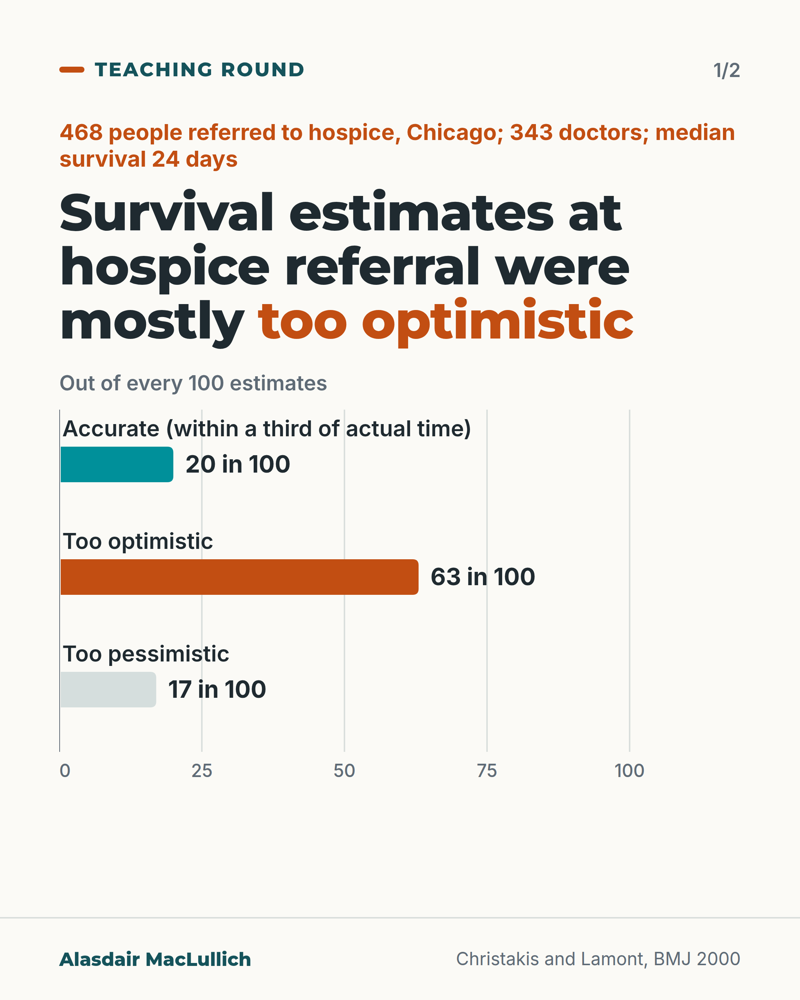
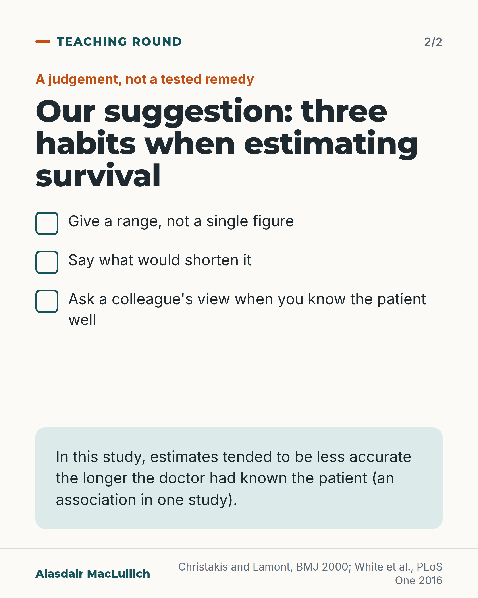

# G180: Survival estimates and knowing the patient

- Category: C19 Palliative care and care near the end of life
- Audience: practitioners
- Series: Teaching round
- Post type: teaching
- Visual format: carousel (bar chart, then checklist)
- Status: text text_final, visual final
- Working id: C19-P01 (candidate C19-18)

## Insight

In one US study of hospice referrals, doctors' survival estimates were accurate about 1 time in 5 and mostly too optimistic, and estimates tended to be less accurate the longer the doctor had known the patient.

## Angle and position

Challenge the assumption that the doctor who knows a patient best estimates survival best, using one cohort's association and a later review, then offer three marked-as-judgement habits: give a range, name what would shorten it, ask a colleague.

Basis: empirical finding (Christakis and Lamont 2000; White 2016 review) plus clinical interpretation marked as 'Our suggestion' (give a range, name what would shorten it, seek a second view); the remedies are judgement, not tested.

## X (651 characters)

```text
The longer a doctor had known a dying patient, the less accurate the doctor's estimate of survival tended to be, in one US study.

In Chicago, 343 doctors estimated survival for 468 people referred to hospice. Median survival was 24 days. About 20 in 100 estimates were within a third of the true time. 63 in 100 were too optimistic and 17 in 100 too pessimistic.

A review of 42 studies found clinicians' survival predictions in palliative care were often inaccurate, and no professional group was consistently better.

Our suggestion: give a range, say which signs would shorten the survival time, and ask a colleague when you know the patient well.
```

## LinkedIn (1169 characters)

```text
The longer a doctor had known a dying patient, the less accurate the doctor's estimate of survival tended to be, in one US study.

Christakis and Lamont followed 468 people referred to hospice programmes in Chicago. 343 doctors gave a survival estimate for each person. Median survival was 24 days. Of the estimates:

1. About 20 in 100 were accurate, meaning within a third of the actual survival time.
2. 63 in 100 were too optimistic.
3. 17 in 100 were too pessimistic.

The longer the doctor had known the patient, and the more recently they had last seen them, the less accurate the estimate tended to be. This is an association in one study from around 2000, in one city, so it does not show that knowing a patient causes the error.

A later systematic review of 42 studies found that clinicians' survival predictions in palliative care were often inaccurate, and that no group of clinicians was consistently more accurate than another.

Our suggestion is a judgement, and the habits have not been tested as a remedy. Give a range rather than a single figure. Say which signs would shorten the survival time. Ask a colleague's view when you know the patient well.
```

## Bluesky (294 characters)

```text
In a US study of 468 people referred to hospice, doctors' survival estimates were within a third of the true time in about 20 in 100 cases; 63 in 100 were too optimistic. Estimates tended to be less accurate the longer the doctor knew the patient. Our suggestion: give a range; ask a colleague.
```

## Threads (461 characters)

```text
In a US study of 468 people referred to hospice, doctors' survival estimates were within a third of the true time in about 20 in 100 cases. 63 in 100 were too optimistic and 17 in 100 too pessimistic.

The longer the doctor had known the patient, the less accurate the estimate tended to be. That is an association in one study, and does not show cause.

Our suggestion: give a range, say which signs would shorten the survival time, and ask a colleague's view.
```

## Source reply

Sources: Christakis and Lamont, BMJ 2000 https://doi.org/10.1136/bmj.320.7233.469 ; White et al., PLoS One 2016 https://doi.org/10.1371/journal.pone.0161407

## Visual



Alt text: Bar chart: of 468 people referred to hospice in Chicago, doctors' survival estimates were accurate (within a third of actual time) for 20 in 100, too optimistic for 63 in 100 and too pessimistic for 17 in 100. Median survival was 24 days.



Alt text: Checklist card headed 'Our suggestion: three habits when estimating survival', marked as a judgement not a tested remedy: give a range, say what would shorten it, ask a colleague's view. Notes that accuracy tended to fall the longer the doctor knew the patient (association, one study).

Editable source: `visuals/src/G180.html`

Design instructions: 2 cards, off-white. Card 1: kicker, headline with orange em, horizontal bar chart on 0 to 100 scale (accurate teal 20, too optimistic orange 63, too pessimistic pale 17), labels above bars with values. Card 2: three tick boxes, mint panel with association note. Claim C19-18-a.

## Sources and verification

- C19-18-a (supported_with_qualification): Doctors' survival estimates at hospice referral were accurate in 1 in 5 and mostly too optimistic.
  - Source: Christakis NA, Lamont EB. Extent and determinants of error in doctors' prognoses in terminally ill patients: prospective cohort study. BMJ. 2000;320(7233):469-72.
  - Passage: "Median survival was 24 days. Only 20% (92/468) of predictions were accurate (within 33% of actual survival); 63% (295/468) were overoptimistic and 17% (81/468) were overpessimistic. Overall, doctors overestimated survival by a factor of 5.3." (Abstract)
- C19-18-b (supported_with_qualification): Longer doctor-patient relationship was linked with less accurate prediction.
  - Source: Christakis NA, Lamont EB. Extent and determinants of error in doctors' prognoses in terminally ill patients: prospective cohort study. BMJ. 2000;320(7233):469-72.
  - Passage: "As duration of doctor-patient relationship increased and time since last contact decreased, prognostic accuracy decreased." (Abstract)
- C19-18-c (supported): A systematic review found clinicians' survival predictions in palliative care are frequently inaccurate, with no expert group.
  - Source: White N, Reid F, Harris A, Harries P, Stone P. A systematic review of predictions of survival in palliative care: how accurate are clinicians and who are the experts? PLoS One. 2016;11(8):e0161407.
  - Passage: "Studies of prognostic accuracy in palliative care are heterogeneous, but the evidence suggests that clinicians' predictions are frequently inaccurate. No sub-group of clinicians was consistently shown to be more accurate than any other." (Abstract)

Verification notes: C19-18-a: Christakis and Lamont 2000 abstract (92/468 accurate, 295/468 overoptimistic, 81/468 overpessimistic; median 24 days; 343 doctors), shown as 20, 63 and 17 in 100 as in safe wording. C19-18-b: same abstract; association only, one study, stated. C19-18-c: White 2016 abstract (42 studies, no group consistently better). C19-18-d is judgement and is labelled 'Our suggestion'. Access: abstracts. Not stated: the overestimation factor 5.3.

## Attention and follow potential

Pause: Doctors who pride themselves on knowing their patients will meet a result that points the other way.

Gain: A named bias and three small habits to apply when a family asks how long.

Follow: Uses the original numbers and says which parts are findings and which are judgement.

## Open issues

None.
