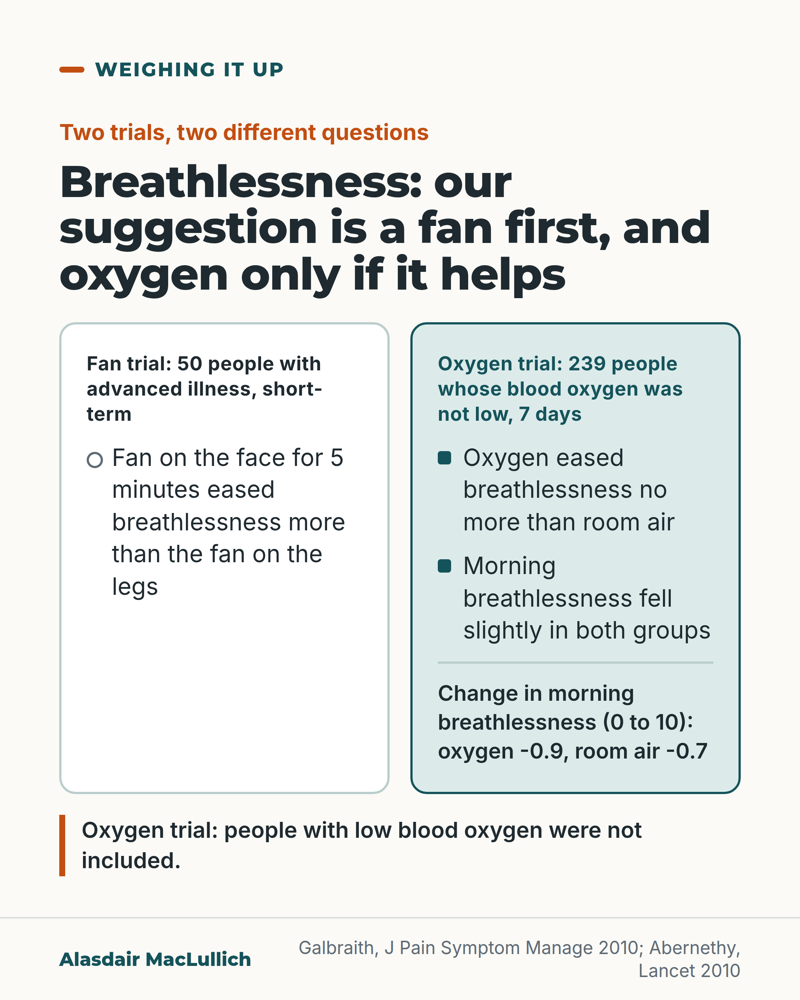

# G181: A fan, and oxygen only when it helps

- Category: C19 Palliative care and care near the end of life
- Audience: both
- Series: Weighing it up
- Post type: decision_support
- Visual format: comparison
- Status: text text_final, visual final
- Working id: C19-P02 (candidate C19-21)

## Insight

In a small trial a hand-held fan on the face eased breathlessness more than the fan on the legs, and in people whose blood oxygen was not low, oxygen eased breathlessness no more than room air.

## Angle and position

Offer a cheap measure to try first and a clearer reason to ask whether oxygen will help a particular person, without claiming the trials cover people with low oxygen.

Basis: empirical finding (Galbraith 2010; Abernethy 2010; Campbell 2013) plus a marked suggestion (try a fan first; check whether oxygen helps that person), which is judgement.

## X (668 characters)

```text
Five minutes of air from a hand-held fan on the face eased breathlessness more than the same fan on the legs. This was a small UK trial of 50 people with advanced illness. The effect shown was short-term.

A second trial involved 239 people with serious illness whose blood oxygen was not low. Oxygen through nasal tubes eased breathlessness no more than room air through the same tubes. Both groups, on oxygen and on room air, said their morning breathlessness eased slightly. That could reflect air flow, expectation or the illness changing on its own.

Our suggestion: try a fan first. If oxygen is tried, ask the care team how they will tell whether it is helping.
```

## LinkedIn (1657 characters)

```text
Five minutes of air from a hand-held fan on the face eased breathlessness more than the same fan on the legs. This was a small UK trial of 50 people with advanced illness. Each person tried both, in random order. The effect shown was short-term.

Oxygen is often given for breathlessness. A trial in which neither the people nor the researchers knew who got oxygen tested it in 239 people with serious illness whose blood oxygen was not low. Oxygen through nasal tubes eased breathlessness no more than room air through the same tubes. By day 6, morning breathlessness on a 0 to 10 scale (a lower score means less breathless) fell by 0.9 points with oxygen and 0.7 with room air. So both groups felt a little better, and the trial did not show that the gap between them was real. The improvement could reflect air flow, expectation or the illness changing on its own, and the trial could not separate them.

Two limits apply. The trial excluded people with low blood oxygen, so it says nothing about them. It was in outpatients, not people who were dying.

A small US study looked at people close to death who were not in distress at the start. Observers rated their breathing distress while oxygen, air and no flow were switched every 10 minutes. Most of the 32 people tolerated this without distress. 3 of the 32 (9 in 100) became distressed and went back on oxygen. The authors of the oxygen trial concluded that less burdensome strategies should be considered after a brief check of whether oxygen helps the individual.

Our suggestion, as a judgement: try a fan first. If oxygen is tried, check whether it helps that person, and stop it if it does not.
```

## Bluesky (289 characters)

```text
In a small trial of 50 people with advanced illness, 5 minutes of a hand-held fan on the face eased breathlessness more than a fan on the legs. In 239 people whose blood oxygen was not low, oxygen eased it no more than room air. Our suggestion: try a fan first; check whether oxygen helps.
```

## Threads (459 characters)

```text
Five minutes of a hand-held fan on the face eased breathlessness more than the fan on the legs. This was a small UK trial of 50 people with advanced illness.

In 239 people whose blood oxygen was not low, oxygen eased breathlessness no more than room air. Both groups, on oxygen and on room air, said their morning breathlessness eased slightly.

Our suggestion: try a fan first. If oxygen is tried, ask the care team how they will tell whether it is helping.
```

## Source reply

Sources: Galbraith et al., J Pain Symptom Manage 2010 https://doi.org/10.1016/j.jpainsymman.2009.09.024 ; Abernethy et al., Lancet 2010 https://doi.org/10.1016/S0140-6736(10)61115-4 ; Campbell et al., J Pain Symptom Manage 2013 https://doi.org/10.1016/j.jpainsymman.2012.02.012

## Visual



Alt text: Two-column comparison. Fan trial, 50 people with advanced illness: a fan on the face for 5 minutes eased breathlessness more than a fan on the legs. Oxygen trial, 239 people whose blood oxygen was not low, 7 days: oxygen eased breathlessness no more than room air; both fell slightly (-0.9 and -0.7 on a 0 to 10 scale). People with low oxygen were not included.

Editable source: `visuals/src/G181.html`

Design instructions: Single card, white column (hollow markers) for fan trial, mint column (solid square markers) for oxygen trial, figures as text, limitation line with orange rule. No drawing. Claim C19-21-b.

## Sources and verification

- C19-21-a (supported_with_qualification): A hand-held fan blown at the face reduced breathlessness compared with the fan on the legs.
  - Source: Galbraith S, Fagan P, Perkins P, Lynch A, Booth S. Does the use of a handheld fan improve chronic dyspnea? A randomized, controlled, crossover trial. J Pain Symptom Manage. 2010;39(5):831-8.
  - Passage: "Fifty participants were randomized to use a handheld fan for five minutes directed to their face or leg first and then crossed over to the other treatment. ... There was a significant difference in the VAS scores between the two treatments, with a reduction in breathlessness when the fan was directed to the face (P=0.003)." (Abstract)
- C19-21-b (supported_with_qualification): In people without low oxygen levels, oxygen through nasal tubes gave no more relief than room air; both groups improved.
  - Source: Abernethy AP, McDonald CF, Frith PA, et al. Effect of palliative oxygen versus room air in relief of breathlessness in patients with refractory dyspnoea: a double-blind, randomised controlled trial. Lancet. 2010;376(9743):784-93.
  - Passage: "From baseline to day 6, mean morning breathlessness changed by -0.9 points (95% CI -1.3 to -0.5) in patients assigned to receive oxygen and by -0.7 points (-1.2 to -0.2) in patients assigned to receive room air (p=0.504). ... Since oxygen delivered by a nasal cannula provides no additional symptomatic benefit for relief of refractory dyspnoea in patients with life-limiting illness compared with room air, less burdensome strategies should be considered after brief assessment of the effect of oxygen therapy on the individual patient." (Abstract)
- C19-21-c (supported_with_qualification): In 32 people near death, oxygen, medical air and no flow made no difference to observed respiratory distress; 91% tolerated the protocol.
  - Source: Campbell ML, Yarandi H, Dove-Medows E. Oxygen is nonbeneficial for most patients who are near death. J Pain Symptom Manage. 2013;45(3):517-23.
  - Passage: "Most (91%) patients tolerated the protocol with no change in respiratory comfort. Three patients (9%) displayed distress and were restored to baseline oxygen ... Repeated-measure analysis of variance revealed no differences in the Respiratory Distress Observation Scale under changing gas and flow conditions. ... The n-of-1 trial of oxygen in clinical practice is appropriate in the face of hypoxemic respiratory distress." (Abstract)
- C19-21-d (partly_supported): Oxygen can cause nasal irritation and add cost.
  - Source: Campbell ML, Yarandi H, Dove-Medows E. Oxygen is nonbeneficial for most patients who are near death. J Pain Symptom Manage. 2013;45(3):517-23.; Abernethy AP, McDonald CF, Frith PA, et al. Effect of palliative oxygen versus room air in relief of breathlessness in patients with refractory dyspnoea: a double-blind, randomised controlled trial. Lancet. 2010;376(9743):784-93.
  - Passage: "Campbell (background): "Oxygen may produce nasal irritation and increase the cost of care." Abernethy: "The frequency of side-effects did not differ between groups."" (Abstract (Campbell introduction; Abernethy results))

Verification notes: C19-21-a: Galbraith 2010 abstract (50 people, 5 min, face vs leg, P=0.003), small short-term study carried. C19-21-b: Abernethy 2010 abstract (239 people, -0.9 vs -0.7, p=0.504); excluded low blood oxygen; outpatients; 7 days; improvement in both groups explained as possibly air flow, expectation or natural course, as the claim allows. C19-21-c: Campbell 2013 abstract (32 people, 91% tolerated, 3 distressed went back on oxygen); small and not distressed at baseline carried. C19-21-d is partly supported: the post says only that tubing and equipment are hard for some people to live with and does not claim trial-proven side effects. 'Try a fan first' is marked as our suggestion (judgement). Access: abstracts.

## Attention and follow potential

Pause: Families and clinicians who assume oxygen is the answer to breathlessness will see it set beside an inexpensive alternative.

Gain: Something to try straight away and a clear question to ask about oxygen.

Follow: Common interventions weighed with the numbers and their limits.

## Open issues

None.
