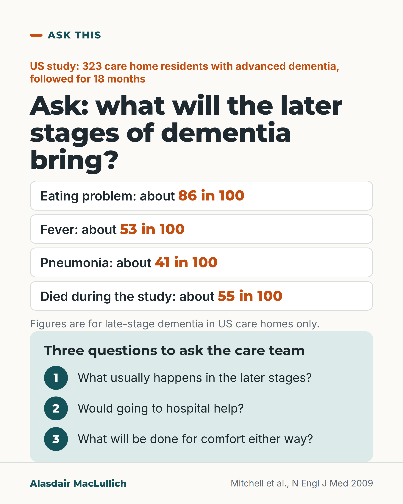

# G182: What the later stages of dementia usually bring

- Category: C19 Palliative care and care near the end of life
- Audience: public
- Series: Ask this
- Post type: decision_support
- Visual format: question card
- Status: text text_final, visual final
- Working id: C19-P03 (candidate C19-24)

## Insight

In a US study of care home residents with advanced dementia, most developed an eating problem within 18 months, and residents whose health care proxies understood the likely course were much less likely to have hospital-type interventions in their last 3 months.

## Angle and position

Give families the usual course of late-stage dementia in numbers, then three questions to put to the care team, so decisions about hospital, drips and tube feeding can be made calmly and early. The suggestion to plan ahead is judgement.

Basis: empirical finding (Mitchell 2009, observational) plus ethical and practical judgement marked as 'We think' (families should be told what the later stages usually bring and invited to plan).

## X (785 characters)

```text
About 86 in 100 people with advanced dementia (the late stage) developed an eating problem within 18 months, in a US care home study.

The study followed 323 residents for 18 months. About 53 in 100 had a fever. About 41 in 100 had pneumonia. About 55 in 100 died within the 18 months.

Among residents who died, about 4 in 10 had a hospital transfer, emergency visit, drip or tube feeding in their last 3 months. Those whose health care proxy (the person who decides for the resident) understood the likely course were much less likely to have these. That is a link. It does not show that explaining the course caused the difference.

You can ask the care team what the later stages usually bring. You can ask whether hospital would help, and what will be done for comfort either way.
```

## LinkedIn (1150 characters)

```text
About 86 in 100 people with advanced dementia (the late stage) developed an eating problem within 18 months, in a US care home study.

Mitchell and colleagues followed 323 care home residents with advanced dementia in the Boston area for 18 months. Over that time:

1. About 86 in 100 developed an eating problem.
2. About 53 in 100 had a fever.
3. About 41 in 100 had pneumonia.
4. About 55 in 100 died.

Among those who died, about 4 in 10 had a hospital transfer, emergency visit, drip or tube feeding in their last 3 months. Residents whose health care proxies (the person who decides for the resident) understood the likely course were much less likely to have these. That finding comes from watching what happened, not from a trial. It does not show that explaining the course caused the difference.

The figures come from US care homes and apply to late-stage dementia only.

We think families should be told clearly what the later stages usually bring, and be invited to plan ahead. Three questions you can put to the care team: What usually happens in the later stages? Would going to hospital help? What will be done for comfort either way?
```

## Bluesky (298 characters)

```text
In 18 months, about 86 in 100 of 323 US care home residents with advanced dementia had an eating problem and 55 in 100 died. Where the proxy (decision-maker) understood the likely course, residents were linked with fewer hospital transfers, drips and tube feeding. Ask the care team what to expect.
```

## Threads (483 characters)

```text
In a US study of 323 care home residents with advanced dementia, about 86 in 100 developed an eating problem, about 53 in 100 had a fever, 41 in 100 had pneumonia and 55 in 100 died, all within 18 months.

Where the health care proxy (the person who decides for the resident) understood the likely course, residents were linked with fewer hospital transfers, drips and tube feeding at the end. This does not show cause.

You can ask the care team what the later stages usually bring.
```

## Source reply

Source: Mitchell et al., N Engl J Med 2009 https://doi.org/10.1056/NEJMoa0902234

## Visual



Alt text: Question card on dementia: in a US study of 323 care home residents with advanced dementia over 18 months, about 86 in 100 had an eating problem, 53 in 100 fever, 41 in 100 pneumonia and 55 in 100 died. US care homes only. Three questions to ask the care team: what usually happens, would hospital help, what will be done for comfort.

Editable source: `visuals/src/G182.html`

Design instructions: Single card, four white rows with orange figures (text, not bars), mint panel with three numbered questions. No drawing. Claim C19-24-a.

## Sources and verification

- C19-24-a (supported_with_qualification): Course of advanced dementia over 18 months.
  - Source: Mitchell SL, Teno JM, Kiely DK, Shaffer ML, Jones RN, Prigerson HG, et al. The clinical course of advanced dementia. N Engl J Med. 2009;361(16):1529-38.
  - Passage: "Over a period of 18 months, 54.8% of the residents died. The probability of pneumonia was 41.1%; a febrile episode, 52.6%; and an eating problem, 85.8%." (Abstract)
- C19-24-b (supported_with_qualification): Burdensome interventions in last 3 months and link with proxy understanding.
  - Source: Mitchell SL, Teno JM, Kiely DK, Shaffer ML, Jones RN, Prigerson HG, et al. The clinical course of advanced dementia. N Engl J Med. 2009;361(16):1529-38.
  - Passage: "In the last 3 months of life, 40.7% of residents underwent at least one burdensome intervention (hospitalization, emergency room visit, parenteral therapy, or tube feeding). Residents whose proxies had an understanding of the poor prognosis and clinical complications expected in advanced dementia were much less likely to have burdensome interventions in the last 3 months of life than were residents whose proxies did not have this understanding (adjusted odds ratio, 0.12; 95% confidence interval, 0.04 to 0.37)." (Abstract)

Verification notes: C19-24-a: Mitchell 2009 abstract (323 residents; 85.8% eating problem, 52.6% febrile episode, 41.1% pneumonia probability, 54.8% died over 18 months), rounded as in safe wording; US nursing homes and advanced dementia carried. C19-24-b: same abstract (40.7% of residents who died had a burdensome intervention in the last 3 months; adjusted OR 0.12 given in words only, observational). The questions are suggestions, and 'We think families should be told' is marked as judgement. Access: abstract.

## Attention and follow potential

Pause: Families of people with advanced dementia, especially in care homes, will recognise the situations named.

Gain: Knowledge of the usual course and three questions that allow decisions before a crisis.

Follow: Frank, humane information about dementia that carries its limits.

## Open issues

None.
