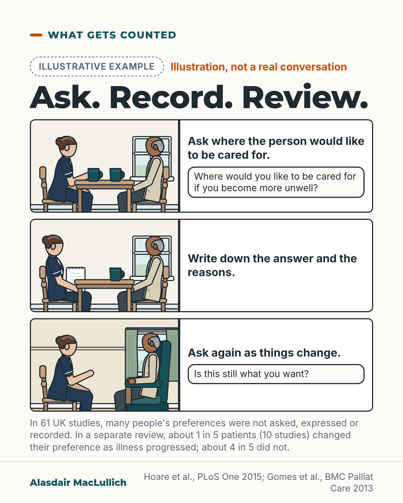

# G183: Ask, record, review the place of care

- Category: C19 Palliative care and care near the end of life
- Audience: both
- Series: What gets counted
- Post type: evidence_interpretation
- Visual format: comic strip
- Status: text text_final, visual final
- Working id: C19-P04 (candidate C19-04)

## Insight

Where preferences are recorded, home is the most common choice, but many UK studies did not ask, or did not record, people's views, so the true share is unknown, and about 1 in 5 patients changed their preference as illness progressed.

## Angle and position

Revised angle: home usually comes first where people state a preference, so the argument is for asking, recording and reviewing, not for doubting home. A well-planned death in a hospice, hospital or care home should not be counted as a failure (judgement).

Basis: empirical finding (Hoare 2015; Gomes 2013) plus ethical judgement marked as 'We should' (ask, record and review; do not count a planned death elsewhere as a failure).

## X (869 characters)

```text
A review of 61 UK studies found that many people's wishes about where to die were not asked, not expressed or not recorded.

Among the wishes that were recorded, most chose home. Counting the missing wishes as well, it is not known what share of people prefer home. The place where people were asked was also linked with the answer they gave.

A separate, larger review of 210 studies from 33 countries also found that home was the most common stated choice. In 9 better-quality studies of patients, leaving out outliers, the share who preferred home ranged from about 3 in 10 to nearly 9 in 10. In 10 studies, mostly of lower quality, about 1 in 5 patients changed their preference as illness progressed, and about 4 in 5 did not. The studies did not check whether this could be chance.

We should ask each person, write down the answer and the reasons, and ask again.
```

## LinkedIn (1232 characters)

```text
A review of 61 UK studies found that many people's wishes about where to die were not asked, not expressed or not recorded.

Hoare and colleagues reviewed UK studies from 2000 to 2015. Among the preferences that were recorded, most people chose home. Counting the missing views as well, it is not known what share of people prefer home. Where people were asked was also linked with the place they said they preferred.

A larger international review covered 210 studies in 33 countries. It also found that home is the most common stated choice. In 9 better-quality studies of patients (leaving out outliers), the share who preferred home ranged from about 3 in 10 to nearly 9 in 10.

In 10 studies, about 1 in 5 patients changed their preference as illness progressed. Those data came from few studies, mostly of low quality, and the studies did not check whether the change could be chance.

The case for helping people who choose home stands. Each person still needs to be asked.

We should ask each person where they would like to be cared for and to die. We should record the reasons and review the answer as things change. In our view, a well-planned death in a hospice, hospital or care home should not be counted as a failure.
```

## Bluesky (297 characters)

```text
In 61 UK studies, most recorded wishes about where to die favoured home, but many were not asked, expressed or recorded, so the true share is not known. A separate review found about 1 in 5 patients (10 studies) changed their preference as illness progressed. We should ask, record, and ask again.
```

## Threads (498 characters)

```text
A review of 61 UK studies found many people's wishes about where to die were not asked, not expressed or not recorded. Among the views recorded, most chose home. With the missing views included, the share who prefer home is not known.

A separate review of 210 studies found that, in 10 of them, about 1 in 5 patients changed their preference as illness progressed, and about 4 in 5 did not. The studies did not check whether this could be chance.

We should ask, record the reasons, and ask again.
```

## Source reply

Sources: Hoare et al., PLoS One 2015 https://doi.org/10.1371/journal.pone.0142723 ; Gomes et al., BMC Palliat Care 2013 https://doi.org/10.1186/1472-684X-12-7

## Visual



Alt text: Illustrative three-panel strip headed 'Ask. Record. Review.' A community nurse and an older man talk at a kitchen table over tea: she asks where he would like to be cared for, writes down his answer and reasons, then asks again later as things change. Text notes many preferences were not asked or recorded in 61 UK studies; about 1 in 5 patients changed preference.

Editable source: `visuals/src/G183.html`

Design instructions: Single card, three panel rows: drawn art left (nurse f brown bun, older man tan cardigan; kitchen table, chairs, mugs; panel 3 living room armchair), caption and dialogue box right, dashed Illustrative example badge, evidence note below. No claim ids given in brief (Hoare 2015; Gomes 2013).

## Sources and verification

- C19-04-a (supported): In UK studies, missing preferences were common; once included, the proportion preferring home was unknown.
  - Source: Hoare S, Morris ZS, Kelly MP, Kuhn I, Barclay S. Do patients want to die at home? A systematic review of the UK literature, focused on missing preferences for place of death. PLoS One. 2015;10(11):e0142723.
  - Passage: "Missing data were common. Across all health conditions when missing data were excluded the majority preference was for home: when missing data were included, it was not known what proportion of patients with cancer, non-cancer or multiple conditions preferred home. Caution should be exercised if asserting that most patients prefer to die at home." (Abstract, Results and Conclusions)
- C19-04-b (supported): Where people were asked was related to where they said they wished to die.
  - Source: Hoare S, Morris ZS, Kelly MP, Kuhn I, Barclay S. Do patients want to die at home? A systematic review of the UK literature, focused on missing preferences for place of death. PLoS One. 2015;10(11):e0142723.
  - Passage: "Where patients wished to die was related to where they were asked their preference." (Abstract, Results)
- C19-04-c (supported_with_qualification): Most people who state a preference choose home, but estimates vary widely and about 1 in 5 changed preference.
  - Source: Gomes B, Calanzani N, Gysels M, Hall S, Higginson IJ. Heterogeneity and changes in preferences for dying at home: a systematic review. BMC Palliat Care. 2013;12:7.
  - Passage: "There was moderate evidence that most people prefer a home death-this was found in 75% of studies, 9/14 of those of high quality. Amongst the latter and excluding outliers, home preference estimates ranged 31% to 87% for patients (9 studies)... 20% of 1395 patients in 10 studies (2 of high quality) changed their preference, but statistical significance was untested." (Abstract, Results)

Verification notes: C19-04-a and C19-04-b: Hoare 2015 abstract (61 studies; missing data common; most recorded views favoured home; with missing data included the share preferring home was unknown; place of asking linked with preference). C19-04-c: Gomes 2013 abstract (210 studies, 33 countries; home preference 75% of studies; 31% to 87% in high-quality patient studies; 20% of 1395 patients in 10 studies changed preference, significance untested). Steinhauser ranking and UK indicator claims (C19-04-d, C19-04-e) not used. The comic dialogue is illustrative and labelled. Access: abstracts.

## Attention and follow potential

Pause: Anyone who has heard 'most people want to die at home' will see what the studies did and did not ask.

Gain: A careful reading of a much-repeated statement and a better routine: ask, record, review.

Follow: Checks common claims against the original studies.

## Open issues

None.
