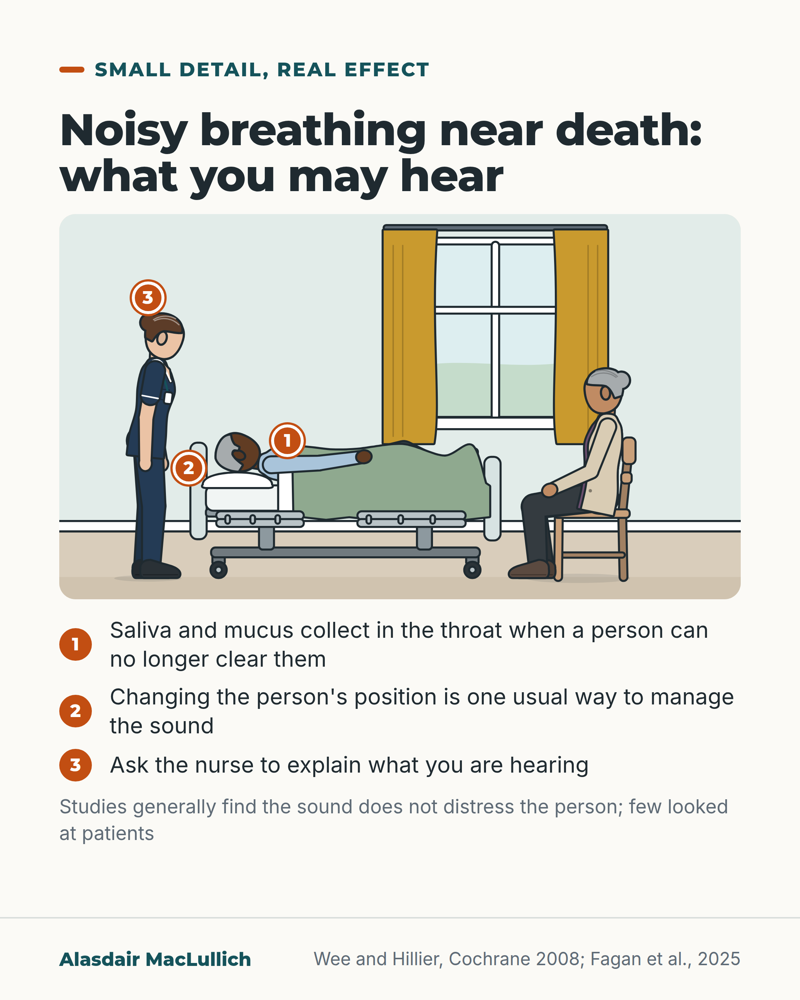

# G184: The rattling breath near death

- Category: C19 Palliative care and care near the end of life
- Audience: public
- Series: Small detail, real effect
- Post type: public_explanation
- Visual format: annotated scene
- Status: text text_final, visual final
- Working id: C19-P05 (candidate C19-05)

## Insight

The rattling breathing that can come in the last days of life is thought to be saliva and mucus collecting in the throat; a 2025 review found general agreement that it does not distress the person, but few studies looked at patients, and many relatives in interview studies were upset, so an explanation helps.

## Angle and position

Separate what has been measured (relatives' distress in interviews; a hospice trial of preventive medicine) from what is inferred (the dying person's comfort), say that evidence for treating an established rattle is lacking, and give two things a relative can ask for.

Basis: empirical findings from interviews, a Cochrane review, a scoping review and a trial, with the dying person's comfort stated as expert consensus and not measured; the advice to ask for an explanation is a practical suggestion.

## X (868 characters)

```text
The rattling breathing that can come in the last days of life is thought to be saliva and mucus. They collect in the throat when a person can no longer cough up or swallow them. That is the presumed cause. It has not been shown directly.

A 2025 review of 14 studies found general agreement that the sound does not distress the dying person. Only 2 of the studies looked at patients, so this has not been measured well. In interview studies, many relatives were upset by it, especially when they thought the person was choking or drowning. Others were not. Some see it as a sign that death is close.

Changing the person's position is one of the usual ways to manage it. A 2008 review of trials found no evidence that it, or any medicine, reduces the sound once it has started. Relatives need time and explanation.

If you hear it, ask the nurse to explain what it is.
```

## LinkedIn (1819 characters)

```text
The rattling breathing that can come in the last days of life is thought to be saliva and mucus. They collect in the throat when a person can no longer cough up or swallow them. Some call it the death rattle. That is the presumed cause, and it has not been shown directly.

A 2025 review of 14 studies found general agreement that the sound does not distress the dying person. Only 2 of the studies looked at patients, so this has not been measured well.

Relatives react differently. In a UK interview study of 25 bereaved relatives, 17 had heard the sound. 10 of them were distressed by it and 7 were not. Relatives were distressed when they thought the person might be choking or drowning. Some saw the sound as a useful sign that death was close. These are small interview studies. They show what these relatives said, not how common each reaction is.

Changing the person's position is one of the usual ways to manage it. A review of trials found no evidence that any medicine or other measure was better than a dummy treatment (placebo) for treating the sound once it has started. It concluded that relatives need time, explanation and reassurance.

A Dutch hospice trial of 157 dying people tested an injection of hyoscine butylbromide. It was given as soon as dying was recognised, before any rattle. About 13 in 100 developed the rattle, compared with 27 in 100 given placebo. That trial tested prevention, before the rattle started. Restlessness was reported in 28 in 100 on the injection and 23 in 100 on placebo, and we do not know whether that gap was more than chance. Dry mouth was reported in 10 in 100 on the injection and 15 in 100 on placebo.

If you hear this sound, ask the nurse to explain what it is and how it is being managed. You can also ask whether changing the person's position could help.
```

## Bluesky (295 characters)

```text
Rattling breath near death is thought to be mucus the person can no longer clear. A review found general agreement it does not distress them; only 2 of 14 studies looked at patients. Many relatives were upset. Changing position is usual care; no trial shows it or any medicine reduces the sound.
```

## Threads (492 characters)

```text
The rattling breathing near death is thought to be saliva and mucus the person can no longer clear.

A 2025 review of 14 studies found general agreement that the sound does not distress the dying person. Only 2 studies looked at patients. In interview studies, many relatives were upset, especially if they feared choking. Others were not.

Changing position is usual care, but no trial shows it or any medicine reduces the sound once it has started. If you hear it, ask the nurse what it is.
```

## Source reply

Sources: Wee et al., Palliat Med 2006 https://doi.org/10.1191/0269216306pm1138oa ; Wee and Hillier, Cochrane 2008 https://doi.org/10.1002/14651858.CD005177.pub2 ; van Esch et al., JAMA 2021 https://doi.org/10.1001/jama.2021.14785 ; Fagan et al., 2025 https://doi.org/10.1177/10499091251382508

## Visual



Alt text: Bedside scene: an older man lies in a hospital bed, a woman sits beside him and a nurse stands at the bedside. Three numbered markers explain noisy breathing near death: saliva collects in the throat, changing position is one usual way to manage the sound, and ask the nurse to explain. Studies generally find it does not distress the person; few looked at patients.

Editable source: `visuals/src/G184.html`

Design instructions: Single card, kit scene (home bedroom, hospital bed rails down, man lying, woman on chair, nurse standing), orange pins 1 to 3, numbered key beneath, footnote. Sources Wee and Hillier 2008; Fagan 2025.

## Sources and verification

- C19-05-a (supported_with_qualification): The noise is presumed to come from secretions gathering in the airways that the dying person cannot clear.
  - Source: Wee B, Hillier R. Interventions for noisy breathing in patients near to death. Cochrane Database Syst Rev. 2008;(1):CD005177.; van Esch HJ, van Zuylen L, Geijteman ECT, et al. Effect of prophylactic subcutaneous scopolamine butylbromide on death rattle in patients at the end of life: the SILENCE randomized clinical trial. JAMA. 2021;326(13):1268-76.
  - Passage: "Cochrane: "The cause of death rattle remains unproven but is presumed to be due to an accumulation of secretions in the airways. It is therefore managed physically (repositioning and clearing the upper airways of fluid with a mechanical sucker) or pharmacologically (with anticholinergic drugs)." SILENCE: "Death rattle, defined as noisy breathing caused by the presence of mucus in the respiratory tract, is relatively common among dying patients."" (Abstracts)
- C19-05-b (supported_with_qualification): The person is thought not to be distressed by the sound.
  - Source: Fagan N, Connolly M, Keane N, Davies A. The impact of "death rattle" on patients, informal caregivers and healthcare professionals: a scoping review. Am J Hosp Palliat Care. 2025. doi:10.1177/10499091251382508.
  - Passage: "The impact of death rattle on patients was less well described, although there was a consensus that death rattle is not distressing to affected patients (but may be distressing to other patients)." (Abstract, Results)
- C19-05-c (supported): Some relatives are distressed by the sound, especially if they think the person is choking or drowning; others are not.
  - Source: Wee BL, Coleman PG, Hillier R, Holgate SH. The sound of death rattle I: are relatives distressed by hearing this sound? Palliat Med. 2006;20(3):171-5.; Wee BL, Coleman PG, Hillier R, Holgate SH. The sound of death rattle II: how do relatives interpret the sound? Palliat Med. 2006;20(3):177-81.; Fagan N, Connolly M, Keane N, Davies A. The impact of "death rattle" on patients, informal caregivers and healthcare professionals: a scoping review. Am J Hosp Palliat Care. 2025. doi:10.1177/10499091251382508.
  - Passage: "Wee II: "Seventeen of the 25 bereaved relatives interviewed had heard the sound of death rattle. Ten relatives were distressed by the sound, but seven were not. Some relatives regarded the sound of death rattle as a useful warning sign that death was imminent. ... Relatives were distressed when they thought that the sound of death rattle indicated that the patient might be drowning or choking." Wee I: "almost half of the 12 relatives who had heard the sound of death rattle had been distressed by it. The others were either neutral about the sound or found it a helpful signal of impending death." Fagan 2025: "related distress was common amongst informal carers"." (Abstracts)
- C19-05-d (supported_with_qualification): Repositioning is a recognised way to manage the sound; evidence that any treatment helps an established rattle is lacking.
  - Source: Wee B, Hillier R. Interventions for noisy breathing in patients near to death. Cochrane Database Syst Rev. 2008;(1):CD005177.
  - Passage: "It is therefore managed physically (repositioning and clearing the upper airways of fluid with a mechanical sucker) or pharmacologically (with anticholinergic drugs). ... There is currently no evidence to show that any intervention, be it pharmacological or non-pharmacological, is superior to placebo in the treatment of death rattle. ... relatives need time, explanation and reassurance to relieve their fears and concerns." (Abstract)
- C19-05-e (supported_with_qualification): A preventive injection of hyoscine butylbromide reduced death rattle from 27% to 13% in Dutch hospices.
  - Source: van Esch HJ, van Zuylen L, Geijteman ECT, et al. Effect of prophylactic subcutaneous scopolamine butylbromide on death rattle in patients at the end of life: the SILENCE randomized clinical trial. JAMA. 2021;326(13):1268-76.
  - Passage: "A death rattle occurred in 10 patients (13%) in the scopolamine group compared with 21 patients (27%) in the placebo group (difference, 14%; 95% CI, 2%-27%, P = .02)." (Abstract)

Verification notes: C19-05-a: Cochrane 2008 and SILENCE 2021 abstracts (cause presumed, secretions in airways). C19-05-b: Fagan 2025 scoping review abstract (consensus not distressing to patients; not measured well). C19-05-c: Wee II abstract (17 of 25 heard the sound; 10 distressed, 7 not; drowning or choking fear) and Wee I, Fagan 2025; small qualitative studies. C19-05-d: Cochrane 2008 (repositioning and suction, medicines; no evidence any intervention better than placebo; relatives need time and explanation). C19-05-e: van Esch 2021 abstract (13% vs 27%; prevention; hospice; restlessness 28% vs 23%). Access: abstracts. 'Deeply unconscious' from the candidate was not used because it is not in a verified claim.

## Attention and follow potential

Pause: Relatives who have heard the sound, or have been told it may come.

Gain: An explanation that may ease fear, and two things to ask for.

Follow: Plain explanations of what happens near the end of life.

## Open issues

None.
