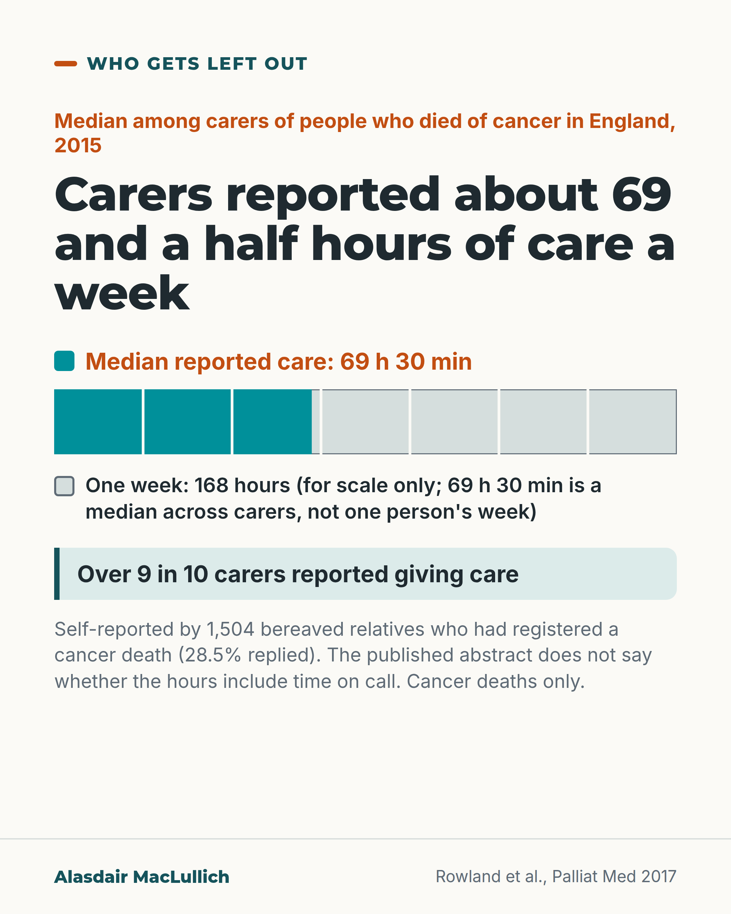

# G185: Count the carer's hours

- Category: C19 Palliative care and care near the end of life
- Audience: both
- Series: Who gets left out
- Post type: evidence_interpretation
- Visual format: chart (bar)
- Status: text text_final, visual final
- Working id: C19-P06 (candidate C19-10)

## Insight

In a national survey of bereaved relatives in England, people who cared for someone who died of cancer reported a median of about 69 and a half hours of care a week in the last 3 months, and many reported out-of-pocket spending.

## Angle and position

Plans for dying at home are usually described in visits and equipment; the largest input reported here is the family's time and money. Put it on the record and end on planning questions about the carer's limits.

Basis: empirical finding (Rowland 2017, self-report, cancer only, 28.5% response) plus a marked judgement ('We think a plan for dying at home should ask...').

## X (854 characters)

```text
Family carers of people who died of cancer in England reported caring for a median of about 69 and a half hours a week. This covers the last 3 months of life. Half reported more and half less.

The figure comes from a national survey of 1,504 bereaved relatives who had registered a cancer death. 28.5% of those sent the survey replied. It covered deaths registered in two weeks of May 2015. Over 9 in 10 reported giving care. Those who gave details of money spent reported a median of £370 over the 3 months.

The survey covers cancer only and relies on carers' own reports. It is not clear whether the hours include time on call. The authors note that carers' contributions are often overlooked in evaluations.

We think a plan for dying at home should ask three things. What hours can the main carer give? What is it costing them? Who covers the rest?
```

## LinkedIn (1220 characters)

```text
Family carers of people who died of cancer in England reported caring for a median of about 69 and a half hours a week. This covers the last 3 months of life. Median means the middle value: half of the carers reported more and half reported less.

The figure comes from a national postal survey by Rowland and colleagues. People who registered a death from cancer in England between 1 and 16 May 2015 were sent a survey about the last 3 months of life. 1,504 completed surveys came back, 28.5% of those sent. Over 9 in 10 respondents reported spending time on care. Among the 72.5% who gave details of money spent, the median was £370 over the 3 months.

There are limits. The survey covers cancer deaths only. It relies on what carers remembered and reported, and fewer than 3 in 10 replied. It is not clear whether the hours include time spent on call.

The authors note that the value of carers' contributions is often underestimated or overlooked in evaluations.

We think a plan for dying at home should ask the main carer three questions. How many hours can you give? What is it costing you? Who covers the rest? In our view, a plan that leaves those unanswered risks relying on unpaid time the carer may not have.
```

## Bluesky (296 characters)

```text
Carers of people who died of cancer in England reported a median (middle value) of about 69.5 hours of care a week in the last 3 months. The survey had 1,504 bereaved relatives; 28.5% replied. We think plans for dying at home should ask what hours the main carer can give and who covers the rest.
```

## Threads (422 characters)

```text
Carers of people who died of cancer in England reported a median (the middle value) of about 69 and a half hours of care a week. This covers the last 3 months of life. Over 9 in 10 reported giving care.

The survey had 1,504 replies, a 28.5% response, in 2015. It covers cancer only and relies on carers' own reports.

We think plans for dying at home should ask what hours the main carer can give and who covers the rest.
```

## Source reply

Source: Rowland et al., Palliat Med 2017 https://doi.org/10.1177/0269216317690479

## Visual



Alt text: Bar drawn to scale: a week of 168 hours split into seven days, with the first 69 and a half hours shaded. Carers of people who died of cancer in England in 2015 reported a median of 69 h 30 min of care a week; over 9 in 10 gave care. For scale only. Self-reported by 1,504 bereaved relatives (28.5% replied).

Editable source: `visuals/src/G185.html`

Design instructions: Single card, one bar 920 wide with teal fill to 69.5/168, day dividers, legend labels, mint fact line, small note. Claim C19-10-a; 168 is arithmetic.

## Sources and verification

- C19-10-a (supported_with_qualification): England census survey of cancer carers: over 90% gave care in last 3 months, median 69 h 30 min per week; median GBP 370 spent.
  - Source: Rowland C, Hanratty B, Pilling M, van den Berg B, Grande G. The contributions of family care-givers at end of life: a national post-bereavement census survey of cancer carers' hours of care and expenditures. Palliat Med. 2017;31(4):346-355.
  - Passage: "In all, 1504 completed surveys were returned (28.5%). Over 90% of respondents reported spending time on care-giving in the last 3 months of the decedent's life, contributing a median 69 h 30 min of care-giving each week. Those who reported details of expenditure (72.5%) spent a median £370 in the last 3 months of the decedent's life." (Abstract, Results)
- C19-10-b (supported_with_qualification): Carers' contributions are often underestimated or overlooked in evaluations.
  - Source: Rowland C, Hanratty B, Pilling M, van den Berg B, Grande G. The contributions of family care-givers at end of life: a national post-bereavement census survey of cancer carers' hours of care and expenditures. Palliat Med. 2017;31(4):346-355.
  - Passage: "However, the value of care-givers' contributions is often underestimated or overlooked in evaluations." (Abstract, Background)

Verification notes: C19-10-a: Rowland 2017 abstract (1504 responses, 28.5%; over 90% reported caregiving in last 3 months; median 69 h 30 min a week; 72.5% gave expenditure, median 370 pounds). Qualifications carried: reported caregiving, cancer only, 28.5% response, self-report, hours content not stated. C19-10-b: authors' background statement, reported as the authors' note. 'We think' sentence is judgement. Access: abstract.

## Attention and follow potential

Pause: Carers who recognise the hours, and planners who have not seen them counted.

Gain: A concrete figure that puts the family's contribution on the record, and three questions for planning.

Follow: Attention to unpaid carers without assuming their time is unlimited.

## Open issues

None.
