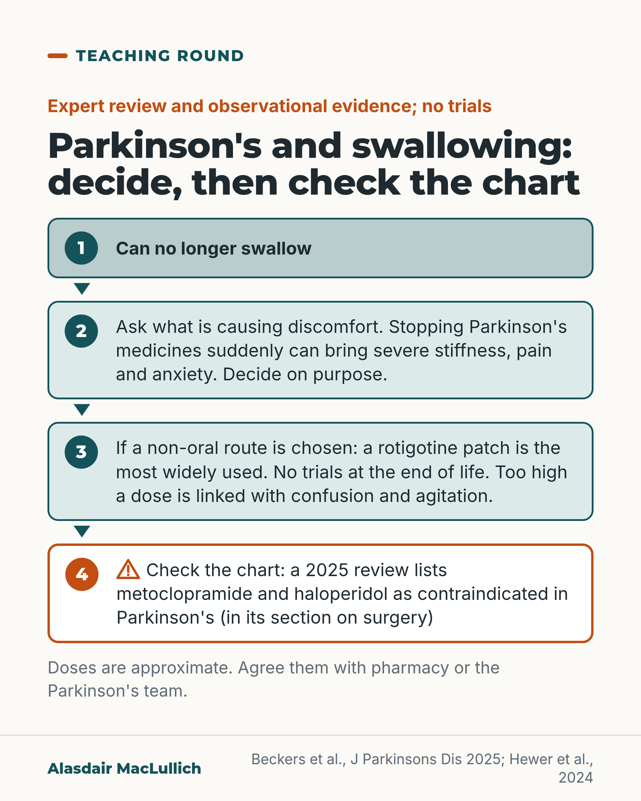

# G186: Parkinson's medicines when swallowing stops

- Category: C19 Palliative care and care near the end of life
- Audience: practitioners
- Series: Teaching round
- Post type: teaching
- Visual format: diagram (flow)
- Status: text text_final, visual final
- Working id: C19-P07 (candidate C19-22)

## Insight

For a person with Parkinson's who can no longer swallow, 'stop all oral medicines' is a decision: sudden withdrawal can bring severe stiffness and pain, a rotigotine patch is the most widely used non-oral option (dose approximate, no trials), and dopamine-blocking medicines such as metoclopramide and haloperidol should be checked for on the chart.

## Angle and position

Revised angle: the editor's 'convert, not simply stop' is stronger than the evidence, so the post says to decide on purpose, offers the rotigotine route with its limits, and owns the check for dopamine blockers, naming only the two drugs the sources name. No alternative drugs are named.

Basis: empirical findings and expert-review statements (Beckers 2025 full text; Hewer 2024; Kim 2023 abstracts), with the recommendation to decide on purpose and agree the dose with pharmacy or the Parkinson's team as clinical interpretation. Evidence is observational and expert opinion; no trials.

## X (1088 characters)

```text
When a person with Parkinson's can no longer swallow, 'stop all oral medicines' on the chart stops their Parkinson's medicines too.

Sudden withdrawal can bring severe stiffness, pain and anxiety and, rarely, a dangerous reaction with high fever. Experts differ on whether to taper the medicines off near the end of life, so decide deliberately whether to stop them: ask what is making the person uncomfortable.

A rotigotine skin patch is the most widely used non-oral option, but no trials show it works at the end of life. Converting from levodopa to the patch dose is approximate, and too high a dose is linked with confusion, hallucinations and agitation. Agree the dose with pharmacy or the Parkinson's team.

A 2025 practice review lists metoclopramide and haloperidol among medicines contraindicated in Parkinson's. It gives the list in its section on surgery, so it does not say whether the list applies in the last days of life. Check every anti-sickness, calming and sedative medicine on the chart against its dopamine-blocking effect, and ask pharmacy or the Parkinson's team.
```

## LinkedIn (2312 characters)

```text
When a person with Parkinson's can no longer swallow, 'stop all oral medicines' on the chart stops their Parkinson's medicines too.

1. Stopping suddenly can harm. Sudden withdrawal can bring severe stiffness, pain and anxiety and, in rare cases, parkinsonism-hyperpyrexia syndrome, a dangerous reaction with high fever that resembles neuroleptic malignant syndrome.

2. Stopping can still be a choice. A 2025 practice review says experts differ: some argue the medicines can be tapered off at the end of life in some people with limited harm, others continue them until death. If symptoms are controlled with palliative treatments, it says one can choose to omit them, although stopping suddenly carries the risk in point 1. So ask what is making the person uncomfortable, and decide on purpose whether to stop them.

3. Before a patch, the review's steps include levodopa dispersed in carbonated water or thickened fluid, and a nasogastric tube if that fits the person's wishes. If neither is possible, a rotigotine skin patch is the most widely used non-oral option. No trials show it works at the end of life, and the advice rests on case series and expert opinion. Skin absorption can fall with sweating, weight loss and poor circulation, which may limit the patch.

4. Converting from levodopa to the patch dose is approximate: about 30 mg of levodopa to 1 mg of rotigotine, and the maximum patch dose of 16 mg a day corresponds to 480 mg of levodopa. Too high a dose is linked with confusion, hallucinations and agitation. In one Australian audit of people with Parkinson's who died, only 7 of 52 eligible people received the recommended dose. Agree the dose with pharmacy or the Parkinson's team.

5. Check the chart for dopamine blockers. A 2025 practice review lists metoclopramide and haloperidol among medicines contraindicated in Parkinson's. It gives the list in its section on surgery, so it does not say whether the list applies in the last days of life. In the same audit, 43 in 100 of the people with Parkinson's were prescribed a contraindicated dopamine blocker, and 31 in 100 of those prescriptions were given. The audit summary does not say which drugs. Check every anti-sickness, calming and sedative medicine against its dopamine-blocking effect, and ask pharmacy or the Parkinson's team.
```

## Bluesky (288 characters)

```text
'Stop oral medicines' also stops Parkinson's medicines. Stopping suddenly can bring severe stiffness and pain; decide on purpose. A rotigotine patch is the most used non-oral option; no trials show it works at the end of life. Metoclopramide and haloperidol are listed as contraindicated.
```

## Threads (487 characters)

```text
When a person with Parkinson's can no longer swallow, 'stop all oral medicines' also stops their Parkinson's medicines. Sudden withdrawal can bring severe stiffness, pain and anxiety.

A rotigotine patch is the most widely used non-oral option, but no trials show it works at the end of life. Agree the dose with pharmacy or the Parkinson's team.

A 2025 practice review lists metoclopramide and haloperidol as contraindicated in Parkinson's (in its section on surgery). Check the chart.
```

## Source reply

Sources: Beckers et al., J Parkinsons Dis 2025 https://doi.org/10.1177/1877718X251356896 ; Hewer et al., J Pain Symptom Manage 2024 https://doi.org/10.1016/j.jpainsymman.2023.10.002 ; Kim et al., J Palliat Med 2023 https://doi.org/10.1089/jpm.2022.0193

## Visual



Alt text: Four-step flow for Parkinson's when a person can no longer swallow: 1 can no longer swallow; 2 ask what is causing discomfort, stopping medicines suddenly can bring severe stiffness, decide on purpose; 3 if a non-oral route is chosen a rotigotine patch is most used, no trials, high dose linked with confusion; 4 check the chart for contraindicated drugs. Doses approximate.

Editable source: `visuals/src/G186.html`

Design instructions: Single card, four stacked boxes with numeral circles and arrows; box 1 pale teal, 2 and 3 mint, 4 orange outline with hazard triangle. No drawing. Sources Beckers 2025; Hewer 2024.

## Sources and verification

- C19-22-a (supported_with_qualification): Abrupt stopping of Parkinson's medicines can rarely cause parkinsonism-hyperpyrexia syndrome, a dangerous condition resembling neuroleptic malignant syndrome.
  - Source: Beckers M, Hommel D, Lennaerts H, Stuijt C, Smit P, Bloem BR. Discontinuation or acute unplanned cessation of oral dopaminergic medications in persons with Parkinson's disease: a practice review. J Parkinsons Dis. 2025;15(6):1062-77.; Wang JY, Huang JF, Zhu SG, et al. Parkinsonism-hyperpyrexia syndrome and dyskinesia-hyperpyrexia syndrome in Parkinson's disease: two cases and literature review. J Parkinsons Dis. 2022;12(6):1727-35.
  - Passage: "Beckers 2025 (full text, Introduction): "In rare cases, acute cessation causes parkinsonism-hyperpyrexia syndrome. This potentially life-limiting syndrome is a specific form of neuroleptic malignant syndrome and consists of severe rigidity, autonomic dysfunction (e.g., hyperthermia, tachycardia), rhabdomyolysis and disturbances of consciousness." And: "Acute cessation of levodopa might result in a severe relapse of PD symptoms ... This includes a worsening of motor symptoms, such as akinesia, rigidity or tremor, and also of non-motor symptoms, such as anxiety and pain." End-of-life section: "If a person has sufficient symptom control with palliative treatments, including palliative sedation, one can opt to omit dopaminergic treatment altogether – although sudden cessation carries a risk of parkinsonism-hyperpyrexia syndrome." Also: "In the 72 h before death, severe motor symptoms were present in only 6% of persons in one study." Wang 2022 abstract (retained): "...caused by abrupt withdrawal of antiparkinsonian medication."" (Beckers: Introduction; 'Unplanned cessation ... at the end of life'. Wang: Abstract)
- C19-22-b (supported_with_qualification): A rotigotine skin patch is commonly used when oral Parkinson's medicines can no longer be swallowed at the end of life; conversion is approximate.
  - Source: Beckers M, Hommel D, Lennaerts H, Stuijt C, Smit P, Bloem BR. Discontinuation or acute unplanned cessation of oral dopaminergic medications in persons with Parkinson's disease: a practice review. J Parkinsons Dis. 2025;15(6):1062-77.; Hindmarsh J, Hindmarsh S, Lee M. Idiopathic Parkinson's disease at the end of life: a retrospective evaluation of symptom prevalence, pharmacological symptom management and transdermal rotigotine dosing. Clin Drug Investig. 2021;41(8):675-83.; Ibrahim H, Woodward Z, Pooley J, Richfield EW. Rotigotine patch prescription in inpatients with Parkinson's disease: evaluating prescription accuracy, delirium and end-of-life use. Age Ageing. 2021;50(4):1397-401.; Hewer C, Richfield E, Halton C, Alty J. Transdermal rotigotine at end-of-life for Parkinson's disease: association with measures of distress. J Pain Symptom Manage. 2024;67(2):e121-8.; Kim W, Watt CL, Enright P, Sikora L, Zwicker J. Management of motor symptoms for patients with advanced Parkinson's disease without safe oral access: a scoping review. J Palliat Med. 2023;26(1):131-41.
  - Passage: "Hindmarsh: "when oral administration of antiparkinsonian medications is no longer possible in dying patients, it is becoming common place to initiate transdermal rotigotine, despite a paucity of evidence to guide dosing. ... The majority of patients were converted to transdermal rotigotine (90%). Patients converted to a higher than equivalent dose of rotigotine were more likely to be agitated (p < 0.05)" Ibrahim: "25 (30%) patients were prescribed the recommended dose of Rotigotine; 31 (37%) higher and 28 (33%) lower than recommended. ... Inappropriate dosing may precipitate or worsen delirium/hallucinations. Use at end-of-life requires further evaluation." || Beckers 2025: "Based on these studies, transdermal rotigotine is the most widely used non-oral strategy at the end of life. In a UK-based cohort of 51 PwP at the end-of-life, 55% had dopaminergic medication substituted with transdermal rotigotine at death. However, evidence regarding its effectiveness is scarce" and "The equivalency factor from levodopa to transdermal rotigotine is 30:1 and the maximum dose of rotigotine is 16 mg/24 h, corresponding to 480 mg levodopa." and "it can sometimes induce psychotic symptoms or worsen autonomic symptoms" and "as many as 24% of subjects developed a delirium" (in a study of people with advanced PD started on a rotigotine patch). || Hewer 2024 abstract: "83% (n = 52) of PWP were eligible for rotigotine and, of those, 13% (n = 7) received the correct dose, 38% (n = 20) a lower dose, 12% (n = 6) a higher dose and 37% (n = 19) did not receive any. ... Rotigotine dose and admission LEDD were both associated with proxy measures of distress in the last 72 hours of life. This suggests cautious use of rotigotine at EOL." || Kim 2023 abstract: "Although rotigotine patch and apormorphine injections are most frequently recommended, there are no clinical trials in this patient population to support those recommendations."" (Beckers: 'Unplanned cessation ... at the end of life' and Table 1; Hewer, Kim: Abstracts)
- C19-22-c (supported_with_qualification): Dopamine-blocking medicines (for example metoclopramide and haloperidol) are contraindicated in Parkinson's disease, including near the end of life, and are still prescribed.
  - Source: Hewer C, Richfield E, Halton C, Alty J. Transdermal rotigotine at end-of-life for Parkinson's disease: association with measures of distress. J Pain Symptom Manage. 2024;67(2):e121-8.; Beckers M, Hommel D, Lennaerts H, Stuijt C, Smit P, Bloem BR. Discontinuation or acute unplanned cessation of oral dopaminergic medications in persons with Parkinson's disease: a practice review. J Parkinsons Dis. 2025;15(6):1062-77.; Lertxundi U, Isla A, Solinís MÁ, Domingo-Echaburu S, Hernandez R, Peral-Aguirregoitia J, et al. Medication errors in Parkinson's disease inpatients in the Basque Country. Parkinsonism Relat Disord. 2017;36:57-62.
  - Passage: "Hewer 2024 abstract: "Contraindicated dopamine antagonists were prescribed for 43% of PWP and administered in 31% of those cases." || Beckers 2025 (full text, surgery section): "certain drugs which are commonly used periprocedurally are contraindicated in PwP (examples include ketamine, metoclopramide and haloperidol)." || Lertxundi 2017 abstract: "...the administration of centrally acting antidopaminergics. ... inappropriate antiemetic administration OR = 2.15 CI 95% (1.36-3.39); and inappropriate antipsychotic administration OR = 1.91 ... Inappropriately omitted doses and both inappropriate antipsychotic and antiemetic administration were associated with a significant 4-day increase in median hospital stay."" (Hewer: Abstract (Results). Beckers: Surgery section. Lertxundi: Abstract)

Verification notes: C19-22-a: Beckers 2025 full text (introduction and end-of-life section; PHS rare; 6% severe motor symptoms in the 72 h before death in one study), Wang 2022 abstract. C19-22-b: Beckers (rotigotine most widely used non-oral strategy; 30:1; 16 mg/24 h = 480 mg levodopa; evidence scarce), Hindmarsh, Ibrahim, Hewer 2024 abstract (7 of 52 correct dose), Kim 2023 abstract (no clinical trials). C19-22-c: Hewer 2024 abstract (43% prescribed contraindicated dopamine antagonist; 31% administered), Beckers (metoclopramide and haloperidol named, in a perioperative context), Lertxundi 2017. Not used: alternative drug names, any wider list of drugs to avoid, NICE NG71 and Scottish guideline text (not opened), skin-absorption caveat.

## Attention and follow potential

Pause: Doctors and nurses who write 'stop oral medicines' on a drug chart will see an exception named.

Gain: A specific exception to a common rule, the patch route with its limits, and two drugs to look for on the chart.

Follow: Teaching that qualifies common shortcuts and states how thin the evidence is.

## Open issues

- The editor asked this post to own 'the list of drugs to avoid'. Only metoclopramide and haloperidol are named because they are the only drugs a source opened here names as contraindicated (in the surgery section of Beckers 2025); a fuller guideline list (NICE NG71, Scottish Palliative Care Guidelines) was not opened and must be checked before more drugs are added.
- The 43 in 100 and 31 in 100 figures come from the Hewer 2024 abstract (denominator about 63 people; the abstract does not list the drugs). The post now says '31 in 100 of those prescriptions were given'. Check the Hewer full text before the figures are quoted anywhere else.
