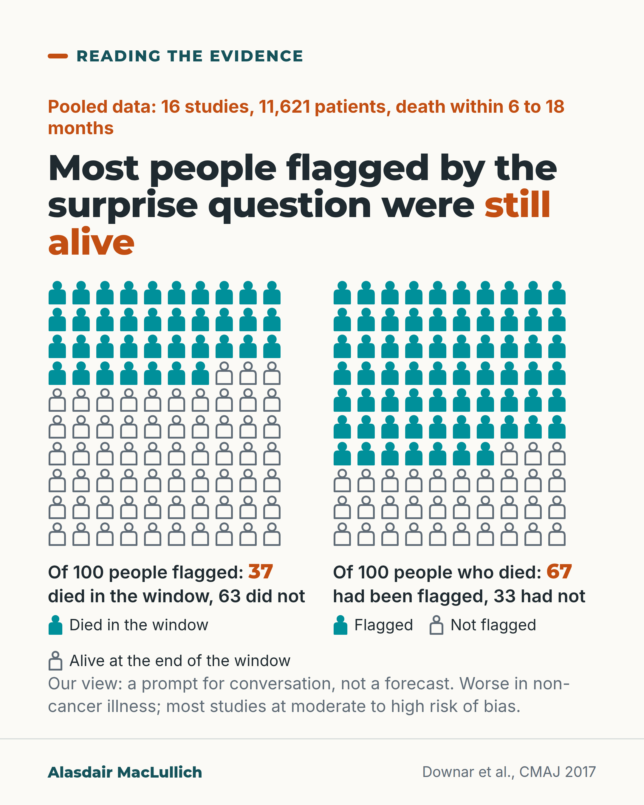

# G187: The surprise question is a prompt, not a forecast

- Category: C19 Palliative care and care near the end of life
- Audience: practitioners
- Series: Reading the evidence
- Post type: evidence_interpretation
- Visual format: chart (10 by 10 icon arrays)
- Status: text text_final, visual final
- Working id: C19-P08 (candidate C19-17)

## Insight

Pooled across 16 studies, the surprise question picked up about 67 in 100 people who died within 6 to 18 months, but only about 37 in 100 of those it flagged died in that window, so most flagged people were still alive.

## Angle and position

Revised angle: drop the Gold Standards Framework attribution, keep the 6 to 18 month window, note that the 37 in 100 depends on how many in a group die, and mark 'prompt, not prediction' as judgement.

Basis: empirical finding (Downar 2017 meta-analysis; studies at moderate to high risk of bias) plus clinical judgement marked 'Our view' (use it to start conversations, not to forecast or limit treatment).

## X (734 characters)

```text
Most people flagged by the surprise question were still alive 6 to 18 months later, in pooled data from 16 studies.

The question is: 'Would I be surprised if this patient died in the next 12 months?' Across 11,621 patients, about 67 in 100 of those who died within 6 to 18 months had been flagged by the question. Of the people it flagged, about 37 in 100 died in that window. That second figure depends on how many in the group die, so it varies by setting.

It worked less well in illnesses other than cancer, and most studies had a moderate to high risk of bias. The authors judged it a poor to modest predictor.

Our view: use it to start conversations about future care. A flag gives no date and is no reason to limit treatment.
```

## LinkedIn (1187 characters)

```text
Most people flagged by the surprise question were still alive 6 to 18 months later, in pooled data from 16 studies.

The surprise question asks: would I be surprised if this patient died in the next 12 months? Downar and colleagues pooled 16 studies (17 cohorts, 11,621 patients) that followed people for death at 6 to 18 months after the question, although the question asks about 12 months.

In plain terms:

1. Of 100 people who died in that window, about 67 had been flagged by the question and about 33 had not.
2. Of 100 people flagged, about 37 died in that window and about 63 did not.

The second figure depends on how many people in the group die, so it will be different in a hospice, a ward and a general practice list. The question also worked less well in illnesses other than cancer, and most of the studies had a moderate to high risk of bias. The authors judged it a poor to modest predictor of death.

Our view, which is a judgement: use the question to start conversations and care planning with the person and their family. About 4 in 10 of the people it flagged died in the window, so a flag is a reason to talk. It gives no date and is no reason to limit treatment.
```

## Bluesky (257 characters)

```text
Pooled across 16 studies: of 100 people who died within 6 to 18 months, about 67 had been flagged by the surprise question. Of 100 people flagged, about 37 died in that window. Our view: use it to start conversations about future care. A flag gives no date.
```

## Threads (393 characters)

```text
Pooled across 16 studies of the surprise question ('Would I be surprised if this patient died in the next 12 months?'): of 100 people who died within 6 to 18 months, about 67 had been flagged. Of 100 people flagged, about 37 died in that window.

It worked less well outside cancer, and most studies had moderate to high risk of bias.

Our view: use it to start conversations, not to forecast.
```

## Source reply

Source: Downar et al., CMAJ 2017 https://doi.org/10.1503/cmaj.160775

## Visual



Alt text: Two 10 by 10 person grids. Of 100 people flagged by the surprise question, 37 died within the window (solid) and 63 did not (outline). Of 100 people who died, 67 had been flagged and 33 had not. Pooled from 16 studies and 11,621 patients, death within 6 to 18 months. A prompt for conversation, not a forecast.

Editable source: `visuals/src/G187.html`

Design instructions: Single card, two custom person-icon grids (solid teal vs outline), captions with own denominators, keys, caveat line. Claim C19-17-a (37 and 67; 63 and 33 remainders).

## Sources and verification

- C19-17-a (supported_with_qualification): Surprise question pooled performance.
  - Source: Downar J, Goldman R, Pinto R, Englesakis M, Adhikari NKJ. The "surprise question" for predicting death in seriously ill patients: a systematic review and meta-analysis. CMAJ. 2017;189(13):E484-93.
  - Passage: "For the outcome of death at 6 to 18 months, the pooled prognostic characteristics were sensitivity 67.0% (95% confidence interval [CI] 55.7%-76.7%), specificity 80.2% (73.3%-85.6%), ... positive predictive value 37.1% (95% CI 30.2%-44.6%) and negative predictive value 93.1% (95% CI 91.0%-94.8%)." (Abstract)
- C19-17-b (supported): Worse in non-cancer illness; most studies at moderate-high risk of bias.
  - Source: Downar J, Goldman R, Pinto R, Englesakis M, Adhikari NKJ. The "surprise question" for predicting death in seriously ill patients: a systematic review and meta-analysis. CMAJ. 2017;189(13):E484-93.
  - Passage: "The surprise question had worse discrimination in patients with noncancer illness (area under sROC curve 0.77 [95% CI 0.73-0.81]) than in patients with cancer (area under sROC curve 0.83 ... ). Most studies had a moderate to high risk of bias" (Abstract)
- C19-17-d (supported_with_qualification): Use it as a prompt for conversation rather than prediction.
  - Source: Downar J, Goldman R, Pinto R, Englesakis M, Adhikari NKJ. The "surprise question" for predicting death in seriously ill patients: a systematic review and meta-analysis. CMAJ. 2017;189(13):E484-93.
  - Passage: "The surprise question performs poorly to modestly as a predictive tool for death" (Abstract)

Verification notes: C19-17-a: Downar 2017 abstract (pooled sensitivity 67.0%, specificity 80.2%, PPV 37.1%, NPV 93.1%; 16 studies, 11,621 patients; death 6 to 18 months). PPV dependence on setting carried as a qualification. C19-17-b: same abstract (worse in non-cancer illness; moderate to high risk of bias). C19-17-d: authors' words 'poor to modest'; 'start conversations' labelled as our view. C19-17-c (Gold Standards Framework) not found and not used. 'A flag that is wrong about 6 times in 10' in the LinkedIn text is the 63 in 100 remainder of the pooled PPV in this analysis. Access: abstract.

## Attention and follow potential

Pause: Clinicians who use the question for registers and ward rounds will see both of its error rates.

Gain: A correct reading of what a flag does and does not tell you.

Follow: Careful reading of tools used every day.

## Open issues

None.
