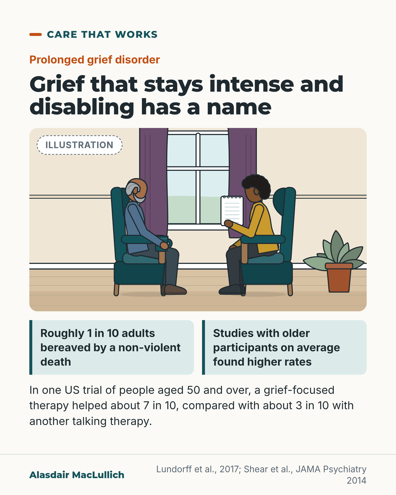

# G188: When grief stays intense

- Category: C19 Palliative care and care near the end of life
- Audience: public
- Series: Care that works
- Post type: public_explanation
- Visual format: drawn illustration
- Status: text text_final, visual final
- Working id: C19-P09 (candidate C19-29)

## Insight

Roughly 1 in 10 bereaved adults develop grief that stays intense and disabling, studies with older participants on average found higher rates, and in one US trial of people aged 50 and over a grief-focused therapy helped about 7 in 10 compared with about 3 in 10 with another talking therapy.

## Angle and position

Name prolonged grief so that long, heavy grief is not dismissed as private or as depression, and say that a specific therapy has been tested in older adults, without promising availability.

Basis: empirical finding (Lundorff 2017 meta-analysis; Shear 2014 trial) plus a practical suggestion to tell a GP and ask what help is available.

## X (820 characters)

```text
Grief that stays intense and disabling has a name: prolonged grief disorder. Combining studies suggests roughly 1 in 10 adults bereaved by a non-violent death develop it. Studies with older participants on average found higher rates. The studies differed from each other, so the figure is approximate.

A grief-focused therapy has been tested in older adults. A US trial included 151 people aged 50 and over with long-lasting intense grief (the trial called it complicated grief). After 20 weeks, about 7 in 10 improved with grief-focused therapy. About 3 in 10 improved with interpersonal psychotherapy, a talking therapy used for depression. The trial compared two treatments, so it does not show how either compares with no treatment.

If your grief is not easing, you can tell your GP and ask what help is available.
```

## LinkedIn (1138 characters)

```text
Grief that stays intense and disabling has a name: prolonged grief disorder.

Combining 14 studies, about 1 in 10 (9.8%) of adults bereaved by a non-violent death had it. Studies with older participants on average found higher rates. The studies differed from each other and used differing definitions of the disorder. The authors advise caution with the figure.

A grief-focused therapy has been tested in older adults. Shear and colleagues randomly assigned 151 people aged 50 and over (average age 66) with long-lasting intense grief, which the trial called complicated grief. After 20 weeks, about 7 in 10 (70.5%) had improved with grief-focused therapy. About 3 in 10 (32.0%) had improved with interpersonal psychotherapy, a talking therapy used for depression. Age made no clear difference to the result. This was one US trial that compared two treatments, so it does not show how either compares with no treatment.

We think anyone whose grief stays intense and disabling should be offered an assessment and grief-specific help, whatever their age.

If your grief is not easing, you can tell your GP and ask what help is available.
```

## Bluesky (297 characters)

```text
About 1 in 10 adults bereaved by a non-violent death develop grief that stays intense and disabling; studies with older participants on average found higher rates. In a US trial of people aged 50+, grief-focused therapy helped about 7 in 10 at 20 weeks, against about 3 in 10 with another therapy.
```

## Threads (471 characters)

```text
Grief that stays intense and disabling has a name: prolonged grief disorder. Roughly 1 in 10 adults bereaved by a non-violent death had it, when studies were combined. Studies with older participants on average found higher rates.

A US trial included 151 people aged 50 and over. After 20 weeks, a grief-focused therapy helped about 7 in 10. Another talking therapy helped about 3 in 10.

If your grief is not easing, you can tell your GP and ask what help is available.
```

## Source reply

Sources: Lundorff et al., J Affect Disord 2017 https://doi.org/10.1016/j.jad.2017.01.030 ; Shear et al., JAMA Psychiatry 2014 https://doi.org/10.1001/jamapsychiatry.2014.1242

## Visual



Alt text: Illustration of a quiet conversation: an older bearded man holding a mug sits in an armchair opposite a woman counsellor with a closed notepad, in a room with a window and plant. Text: prolonged grief disorder affects roughly 1 in 10 bereaved adults; a US trial of people 50 and over found grief-focused therapy helped about 7 in 10 against about 3 in 10.

Editable source: `visuals/src/G188.html`

Design instructions: Single card, kit scene (home living room, two armchairs, window, plant), Illustration badge, two mint fact boxes, trial sentence. Body tightened to drop duplicated first sentence. Sources Lundorff 2017; Shear 2014.

## Sources and verification

- C19-29-a (supported_with_qualification): About 1 in 10 bereaved adults develop prolonged grief disorder after non-violent loss; higher mean age linked with higher prevalence.
  - Source: Lundorff M, Holmgren H, Zachariae R, Farver-Vestergaard I, O'Connor M. Prevalence of prolonged grief disorder in adult bereavement: a systematic review and meta-analysis. J Affect Disord. 2017;212:138-49.
  - Passage: "Meta-analysis revealed a pooled prevalence of PGD of 9.8% (95% CI 6.8-14.0). Moderation analyses showed higher mean age to be associated with higher prevalence of PGD. ... Due to heterogeneity and limited representativeness, the findings should be interpreted cautiously" (Abstract)
- C19-29-b (supported_with_qualification): In adults 50+, complicated grief treatment gave a response rate of 70.5% vs 32.0% with interpersonal psychotherapy.
  - Source: Shear MK, Wang Y, Skritskaya N, Duan N, Mauro C, Ghesquiere A. Treatment of complicated grief in elderly persons: a randomized clinical trial. JAMA Psychiatry. 2014;71(11):1287-95.
  - Passage: "Response rate for CGT (52 individuals [70.5%]) was more than twice that for IPT (24 [32.0%]) (relative risk, 2.20 [95% CI, 1.51-3.22]; P < .001), with the number needed to treat at 2.56. ... Results were not moderated by participant age." (Abstract)

Verification notes: C19-29-a: Lundorff 2017 abstract (14 studies, pooled prevalence 9.8% CI 6.8 to 14.0; higher mean age linked with higher prevalence; heterogeneity and limited representativeness). C19-29-b: Shear 2014 abstract (151 adults 50+, mean age 66; response 70.5% vs 32.0%; not moderated by age; active comparator). Not used: the ICD-11 duration criterion (C19-29-c, not found), any statement about UK availability of grief-specific therapy, any month count. 'Complicated grief' is described only as the trial's term for long-lasting intense grief. 'We think... should be offered an assessment' is judgement. Access: abstracts. Resolved by design (moved from open_issues): UK availability of grief-specific therapy was not verified and the post says only 'ask what help is available'. The description of complicated grief as 'a term for long-lasting intense grief' is a plain-English gloss, not a quoted definition.

## Attention and follow potential

Pause: Older people and families living with long, heavy grief.

Gain: Knowing it has a name, that a specific therapy has been tested in older adults, and who to tell.

Follow: Care that includes the bereaved.

## Open issues

None.
