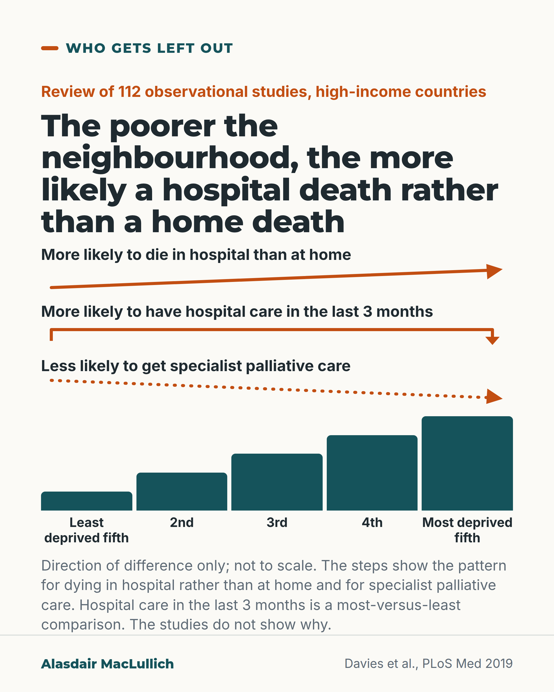

# G189: Poorer neighbourhoods and hospital deaths

- Category: C19 Palliative care and care near the end of life
- Audience: both
- Series: Who gets left out
- Post type: evidence_interpretation
- Visual format: diagram (stepped comparison)
- Status: text text_final, visual final
- Working id: C19-P10 (candidate C19-28)

## Insight

Across high-income countries, people from the most deprived neighbourhoods were more likely than people from the least deprived to die in hospital rather than at home, to have hospital care in their last 3 months, and less likely to receive specialist palliative care.

## Angle and position

Report the gradient in words only, say the studies do not show why, and frame the concern as unequal access to specialist support, not hospital death as worse in itself (consistent with the place-of-care post).

Basis: empirical finding (Davies 2019 meta-analysis, observational, modest effects) plus judgement marked 'we should' (report end-of-life care by deprivation and plan to reach the poorest areas).

## X (912 characters)

```text
In high-income countries, people from the most deprived neighbourhoods were more likely to die in hospital than at home. The comparison was with people from the least deprived neighbourhoods.

They were also more likely to have hospital care in their last 3 months. They were less likely to get specialist palliative care. That is care from a team that focuses on symptom relief and support in serious illness. The more deprived the area, the more likely a death in hospital rather than at home, and the less likely specialist palliative care.

This comes from a review that combined 112 studies that watched what happened without assigning treatments, just over half from North America. The differences were modest. The studies do not show why they occur.

A planned hospital death can be right for a person. The concern is unequal access to specialist support. We should report end-of-life care by deprivation.
```

## LinkedIn (1355 characters)

```text
In high-income countries, people from the most deprived neighbourhoods were more likely to die in hospital than at home. The comparison was with people from the least deprived neighbourhoods.

Davies and colleagues searched for studies of how deprived people's neighbourhoods were and the healthcare they had in the last year of life. They found 209 and combined the results of 112 of them, all of which watched what happened without assigning treatments. Compared with the least deprived, people in the most deprived neighbourhoods were:

1. More likely to die in hospital than at home.
2. More likely to have hospital care in the last 3 months of life.
3. Less likely to receive specialist palliative care, meaning care from a team that focuses on symptom relief and support in serious illness.

The more deprived the area, the more likely a death in hospital rather than at home, and the less likely specialist palliative care. The differences were modest and varied between studies, just over half of which were from North America. Because the studies watched what happened without assigning treatments, they do not show why the gaps exist.

A planned hospital death can be the right place for a person. The concern is the gap in specialist support.

We should report end-of-life care by deprivation, and plan how to reach people in the poorest areas.
```

## Bluesky (289 characters)

```text
A review of studies in high-income countries found people in the poorest neighbourhoods were more likely to die in hospital than at home, and less likely to get specialist palliative care (symptom relief and support). It does not show why. We should report end-of-life care by deprivation.
```

## Threads (485 characters)

```text
A review of 112 studies in high-income countries, none assigning treatments, compared the most and least deprived neighbourhoods. People in the most deprived were more likely to die in hospital than at home. They were more likely to have hospital care in their last 3 months and less likely to get specialist palliative care (a team focused on symptom relief and support).

The differences were modest and the studies do not show why.

We should report end-of-life care by deprivation.
```

## Source reply

Source: Davies et al., PLoS Med 2019 https://doi.org/10.1371/journal.pmed.1002782

## Visual



Alt text: Diagram of five steps rising from least deprived fifth to most deprived fifth, not to scale. Arrows show that the poorer the neighbourhood, the more likely a hospital death rather than a home death, and the less likely specialist palliative care; hospital care in the last 3 months is a most-versus-least comparison. Review of 112 observational studies.

Editable source: `visuals/src/G189.html`

Design instructions: Single card, three arrows (rising, bracket, dotted falling) above five teal steps, labels, not-to-scale note. No numbers. Davies 2019.

## Sources and verification

- C19-28-a (supported_with_qualification): Most vs least deprived neighbourhoods: more likely hospital death vs home, acute hospital care in last 3 months, and not receiving specialist palliative care; gradient across quintiles.
  - Source: Davies JM, Sleeman KE, Leniz J, Wilson R, Higginson IJ, Verne J, et al. Socioeconomic position and use of healthcare in the last year of life: a systematic review and meta-analysis. PLoS Med. 2019;16(4):e1002782.
  - Passage: "Compared to people living in the least deprived neighbourhoods, people living in the most deprived neighbourhoods were more likely to die in hospital versus home (OR 1.30, 95% CI 1.23-1.38, p < 0.001), to receive acute hospital-based care in the last 3 months of life (OR 1.16, 95% CI 1.08-1.25, p < 0.001), and to not receive specialist palliative care (OR 1.13, 95% CI 1.07-1.19, p < 0.001). For every quintile increase in area deprivation, hospital versus home death was more likely (OR 1.07, 95% CI 1.05-1.08, p < 0.001)" (Abstract, Results)

Verification notes: C19-28-a: Davies 2019 abstract (209 studies, 112 synthesised; most vs least deprived: OR 1.30 hospital vs home death, 1.16 acute hospital care in last 3 months, 1.13 no specialist palliative care; gradient per quintile). Odds ratios deliberately not printed or converted; described in words. Qualifications carried: observational, modest, causes not established, just over half North American (53.5%), heterogeneous. 'We should' is judgement. Access: abstract.

## Attention and follow potential

Pause: Clinicians and planners working in deprived areas.

Gain: Evidence to support services that reach people in the poorest areas.

Follow: Attention to people who are poorly served.

## Open issues

None.
