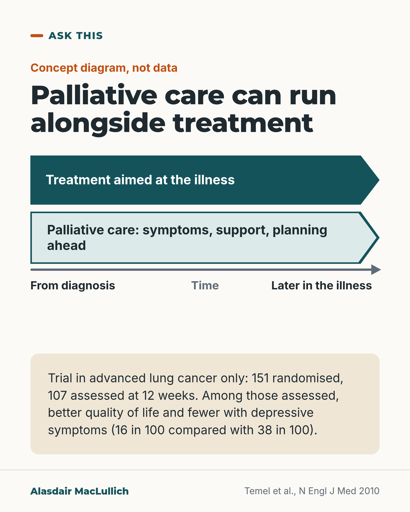

# G190: Palliative care alongside treatment

- Category: C19 Palliative care and care near the end of life
- Audience: public
- Series: Ask this
- Post type: public_explanation
- Visual format: diagram (timeline, concept)
- Status: text text_final, visual final
- Working id: C19-P11 (candidate C19-36)

## Insight

Palliative care can run alongside treatment for the illness itself; in one trial in advanced lung cancer, palliative care from the start improved quality of life and fewer people had depressive symptoms, and some people first think it means death and hopelessness.

## Angle and position

Revised angle: anchor 'alongside treatment' in the trial design, not the WHO definition; cancer-only evidence; no 'younger people' claim; survival does not lead. Use the interview study only to show that some people first associate the term with death and hopelessness.

Basis: empirical findings (Temel 2010 RCT; Zimmermann 2016 interviews) plus a practical suggestion to ask whether palliative care would be given alongside current treatment.

## X (1011 characters)

```text
Palliative care can be given alongside treatment for the illness itself, as it was in a US lung cancer trial. It is care that focuses on symptoms, support and planning ahead.

A US trial randomly assigned 151 people with newly diagnosed advanced lung cancer to palliative care alongside cancer treatment, or cancer treatment alone. 107 people completed the 12-week assessments. Their quality of life was better with palliative care. Fewer had depressive symptoms: 16 in 100, compared with 38 in 100. This was one small trial, in lung cancer. It does not show the same benefit in other illnesses.

In Canadian interviews with 48 people with advanced cancer and 23 carers, many first thought palliative care meant death and hopelessness. Those who received early palliative care described 'ongoing care' that improved their 'quality of living'. They still felt the term carried a stigma (a sense of shame or disapproval).

If it is suggested to you, ask whether it would be given alongside your current treatment.
```

## LinkedIn (1494 characters)

```text
Palliative care can be given alongside treatment for the illness itself, as it was in a US lung cancer trial. It is care that focuses on symptoms, support and planning ahead.

Temel and colleagues randomly assigned 151 people with newly diagnosed advanced lung cancer that had spread. One group had early palliative care integrated with standard cancer care. The other had standard cancer care alone. 107 people completed the 12-week assessments, and 27 had died by then. The early palliative care group had a better quality of life. Fewer had depressive symptoms (16 in 100 compared with 38 in 100). Limits: this was one small US trial, in one cancer. It does not show the same benefit for other illnesses or for older people with other conditions.

A Canadian interview study involved 48 people with advanced cancer and 23 carers. Their first impressions of palliative care were of death and hopelessness. That led to fear and avoidance, and these impressions often came from conversations with health professionals. Participants who received early palliative care described it as 'ongoing care' that improved their 'quality of living'. They still felt the term carried a stigma (a sense of shame or disapproval). This is a small study based on interviews. It shows what these people said, not how common the view is.

If palliative care is suggested to you or to someone you care for, you can ask whether it would be given alongside the current treatment. You can also ask what it would add.
```

## Bluesky (290 characters)

```text
Palliative care (symptom relief, support, planning) can be given alongside illness treatment. In a trial of 151 people with advanced lung cancer, those given it early had better quality of life at 12 weeks and fewer had depressive symptoms (16 vs 38 in 100, 107 assessed). Lung cancer only.
```

## Threads (479 characters)

```text
Palliative care (care focused on symptoms, support and planning ahead) can be given alongside treatment for the illness itself.

A US trial randomly assigned 151 people with advanced lung cancer. Those given palliative care early had better quality of life at 12 weeks. Among the 107 assessed, fewer had depressive symptoms (16 in 100 vs 38 in 100). It was one small trial, in lung cancer only.

If it is suggested, ask whether it would be given alongside your current treatment.
```

## Source reply

Sources: Temel et al., N Engl J Med 2010 https://doi.org/10.1056/NEJMoa1000678 ; Zimmermann et al., CMAJ 2016 https://doi.org/10.1503/cmaj.151171

## Visual



Alt text: Concept diagram: two parallel arrows of equal length, treatment aimed at the illness and palliative care (symptoms, support, planning ahead), both running from diagnosis to later in the illness along a time axis. Box: in a lung cancer trial, among 107 assessed, depressive symptoms 16 in 100 versus 38 in 100.

Editable source: `visuals/src/G190.html`

Design instructions: Single card, teal band and mint outlined band as arrows, time axis with labels, sand result panel. Claim C19-36-a.

## Sources and verification

- C19-36-a (supported_with_qualification): Early palliative care alongside cancer treatment improved quality of life and mood.
  - Source: Temel JS, Greer JA, Muzikansky A, Gallagher ER, Admane S, Jackson VA, et al. Early palliative care for patients with metastatic non-small-cell lung cancer. N Engl J Med. 2010;363(8):733-42.
  - Passage: "We randomly assigned patients with newly diagnosed metastatic non-small-cell lung cancer to receive either early palliative care integrated with standard oncologic care or standard oncologic care alone. ... Patients assigned to early palliative care had a better quality of life ... (98.0 vs. 91.5; P=0.03). In addition, fewer patients in the palliative care group than in the standard care group had depressive symptoms (16% vs. 38%, P=0.01)." (Abstract)
- C19-36-c (supported_with_qualification): In interviews, people with advanced cancer and their caregivers initially associated palliative care with death and hopelessness.
  - Source: Zimmermann C, Swami N, Krzyzanowska M, Leighl N, Rydall A, Rodin G, Tannock I, Hannon B. Perceptions of palliative care among patients with advanced cancer and their caregivers. CMAJ. 2016;188(10):E217-27.
  - Passage: "Participants' initial perceptions of palliative care in both trial arms were of death, hopelessness, dependency and end-of-life comfort care for inpatients. These perceptions provoked fear and avoidance, and often originated from interactions with health care professionals. During the trial, those in the intervention arm developed a broader concept of palliative care as "ongoing care" that improved their "quality of living" but still felt that the term itself carried a stigma." (Abstract, Results)

Verification notes: C19-36-a: Temel 2010 abstract (151 randomised; early palliative care integrated with standard oncology care vs standard care alone; better quality of life; depressive symptoms 16% vs 38%). Survival not mentioned; aggressive end-of-life care figures not used; age not described. C19-36-c: Zimmermann 2016 abstract (48 patients and 23 caregivers; initial perceptions of death, hopelessness; fear and avoidance; often from interactions with health professionals; 'ongoing care', 'quality of living'; stigma persisted); no 'most' or percentage. WHO definition (C19-36-b) not found and not used. Access: abstracts. Resolved by design (moved from open_issues): The one-line description of palliative care ('care that focuses on symptoms, support and planning ahead') is a plain-English definition, not a claim taken from a quoted source; the WHO wording could not be opened.

## Attention and follow potential

Pause: Older people and families who have turned down a palliative care referral out of fear.

Gain: An accurate picture of what palliative care can be, and a question to ask.

Follow: Plain explanations that correct common misunderstandings, each with its limits.

## Open issues

None.
