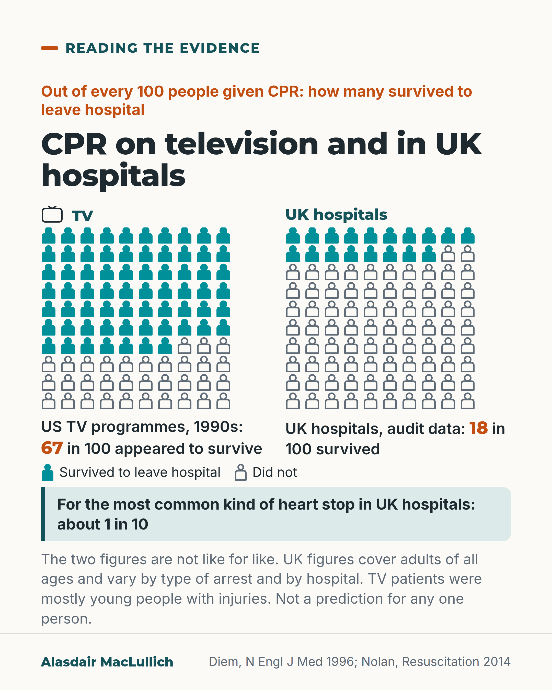

# G191: CPR on television and in hospital

- Category: C19 Palliative care and care near the end of life
- Audience: public
- Series: Reading the evidence
- Post type: evidence_interpretation
- Visual format: comparison (10 by 10 icon arrays)
- Status: text text_final, visual final
- Working id: C19-P12 (candidate C19-26)

## Insight

In 1990s US television programmes about 2 in 3 people given CPR appeared to survive to leave hospital, while in UK hospital audit data fewer than 1 in 5 adults given CPR by the hospital team did, and about 1 in 10 for the most common kind of arrest.

## Angle and position

Set television survival and real survival to hospital discharge side by side (matching the outcome), say the figures cover adults of all ages and vary by type of arrest and hospital, and invite people to ask for the figures that fit their own situation without steering older people as a group.

Basis: empirical findings (Diem 1996; Nolan 2014 audit), plus a practical suggestion to ask a doctor what CPR is likely to achieve for the person; the post takes no position for or against CPR.

## X (835 characters)

```text
On three US television programmes from 1994 to 1995, about 2 in 3 people given CPR appeared to survive to leave hospital. The programmes were ER, Chicago Hope and Rescue 911. CPR (cardiopulmonary resuscitation) means pressing on the chest, sometimes with shocks and breaths, to try to restart a heart that has stopped.

UK audit data covered 22,628 adults in 144 hospitals. Fewer than 1 in 5 adults given CPR by the hospital team survived to leave hospital (18.4%). For the most common kind of heart stop (a rhythm that is not treated with a shock), about 1 in 10 did. The figures cover adults of all ages and varied between hospitals. The TV patients were mostly young people with injuries.

This post takes no side on whether to have CPR. You can ask your doctor what CPR is likely to achieve for you, or for the person you care for.
```

## LinkedIn (1594 characters)

```text
On three US television programmes in 1994 to 1995, about 2 in 3 people given CPR appeared to survive to leave hospital.

CPR (cardiopulmonary resuscitation) means pressing on the chest, sometimes with shocks and breaths, to try to restart a heart that has stopped.

Diem and colleagues watched 97 episodes of three US programmes in 1994 and 1995. CPR was shown 60 times, and 67% of the people given it appeared to survive to leave hospital. The patients shown were mostly young people with injuries. A later study of two US dramas in 2010 and 2011 found about 7 in 10 survived the CPR itself. That is an earlier point than leaving hospital, so it is not directly comparable.

In the UK National Cardiac Arrest Audit, 22,628 adults in 144 hospitals were given CPR by the hospital team. Fewer than 1 in 5 (18.4%) survived to leave hospital. About 7 in 10 arrests were the most common kind of heart stop (a rhythm that is not treated with a shock). About 1 in 10 of those people survived to leave hospital. About 1 in 6 arrests were the less common kind that can be treated with a shock, and about 5 in 10 of those people survived to leave hospital. Survival varied substantially between hospitals. The figures have not been adjusted for differences between patients and cover adults of all ages. The data are now more than a decade old.

These are averages across many people and give no prediction for any one person. This post takes no side on whether to have CPR. You can ask your doctor what CPR is likely to achieve for you, or for the person you care for, rather than relying on television.
```

## Bluesky (296 characters)

```text
On three 1990s US TV programmes, about 2 in 3 people given CPR (chest pressing to restart the heart) appeared to survive to leave hospital. In a UK hospital audit, fewer than 1 in 5 adults did; for the commonest kind of heart stop, about 1 in 10. Ask your doctor what CPR is likely to do for you.
```

## Threads (419 characters)

```text
On three 1990s US TV programmes, about 2 in 3 people given CPR (chest pressing to restart a stopped heart) appeared to survive to leave hospital. In a UK national audit of hospitals covering 22,628 adults, fewer than 1 in 5 did. For the most common kind of heart stop, about 1 in 10 did.

The UK figures cover adults of all ages. You can ask your doctor what CPR is likely to achieve for you or the person you care for.
```

## Source reply

Sources: Diem et al., N Engl J Med 1996 https://doi.org/10.1056/NEJM199606133342406 ; Nolan et al., Resuscitation 2014 https://doi.org/10.1016/j.resuscitation.2014.04.002 ; Portanova et al., Resuscitation 2015 https://doi.org/10.1016/j.resuscitation.2015.08.002

## Visual



Alt text: Two 10 by 10 person grids: on US television in the 1990s, 67 in 100 given CPR appeared to survive to leave hospital; in UK hospital audit data, 18 in 100 did. About 1 in 10 for the most common kind of heart stop. The figures are not like for like and not a prediction for any one person.

Editable source: `visuals/src/G191.html`

Design instructions: Single card, two person-icon grids (solid vs outline), small TV outline icon, key, mint fact, caveat. Claims C19-26-a, C19-26-b.

## Sources and verification

- C19-26-a (supported): On TV dramas most people given CPR survive.
  - Source: Diem SJ, Lantos JD, Tulsky JA. Cardiopulmonary resuscitation on television. Miracles and misinformation. N Engl J Med. 1996;334(24):1578-82.; Portanova J, Irvine K, Yi JY, Enguidanos S. It isn't like this on TV: revisiting CPR survival rates depicted on popular TV shows. Resuscitation. 2015;96:148-50.
  - Passage: "Diem: There were 60 occurrences of CPR in the 97 television episodes... Seventy-five percent of the patients survived the immediate arrest, and 67 percent appeared to have survived to hospital discharge. Portanova: CPR was depicted 46 times in the 91 episodes, with a survival rate of 69.6%. Among those immediately surviving following CPR, the majority (71.9%) survived to hospital discharge" (Abstracts, Results)
- C19-26-b (supported): UK in-hospital arrest survival to discharge 18.4%; 10.5% for non-shockable rhythms (72.3% of arrests).
  - Source: Nolan JP, Soar J, Smith GB, Gwinnutt C, Parrott F, Power S, et al. Incidence and outcome of in-hospital cardiac arrest in the United Kingdom National Cardiac Arrest Audit. Resuscitation. 2014;85(8):987-92.
  - Passage: "Overall unadjusted survival to hospital discharge was 18.4%. The presenting rhythm was shockable (ventricular fibrillation or pulseless ventricular tachycardia) in 16.9% and non-shockable (asystole or pulseless electrical activity) in 72.3%; rates of survival to hospital discharge associated with these rhythms were 49.0% and 10.5%, respectively, but varied substantially across hospitals." (Abstract, Results)

Verification notes: C19-26-a: Diem 1996 abstract (97 episodes; 60 CPR occurrences; 67% appeared to survive to discharge; patients mostly young trauma per quality note); Portanova 2015 abstract used only as a LinkedIn aside with its different outcome (immediate survival 69.6%) stated. C19-26-b: Nolan 2014 abstract (22,628 adults, 144 hospitals; 18.4% survival to discharge; non-shockable 72.3% of arrests with 10.5% survival; shockable 16.9% with 49.0%; varied across hospitals; unadjusted; over a decade old). Frailty and rib-fracture claims not used. Access: abstracts.

## Attention and follow potential

Pause: Anyone whose picture of CPR comes from television.

Gain: Realistic figures to bring to a CPR conversation, and a question to ask.

Follow: Evidence that corrects common expectations without taking sides on the decision.

## Open issues

None.
