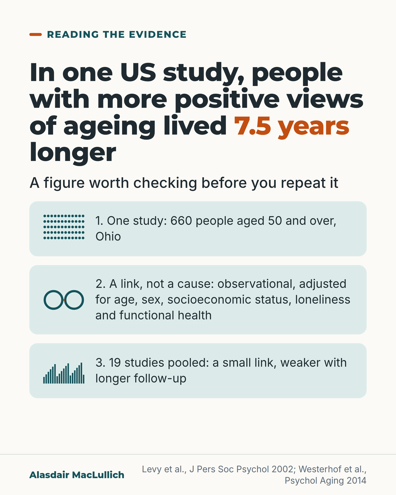

# G192: Checking the 7.5 years

- Category: C20 Ageism, research exclusion, uncertainty and measurement
- Audience: both
- Series: Reading the evidence
- Post type: evidence_interpretation
- Visual format: statement card
- Status: text text_final, visual final
- Working id: C20-P01 (candidate C20-22)

## Insight

The figure that people with positive views of their own ageing lived 7.5 years longer comes from one US study of 660 people and shows a link, not a cause; pooled studies find a small link.

## Angle and position

Quote the 7.5 years with its limits. The case against ageist treatment rests on equal dignity, so it needs no survival figure.

Basis: mixed: empirical finding (Levy 2002 cohort, adjusted, observational; Westerhof 2014 meta-analysis, small link) and clinical interpretation (reverse causation not ruled out); the closing sentence is ethical judgement, marked as such.

## X (908 characters)

```text
People with more positive views of their own ageing lived 7.5 years longer, on average. That figure comes from one US study of 660 people aged 50 and over, whose views were measured once, up to 23 years before the follow-up ended.

The 7.5 years remained after adjusting for age, sex, socioeconomic status (money and background), loneliness and how well people could manage daily tasks. This is a link, which does not show cause. People who were already in poorer health, in ways the study did not measure, may have viewed ageing more negatively. A study of this kind has no way to rule that out.

When the results of 19 studies that followed people for years were combined, the link with later health and survival was small, and weaker where follow-up was longer. That analysis did not express the link as years of life.

We should oppose ageist treatment because it is unfair, whatever the survival figure.
```

## LinkedIn (1364 characters)

```text
People with more positive views of their own ageing lived 7.5 years longer, on average. The figure comes from one US study. Quote it with its limits.

The study followed 660 people aged 50 and over in Ohio. Their views of ageing were measured once, up to 23 years before the follow-up ended. The 7.5 years remained after adjusting for age, sex, socioeconomic status (money and background), loneliness and how well people could manage daily tasks.

Three things to know before you repeat it:

1. It is one group of 660 people in one US state.
2. This is a link, which does not show cause. People who were already in poorer health, in ways the study did not measure, may have viewed ageing more negatively. A study of this kind has no way to rule that out.
3. When the results of 19 studies that followed people for years were combined, views of ageing had a small link with later health and survival. The link was weaker where follow-up was longer. That analysis did not express the link as years of life.

This is a judgement, not a finding: we should oppose ageist treatment because it is unfair, whatever the survival figure. The argument against ageism needs no survival statistic to support it, and it is stronger when the statistics used for it are quoted accurately.

If you use the 7.5 years in a talk or a report, say where it comes from and what it shows.
```

## Bluesky (286 characters)

```text
People with more positive views of their own ageing lived 7.5 years longer in one US study of 660 people. That is a link, which does not show cause. When 19 studies were combined, the link was small.

We should oppose ageist treatment because it is unfair, whatever the survival figure.
```

## Threads (454 characters)

```text
People with more positive views of their own ageing lived 7.5 years longer, on average, in one US study of 660 people aged 50 and over.

That is a link, which does not show cause. People in poorer health may already have viewed ageing more negatively. When 19 studies were combined, the link with later health and survival was small.

Quote the figure with its limits. We should oppose ageist treatment because it is unfair, whatever the survival figure.
```

## Source reply

Sources: https://doi.org/10.1037//0022-3514.83.2.261 https://doi.org/10.1037/a0038016

## Visual



Alt text: Statement card: in one US study of 660 people aged 50 and over in Ohio, people with more positive views of ageing lived 7.5 years longer. Three notes: one study; a link, not a cause; 19 studies pooled show a small link, weaker with longer follow-up.

Editable source: `visuals/src/G192.html`

Design instructions: Statement card, light ground. Headline h1.m with '7.5 years' in orange, lead line, three mint note panels each with a small decorative SVG (60 dots, two linked rings, 19 bars; none a data plot). Claims: none charted. Sources Levy 2002, Westerhof 2014.

## Sources and verification

- C20-22-a (supported_with_qualification): People with more positive self-perceptions of ageing lived 7.5 years longer in one cohort of 660.
  - Source: Levy BR, Slade MD, Kunkel SR, Kasl SV. Longevity increased by positive self-perceptions of aging. J Pers Soc Psychol. 2002;83(2):261-70.
  - Passage: "This research found that older individuals with more positive self-perceptions of aging, measured up to 23 years earlier, lived 7.5 years longer than those with less positive self-perceptions of aging. This advantage remained after age, gender, socioeconomic status, loneliness, and functional health were included as covariates. ... The sample consisted of 660 individuals aged 50 and older who participated in a community-based survey, the Ohio Longitudinal Study of Aging and Retirement (OLSAR)." (Abstract)
- C20-22-b (supported_with_qualification): Meta-analysis of 19 longitudinal studies found a small significant effect, stronger with shorter follow-up and younger samples.
  - Source: Westerhof GJ, Miche M, Brothers AF, Barrett AE, Diehl M, Montepare JM, et al. The influence of subjective aging on health and longevity: a meta-analysis of longitudinal data. Psychol Aging. 2014;29(4):793-802.
  - Passage: "A systematic search ... resulted in 19 longitudinal studies ... The analyses revealed heterogeneity, with stronger effects for studies with a shorter period of follow-up, for studies of health versus survival, for studies with younger participants ... Subjective aging has a small significant effect on health, health behaviors, and survival." (Abstract)
- C20-22-c (supported_with_qualification): Association may reflect reverse causation and confounding; the case against ageism is ethical.
  - Source: 
  - Passage: "(methods interpretation; no source needed as general point; ethical position marked as judgement)" (n/a)

Verification notes: 7.5 years, 660 people, up to 23 years, adjustment list: Levy 2002 abstract (C20-22-a); adjusted, single cohort, 'because of' avoided. 19 studies, small link, weaker with longer follow-up: Westerhof 2014 abstract (C20-22-b), 'small' kept. Reverse causation wording follows C20-22-c safe wording, recast without a banned word; the ethical sentence is marked as judgement. Access level: abstracts for both papers. The post does not say how widely the figure is shared.

## Attention and follow potential

Pause: A figure many readers recognise, followed at once by where it comes from and what it can and cannot show.

Gain: A way to quote a well-known number accurately, and the reminder that the case against ageism does not depend on it.

Follow: The account is sceptical of overclaiming even when the claim supports a cause it holds.

## Open issues

- Checker flags US spelling "Aging" only inside the journal title Psychol Aging in the source line: a proper noun, justified.
