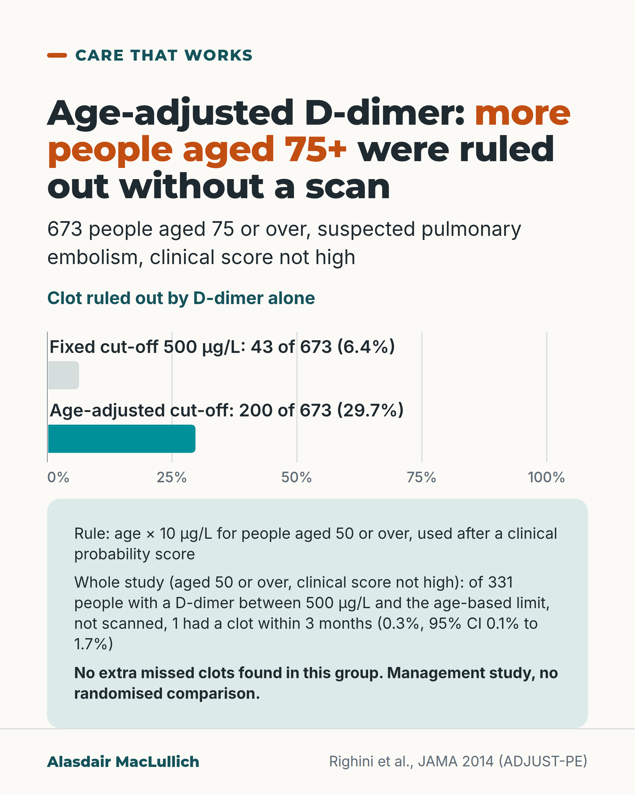

# G193: A D-dimer cut-off adjusted for age

- Category: C20 Ageism, research exclusion, uncertainty and measurement
- Audience: practitioners
- Series: Care that works
- Post type: good_care
- Visual format: chart
- Status: text text_final, visual final
- Working id: C20-P02 (candidate C20-19)

## Insight

In ADJUST-PE, an age-adjusted D-dimer cut-off let a clot be ruled out without a scan in about 30 in 100 people aged 75 or over with a not-high clinical score, against about 6 in 100 with the fixed cut-off, with no extra missed clots found in that group.

## Angle and position

A test threshold adjusted for older people using evidence: the positive case of measurement fitted to the population it is used on, stated with its conditions.

Basis: empirical finding (ADJUST-PE, prospective management study); the closing suggestion to check local pathways is practical advice, not a finding. No statement about NICE or UK guidance is made.

## X (897 characters)

```text
In ADJUST-PE, 673 people aged 75 or over had suspected pulmonary embolism and a clinical score that was not high. A fixed D-dimer cut-off of 500 µg/L ruled out a clot without a scan in about 6 in 100 of the 673. A cut-off of age × 10 µg/L did so in about 30 in 100 of the 673, with no extra missed clots found among those 673 people.

ADJUST-PE was a European study of 3346 emergency outpatients. The age-adjusted cut-off applied from age 50, and only after a clinical probability score (simplified revised Geneva or two-level Wells).

People with a D-dimer between 500 µg/L and their age-based limit were followed for 3 months without a scan or treatment. In the whole study (age 50 or over), 1 of 331 people in that group had a clot within 3 months (0.3%). The true rate could be as high as 1.7%.

It was a management study with no randomised comparison. Check your laboratory's assay and units.
```

## LinkedIn (1490 characters)

```text
Among 673 people aged 75 or over, with suspected pulmonary embolism and a clinical score that was not high, a fixed D-dimer cut-off of 500 µg/L ruled out a clot without a scan in about 6 in 100. An age-adjusted cut-off did so in about 30 in 100. The study found no extra missed clots among those 673 people.

This comes from ADJUST-PE, a prospective study of 3346 emergency outpatients with suspected pulmonary embolism. It ran in 19 centres in Belgium, France, the Netherlands and Switzerland between 2010 and 2013. The age-adjusted cut-off was age × 10 µg/L for people aged 50 or over. It was used only after a clinical probability score (the simplified revised Geneva score or a two-level Wells score).

People with a D-dimer between 500 µg/L and their age-based limit were not scanned or treated, and were followed for 3 months. In the whole study (age 50 or over), 1 of 331 people in that group had a clot within 3 months (0.3%, 95% confidence interval 0.1% to 1.7%). The true rate could be as high as 1.7%, so this is not zero risk.

There are limits. It was a management study with no randomised comparison. The 75 and over result is a subgroup. In that group 200 of the 673 were ruled out without a scan with the age-adjusted cut-off, against 43 of the 673 with the fixed one, so a small risk of a missed clot is not excluded. Assays and units differ between laboratories.

If you work in acute or emergency care, check whether your pathway and laboratory use it, and in what units.
```

## Bluesky (296 characters)

```text
In ADJUST-PE (non-randomised), 673 people aged 75 or over had suspected pulmonary embolism and a not-high clinical score. D-dimer alone ruled out a clot in about 6 in 100 with a fixed cut-off and about 30 in 100 with age × 10 µg/L. No extra missed clots among the 673. Use after a clinical score.
```

## Threads (452 characters)

```text
In ADJUST-PE, 673 people aged 75 or over had suspected pulmonary embolism and a clinical score that was not high. A D-dimer blood test alone, without a scan, ruled out a clot in about 6 in 100 with a fixed cut-off of 500 µg/L. With a cut-off of age × 10 µg/L it was about 30 in 100. No extra missed clots were found among those 673 people. This was a non-randomised study.

Use it only after a clinical probability score. Check your laboratory's units.
```

## Source reply

Source: https://doi.org/10.1001/jama.2014.2135

## Visual



Alt text: Bar chart of 673 people aged 75 or over with suspected pulmonary embolism and a clinical score not high. D-dimer alone ruled out a clot in 43 (6.4%) with the fixed 500 cut-off and 200 (29.7%) with the age-adjusted cut-off. Of 331 untreated people in the wider study, 1 had a clot within 3 months.

Editable source: `visuals/src/G193.html`

Design instructions: Chart card, light. barChart max 100 with ticks 0 to 100, two bars: fixed cut-off 6.4 (pale), age-adjusted 29.7 (teal), labels above bars carry counts. Mint panel with rule, follow-up and caveat. Claims C20-19-a, C20-19-b.

## Sources and verification

- C20-19-a (supported): ADJUST-PE: in people 50 or over with a non-high/unlikely clinical probability, a D-dimer cut-off of age x 10 ug/L was used; of 331 people with a D-dimer between 500 ug/L and their age-adjusted cut-off who were left untreated, 1 had a clot event within 3 months.
  - Source: Righini M, Van Es J, Den Exter PL, Roy PM, Verschuren F, Ghuysen A, et al. Age-adjusted D-dimer cutoff levels to rule out pulmonary embolism: the ADJUST-PE study. JAMA. 2014;311(11):1117-24.
  - Passage: "To prospectively validate whether an age-adjusted D-dimer cutoff, defined as age × 10 in patients 50 years or older, is associated with an increased diagnostic yield of D-dimer in elderly patients with suspected PE. ... Patients with a D-dimer value between the conventional cutoff of 500 µg/L and their age-adjusted cutoff did not undergo CTPA and were left untreated and formally followed-up for a 3-month period. ... The 3-month failure rate in patients with a D-dimer level higher than 500 µg/L but below the age-adjusted cutoff was 1 of 331 patients (0.3% [95% CI, 0.1%-1.7%])." (Abstract (Objective, Design, Results))
- C20-19-b (supported_with_qualification): Among 673 people aged 75 or over with a non-high clinical probability, the share in whom PE could be excluded by D-dimer alone rose from 6.4% (43/673) with the 500 ug/L cut-off to 29.7% (200/673) with the age-adjusted cut-off, without any additional false-negative findings.
  - Source: Righini M, Van Es J, Den Exter PL, Roy PM, Verschuren F, Ghuysen A, et al. Age-adjusted D-dimer cutoff levels to rule out pulmonary embolism: the ADJUST-PE study. JAMA. 2014;311(11):1117-24.
  - Passage: "Among the 766 patients 75 years or older, of whom 673 had a nonhigh clinical probability, using the age-adjusted cutoff instead of the 500 µg/L cutoff increased the proportion of patients in whom PE could be excluded on the basis of D-dimer from 43 of 673 patients (6.4% [95% CI, 4.8%-8.5%) to 200 of 673 patients (29.7% [95% CI, 26.4%-33.3%), without any additional false-negative findings." (Abstract, Results)

Verification notes: All figures from the ADJUST-PE abstract (Righini 2014, JAMA; abstract read, full text not open access). 43/673 (6.4%) to 200/673 (29.7%) is C20-19-b; the 23 percentage point rise is the calculated difference given in the claim. 1 of 331 (0.3%, 95% CI 0.1% to 1.7%) is C20-19-a. Conditions carried: age 50 or over, after a clinical probability score; management study without randomised comparator; subgroup; units. C20-19-c (NICE NG158) was only a search extract and is deliberately not used. 'D-dimer rises with age' is not stated because no claim supports it.

## Attention and follow potential

Pause: Emergency and acute clinicians see the scan queue every day; the rise from about 6 to about 30 in 100 is easy to read at a glance.

Gain: A validated rule, its conditions and its units, and the reminder to hold the 1.7% upper limit in mind.

Follow: Care that works posts show where evidence has made care fairer for older people.

## Open issues

None.
