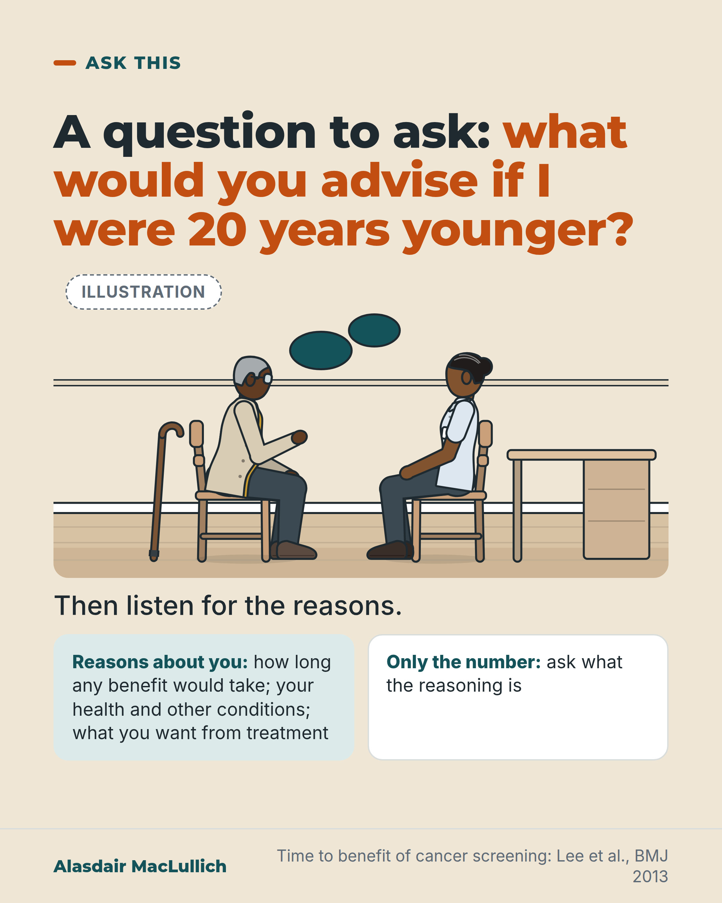

# G194: What would you advise if I were 20 years younger?

- Category: C20 Ageism, research exclusion, uncertainty and measurement
- Audience: public
- Series: Ask this
- Post type: decision_support
- Visual format: drawn illustration
- Status: text text_final, visual final
- Working id: C20-P03 (candidate C20-17)

## Insight

Asking a doctor what they would advise if you were 20 years younger, and why, brings the reasons into the open. Different advice can be fair when a benefit takes years to arrive and the person may not live long enough to receive it, as in cancer screening.

## Angle and position

A polite question that shows whether advice rests on reasons about your health or on the number alone. Revised angle: no legal claim and no ageism-prevalence statistic; one legitimate age-linked reason (time to benefit of screening).

Basis: mixed: empirical finding (Lee 2013: about 10 years to prevent 1 cancer death per 1000 people screened) and ethical judgement (that doctors should give reasons and people should hear them), marked as judgement.

## X (873 characters)

```text
If a doctor does not offer you a treatment, you can ask: what would you advise if I were 20 years younger, and why?

Different advice can be fair when a benefit takes years to arrive and the person may not live long enough to receive it. Take cancer screening, which means tests in people with no symptoms. When the results of trials of breast and bowel cancer screening were combined, about 10 years passed, on average, before 1 cancer death was prevented for every 1000 people screened. The researchers suggest screening is most appropriate for people expected to live more than 10 years. That is a reason about expected benefit, based on how long a person is expected to live.

This example applies to screening only.

We should expect doctors to give reasons about your health and what you want from treatment. If the only reason is your age, ask what the reasoning is.
```

## LinkedIn (1232 characters)

```text
If a doctor does not offer you a treatment, you can ask: what would you advise if I were 20 years younger, and why?

The question asks for the reasoning without accusing anyone. Sometimes the advice should differ. A benefit can take years to arrive, and a person may not live long enough to receive it.

One example comes from cancer screening, which means tests in people with no symptoms. An analysis that combined the results of trials of breast and bowel cancer screening found a delay before benefit. On average, screening prevented 1 cancer death for every 1000 people screened only after about 10 years. The researchers suggest screening is most appropriate for people expected to live more than 10 years. Their criterion is how long a person is expected to live, which is a reason about expected benefit. This example applies to screening. Other treatments have their own time scales.

Other reasons should be about your own health and what you want from treatment. We should expect doctors to give those reasons, and you can ask to hear them. If the only reason given is your age, you can ask what the reasoning is behind it.

Next time a treatment is declined or not mentioned, try the question and listen for the reasons.
```

## Bluesky (296 characters)

```text
If a treatment is not offered, ask: what would you advise if I were 20 years younger, and why?

Different advice can be fair when a benefit takes years to arrive. In cancer screening, it took about 10 years to prevent 1 death per 1000 people screened. Expect reasons about your health and wishes.
```

## Threads (495 characters)

```text
If a treatment is not offered, ask: what would you advise if I were 20 years younger, and why?

Different advice can be fair when a benefit takes years to arrive and the person may not live long enough to receive it. In trials of breast and bowel cancer screening (tests when you have no symptoms), it took about 10 years to prevent 1 cancer death per 1000 people screened.

We should expect reasons about your health and what you want. If the only reason is your age, ask what the reasoning is.
```

## Source reply

Source: https://doi.org/10.1136/bmj.e8441

## Visual



Alt text: Illustration of a consultation: an older man with grey hair and glasses, a walking stick beside him, sits facing a woman doctor, with two blank speech bubbles above. Text asks what you would advise if I were 20 years younger, then lists reasons about you versus only a number.

Editable source: `visuals/src/G194.html`

Design instructions: Sand ground. Headline, Illustration badge, Kit scene 920x470: older Black man (cropped grey hair, glasses, mustard cardigan, stick) and South Asian woman doctor on chairs facing each other, desk at right, two blank teal speech bubbles. Lead line and two panels (mint and white). Source Lee 2013.

## Sources and verification

- C20-17-a (supported): Time to benefit of screening can exceed remaining life, a legitimate reason for different advice.
  - Source: Lee SJ, Boscardin WJ, Stijacic-Cenzer I, Conell-Price J, O'Brien S, Walter LC. Time lag to benefit after screening for breast and colorectal cancer: meta-analysis of survival data from the United States, Sweden, United Kingdom, and Denmark. BMJ. 2013;346:e8441.
  - Passage: "On average across included studies, it took 10.7 years (4.4 to 21.6) before one death from breast cancer was prevented for 1000 women screened. ... it took 10.3 years (6.0 to 16.4) before one death from colorectal cancer was prevented for 1000 patients screened. Our results suggest that screening for breast and colorectal cancer is most appropriate for patients with a life expectancy greater than 10 years." (Abstract)

Verification notes: About 10 years to prevent 1 death per 1000 screened, and the suggestion that screening suits people expected to live more than 10 years: Lee 2013 (C20-17-a, abstract; breast 10.7 years, bowel 10.3 years, rounded to about 10). Qualification carried: screening-specific, life expectancy is the criterion. C20-17-b (ageism and health) and C20-17-c (Equality Act) are deliberately not used. The 'entitled to hear' and 'should expect' sentences are marked as judgement.

## Attention and follow potential

Pause: Older readers who have wondered whether age alone shaped a recommendation recognise the situation, and get words to use.

Gain: One polite question that brings the reasons into the open, and a fair example of when age does change advice.

Follow: The account gives older people and families words to use in real appointments.

## Open issues

None.
