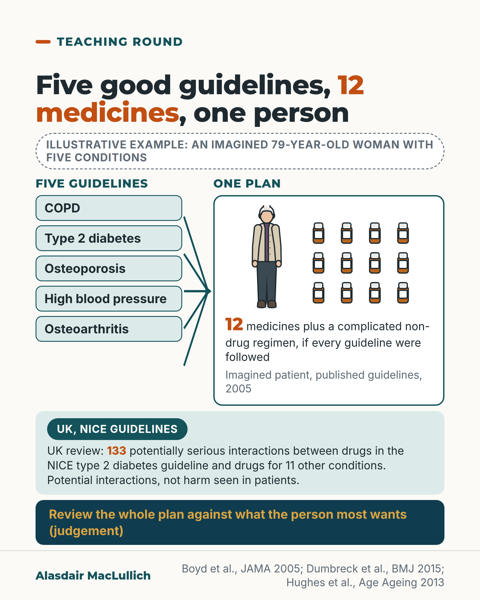

# G195: Several good guidelines, one person

- Category: C20 Ageism, research exclusion, uncertainty and measurement
- Audience: practitioners
- Series: Teaching round
- Post type: teaching
- Visual format: diagram
- Status: text text_final, visual final
- Working id: C20-P04 (candidate C20-02)

## Insight

Single-condition guidelines are not built to weigh their combined effect. Added up for one imagined older woman with five conditions they gave 12 medicines, so the whole plan needs its own review against what the person most wants.

## Angle and position

Each guideline is reasonable alone. Put a US analysis (hypothetical patient) beside UK findings so UK readers cannot set it aside, and close on one step: review the whole plan.

Basis: mixed: empirical findings (Boyd 2005 hypothetical-patient analysis; Dumbreck 2015 potential interactions; Hughes 2013 document review) and clinical judgement (review the whole plan against the person's priorities), marked as judgement. The claim that no trial tested the combination is not made.

## X (1041 characters)

```text
Take five common conditions. If every published guideline were followed, one imagined 79-year-old woman would be prescribed 12 medicines plus a complicated non-drug regimen. The conditions were COPD, type 2 diabetes, osteoporosis, high blood pressure and osteoarthritis. This was a 2005 analysis, and most of the guidelines did not discuss how their advice applies to older people with several conditions.

A UK review found 133 potentially serious interactions between drugs recommended in the NICE type 2 diabetes guideline and drugs recommended in NICE guidelines for 11 other conditions. Few of these were flagged in the guideline. These are possible interactions between recommendations. The review looked at the recommendations, not at patients. Guidelines have been updated since.

When five NICE guidelines were applied to two imagined patients, the advice added up to a heavy treatment burden (a lot to take, do and attend), with no guidance on which to put first. We should review the whole plan against what the person most wants.
```

## LinkedIn (1605 characters)

```text
Add up the US guidelines for five common conditions and one imagined 79-year-old woman would be prescribed 12 medicines, plus a complicated non-drug regimen, if every guideline were followed. The conditions were COPD, type 2 diabetes, osteoporosis, high blood pressure and osteoarthritis. The analysis was published in 2005, it used US and international guidelines, and the patient was hypothetical. Most of the guidelines did not discuss how their advice applies to older people with several conditions.

Two UK papers found something similar:

1. A BMJ review found 133 potentially serious drug-drug interactions between drugs recommended in the NICE type 2 diabetes guideline and drugs recommended in NICE guidelines for 11 other common conditions. The guideline flagged few of them. These are possible interactions between recommendations. The review looked at the recommendations, not at patients.
2. Applying five NICE guidelines to two imagined patients produced a heavy treatment burden and a complex follow-up and self-care routine, with no guidance on which recommendations to put first.

Guidelines have been updated since these papers, so the numbers show the problem rather than today's totals. Each guideline covers one condition. Single-condition guidelines are not built to weigh the combined effect of their advice for a person with several conditions, and they give little help in deciding which advice to put first.

Reviewing the whole plan as one plan is a judgement about good practice. We should ask the person what they most want, then check each medicine and each task against it.
```

## Bluesky (297 characters)

```text
A 2005 analysis: following every guideline for five conditions meant 12 medicines for an imagined 79-year-old woman. A UK review found 133 potentially serious interactions between drugs recommended for type 2 diabetes and for 11 other conditions (patients were not studied). Review the whole plan.
```

## Threads (495 characters)

```text
If every guideline for five conditions were followed, one imagined 79-year-old woman would be prescribed 12 medicines and a complicated non-drug regimen (US, 2005).

A UK review found 133 potentially serious interactions between drugs recommended in NICE's type 2 diabetes guideline and drugs for 11 other conditions. The guideline flagged few of them. These are possible interactions; the review examined recommendations, not patients.

Review the whole plan against what the person most wants.
```

## Source reply

Sources: https://doi.org/10.1001/jama.294.6.716 https://doi.org/10.1136/bmj.h949 https://doi.org/10.1093/ageing/afs100

## Visual



Alt text: Diagram: five single-condition guidelines (COPD, type 2 diabetes, osteoporosis, high blood pressure, osteoarthritis) feed one plan for an imagined 79-year-old woman, shown with 12 medicine bottles. A UK review found 133 potentially serious interactions with the NICE diabetes guideline drugs. Judgement: review the whole plan.

Editable source: `visuals/src/G195.html`

Design instructions: Light ground diagram. Illustrative badge; five mint guideline cards with converging arrows to a white plan card holding Kit older woman and 12 identical medicine bottles (4x3), orange 12; UK strip with orange 133 and Measured badge; deep teal judgement bar in gold. Claims C20-02-a, C20-02-b.

## Sources and verification

- C20-02-a (supported_with_qualification): Following US guidelines for 5 conditions in a hypothetical 79-year-old woman gives 12 medicines and a complicated non-drug regimen; most guidelines did not address older people with multiple conditions.
  - Source: Boyd CM, Darer J, Boult C, Fried LP, Boult L, Wu AW. Clinical practice guidelines and quality of care for older patients with multiple comorbid diseases: implications for pay for performance. JAMA. 2005;294(6):716-24.
  - Passage: "Most CPGs did not modify or discuss the applicability of their recommendations for older patients with multiple comorbidities. ... If the relevant CPGs were followed, the hypothetical patient would be prescribed 12 medications (costing her 406 dollars per month) and a complicated nonpharmacological regimen. Adverse interactions between drugs and diseases could result." (Abstract, Results)
- C20-02-b (supported_with_qualification): Drugs recommended in NICE type 2 diabetes guideline had 133 potentially serious interactions with drugs recommended in guidelines for 11 other conditions; few highlighted.
  - Source: Dumbreck S, Flynn A, Nairn M, Wilson M, Treweek S, Mercer SW, et al. Drug-disease and drug-drug interactions: systematic examination of recommendations in 12 UK national clinical guidelines. BMJ. 2015;350:h949.
  - Passage: "133 drug-drug interactions for drugs recommended in the type 2 diabetes guideline, 89 for depression, and 111 for heart failure. Few of these drug-disease or drug-drug interactions were highlighted in the guidelines for the three index conditions." (Abstract, Results)
- C20-02-c (supported_with_qualification): Following five NICE guidelines for hypothetical patients gives considerable treatment burden and complex follow-up; guidelines give no guidance on prioritising.
  - Source: Hughes LD, McMurdo ME, Guthrie B. Guidelines for people not for diseases: the challenges of applying UK clinical guidelines to people with multimorbidity. Age Ageing. 2013;42(1):62-9.
  - Passage: "Explicitly following guideline recommendations for our two hypothetical patients would lead to a considerable treatment burden, even when recommendations were followed for mild to moderate conditions. In addition, the follow-up and self-care regime was complex ... current guideline recommendations rapidly cumulate to drive polypharmacy, without providing guidance on how best to prioritise recommendations" (Abstract, Results and Conclusion)
- C20-02-d (partly_supported): Single-condition guidelines are not designed to weigh the combined effect of their recommendations in a person with several conditions, and give little guidance on prioritising them; the whole plan should be reviewed against the person's priorities.
  - Source: Hughes LD, McMurdo ME, Guthrie B. Guidelines for people not for diseases: the challenges of applying UK clinical guidelines to people with multimorbidity. Age Ageing. 2013;42(1):62-9.
  - Passage: "Current guidelines are not designed to consider the cumulative impact of treatment recommendations on people with several conditions, nor to allow comparison of relative benefits or risks. ... in people with multimorbidity current guideline recommendations rapidly cumulate to drive polypharmacy, without providing guidance on how best to prioritise recommendations for individuals in whom treatment burden will sometimes be overwhelming." (Abstract, Background and Conclusion)

Verification notes: 12 medicines, five conditions, 79-year-old hypothetical, most guidelines silent on older people with several conditions: Boyd 2005 abstract (C20-02-a); US/international guidelines, daily dose count not stated. 133, 11 other conditions, few flagged: Dumbreck 2015 abstract (C20-02-b), potential interactions only. Five NICE guidelines, two hypothetical patients, heavy burden, no prioritisation guidance: Hughes 2013 abstract (C20-02-c). Not designed for cumulative impact: Hughes 2013 (C20-02-d). Review of the whole plan marked as judgement. NICE NG56 not cited; 'no trial tested this combination' not claimed. The caveat that guidelines have since changed follows the claim's own 'old; guidelines have changed' note.

## Attention and follow potential

Pause: Clinicians recognise the regimen, and the arithmetic of adding guidelines together is uncomfortable.

Gain: A reason and a method to review the whole plan against the person's priorities instead of defending each part.

Follow: Teaching rounds connect evidence methods to the prescribing decisions geriatricians make every day.

## Open issues

None.
