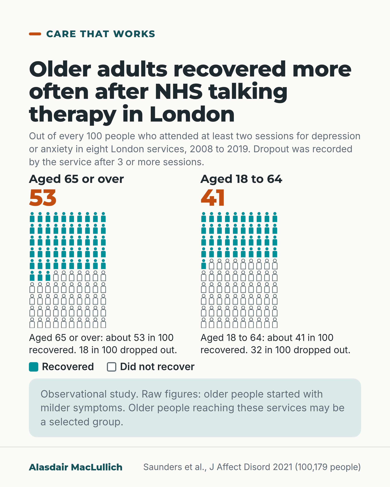

# G197: Talking therapy in later life

- Category: C20 Ageism, research exclusion, uncertainty and measurement
- Audience: public
- Series: Care that works
- Post type: good_care
- Visual format: chart
- Status: text text_final, visual final
- Working id: C20-P06 (candidate C20-30)

## Insight

In NHS talking therapy services in London, about 53 in 100 people aged 65 or over recovered, against about 41 in 100 working-age adults, and fewer older people dropped out. Older people made up fewer than 4 in 100 of those treated.

## Angle and position

Low mood and worry in later life are treatable. Older people did at least as well in these services, yet few reached them. Give crude figures, state the observational limits, and carry the depression-alone qualification.

Basis: mixed: empirical finding (Saunders 2021, observational, London services, selection bias possible) and ethical judgement (older people should be offered talking therapy on the same terms as younger adults), marked as judgement.

## X (1344 characters)

```text
Adults aged 65 or over were more likely to recover in NHS talking therapy services in London than working-age adults. Talking therapy means a course of sessions with a trained worker.

The study used service records for 100,179 people treated for depression or anxiety. By the end of treatment, about 53 in 100 older adults had recovered, as the services measured it. For adults aged 18 to 64, it was about 41 in 100. Fewer older people dropped out: 18 in 100, against 32 in 100.

These figures are not adjusted, and older people started with milder symptoms. After allowing for that, older adults were still more likely to recover, but the gap was smaller. This post does not give a figure for the smaller gap. Older people who reach these services may differ from older people who never do.

The gap was larger for anxiety. For depression alone, older adults were still more likely to recover after allowing for how unwell people were at the start. The gap was no longer clear when each older person was compared with working-age adults who were similar in other ways.

Older people were few among those treated: fewer than 4 in 100 were 65 or over, although about 18 in 100 of the population are that age, a figure the authors cite. That comparison is rough.

If you are over 65 and feeling low or anxious, ask your GP about talking therapy.
```

## LinkedIn (1961 characters)

```text
Adults aged 65 or over were more likely to recover in NHS talking therapy services in London than working-age adults. Talking therapy means a course of sessions with a trained worker, which can include guided self-help.

The study covered 100,179 people treated for depression or anxiety in eight London services between 2008 and 2019. At the end of treatment, about 53 in 100 of those aged 65 or over had recovered, as the services measured it. For those aged 18 to 64, it was about 41 in 100. Fewer older people dropped out: 18 in 100, against 32 in 100.

There are limits to these figures. The study looked at routine service records and did not assign people to treatments. The 53 and 41 in 100 are not adjusted, and older people started with milder symptoms. After allowing for how unwell people were at the start, older adults were still more likely to recover, but the gap was smaller. This post does not give a figure for the smaller gap.

Older people who reach these services may differ from older people who never do, and some differences between the groups may remain. The gap was larger for anxiety. For depression alone, older adults were still more likely to recover after allowing for how unwell people were at the start. The gap was no longer clear when each older person was compared with working-age adults who were similar in other ways. The data come from London services only.

Older people were also few among those treated. Fewer than 4 in 100 people treated in these services were 65 or over, although about 18 in 100 of the population are that age, a background figure the authors cite. That comparison is rough, because need as well as population share counts.

We should treat depression and anxiety in later life as treatable, and offer older people talking therapy on the same terms as younger adults. That is a judgement about fair access.

If you are over 65 and feeling low or anxious, you can ask your GP about talking therapy.
```

## Bluesky (291 characters)

```text
In NHS talking therapy in London, about 53 in 100 people aged 65 or over recovered, against 41 in 100 aged 18 to 64. Fewer dropped out (18 against 32 in 100). The gap was smaller after allowing for older people's milder symptoms. If you are low or anxious, ask your GP about talking therapy.
```

## Threads (482 characters)

```text
In NHS talking therapy services in London, about 53 in 100 people aged 65 or over recovered, against about 41 in 100 adults aged 18 to 64. Fewer older people dropped out: 18 in 100, against 32 in 100.

These figures are not adjusted. Older people started with milder symptoms, and after allowing for that the gap was smaller. Older people who reach these services may differ from those who never do.

If you are over 65 and feeling low or anxious, ask your GP about talking therapy.
```

## Source reply

Source: https://doi.org/10.1016/j.jad.2021.06.084

## Visual



Alt text: Two icon arrays of 100 people. Aged 65 or over: about 53 recovered, 18 dropped out. Aged 18 to 64: about 41 recovered, 32 dropped out. Eight London NHS talking therapy services, 2008 to 2019. Observational; older people started with milder symptoms and may be a selected group.

Editable source: `visuals/src/G197.html`

Design instructions: Chart card, light. Two 10x10 person iconArrays (53 and 41 solid teal, rest outlined) with orange numerals, dropout lines (18 and 32), key, mint limit note. Claim C20-30-a (C20-30-b not shown).

## Sources and verification

- C20-30-a (supported_with_qualification): In >100,000 IAPT patients, older adults were more likely to recover (crude and adjusted) and less likely to drop out.
  - Source: Saunders R, Buckman JEJ, Stott J, Leibowitz J, Aguirre E, John A, et al. Older adults respond better to psychological therapy than working-age adults: evidence from a large sample of mental health service attendees. J Affect Disord. 2021;294:85-93.
  - Passage: "At the end of treatment, older adults were more likely to reliably recover (52.5% vs 40.9%,<0.001), reliably improve (72% vs 66.4%,<0.001), and attrition was less likely (18.1% vs 31.6%,<0.001) compared to working-age adults. ... In adjusted models older adults were more likely to reliably recover (OR=1.33(95%CI=1.24-1.43)) ... There are potential selection biases affecting the characteristics of older people attending these services. Residual confounding cannot be ruled out" (Results 3.1; Abstract)
- C20-30-b (supported_with_qualification): Older adults are under-represented in these services.
  - Source: Saunders R, Buckman JEJ, Stott J, Leibowitz J, Aguirre E, John A, et al. Older adults respond better to psychological therapy than working-age adults: evidence from a large sample of mental health service attendees. J Affect Disord. 2021;294:85-93.
  - Passage: "We found that older people accounted for just 3.8% of patients treated at the services. This suggests that older adults were under-represented in the services that provided data here as over 65 year olds account for approximately 18% of the population ()." (Discussion)

Verification notes: Crude recovery 52.5% vs 40.9%, reliable improvement 72% vs 66.4%, attrition 18.1% vs 31.6%, 100,179 patients, eight London services 2008 to 2019: Saunders 2021 full text, Results 3.1 (C20-30-a). Adjusted advantage held; selection bias and residual confounding acknowledged; after matching, the recovery advantage for depression alone was not clear and anxiety drove the effect (stated in captions). Under-representation: 3.8% of treated patients aged 65+, about 18% of the population (background figure cited by the authors), crude comparison (C20-30-b). Referral routes (C20-30-c) not found, so only 'ask your GP' is said. Fair access sentence marked as judgement. Invitation to follow is general and promises no schedule.

## Attention and follow potential

Pause: It overturns a common belief that talking therapy is less useful in later life, and gives the numbers as simple counts out of 100.

Gain: Knowing that talking therapy is worth asking about from age 65, and the plain instruction to ask a GP.

Follow: Care that works posts point to treatments and how they work in later life.

## Open issues

None.
